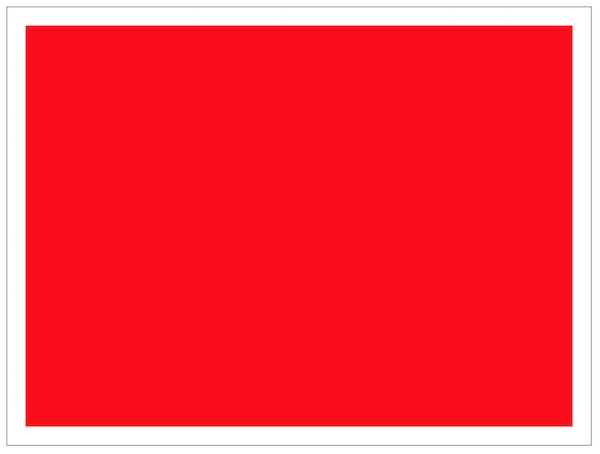

# Canvas 2D Essential Skills #1 - Intro to the Drawing Context

## I. About Canvas

### What is it good for?
The Canvas API provides a means for drawing graphics via JavaScript and the HTML `<canvas>` element. It can be used in the following applications, and we will do these all in this course:
  - animation
  - game graphics
  - data visualization
  - photo manipulation
  - real-time video processing

### The canvas specification
*When in doubt, read the spec!*
- https://www.w3.org/TR/2dcontext/
- https://html.spec.whatwg.org/multipage/canvas.html#2dcontext

### Links
- Overview - https://developer.mozilla.org/en-US/docs/Web/API/Canvas_API
- Many libraries are built on top of canvas - https://developer.mozilla.org/en-US/docs/Web/API/Canvas_API#libraries
- Guide & Tuorials - https://developer.mozilla.org/en-US/docs/Web/API/Canvas_API#guides_and_tutorials

### Other Graphics Technologies (for the web browser)
- https://developer.mozilla.org/en-US/docs/Web/API/WebGL_API
- https://developer.mozilla.org/en-US/docs/Web/SVG
- DOM
  - https://developer.mozilla.org/en-US/docs/Web/CSS/CSS_Animations/Using_CSS_animations
  - https://developer.mozilla.org/en-US/docs/Web/CSS/CSS_Transitions/Using_CSS_transitions
  - https://developer.mozilla.org/en-US/docs/Web/CSS/CSS_Transforms/Using_CSS_transforms
  - https://developer.mozilla.org/en-US/docs/Web/CSS/CSS_Transforms/Using_CSS_transforms#3d_specific_css_properties
  
<hr>

## II. Demo!
- Start file for this module is below
- Concepts covered:
  - Intro to Canvas2D API
  - Obtaining a drawing context with [`canvas.getContext("2d")`](https://developer.mozilla.org/en-US/docs/Web/API/HTMLCanvasElement/getContext)
  - Canvas2D convenience method: [`ctx.fillRect()`](https://developer.mozilla.org/en-US/docs/Web/API/CanvasRenderingContext2D/fillRect)
  - Canvas2D property: [`ctx.fillStyle`](https://developer.mozilla.org/en-US/docs/Web/API/CanvasRenderingContext2D/fillStyle)
  
## II. Start File

**first-canvas.html**

```html
<!DOCTYPE html>
<html lang="en">
<head>
	<meta charset="utf-8" />
	<title>First Canvas</title>
	<style type="text/css">
	canvas{
		border:1px solid gray;
	}
	</style>
	<script>
		// #0 - in this class we will always use ECMAScript 5's "strict" mode
		// See what 'use strict' does here:
		// https://developer.mozilla.org/en-US/docs/Web/JavaScript/Reference/Functions_and_function_scope/Strict_mode
		'use strict';
		
		// #1 call the `init` function after the pages loads
		window.onload = init;
	
		function init(){
			console.log("page loaded!");
			// #2 Now that the page has loaded, start drawing!
			
			// A - `canvas` variable points at <canvas> tag
			let canvas = document.querySelector('canvas');
			
			// B - the `ctx` variable points at a "2D drawing context"
			let ctx = canvas.getContext('2d');
			
			// C - all fill operations are now in red
			ctx.fillStyle = 'red'; 
			
			// D - fill a rectangle with the current fill color
			ctx.fillRect(20,20,600,440); 
		}
	</script>
</head>
<body>
	<canvas width="640" height="480">
		Get a real browser!
	</canvas>
</body>
</html>
```

**Which gives us:**

**(Not really! Actually, we'll only get a red rectangle!)**



<hr>

### II-A. Handy Helper Functions

These will be useful as we build our screen saver.
```js
 // handy helper functions!
    function getRandomColor(){
      function getByte(){
        return 55 + Math.round(Math.random() * 200);
      }
      return "rgba(" + getByte() + "," + getByte() + "," + getByte() + ",.8)";
    }

    function getRandomInt(min, max) {
      return Math.floor(Math.random() * (max - min + 1)) + min;
    }
 ```
 
- BTW: what is the *scope* of the `getByte()` function above? Is it visible outside of the `getRandomColor()` function?
- and if we have time, we might re-factor `getRandomColor()` into something a little more "ES6ish" - for example:
  - replace `getByte()` with an [arrow function](https://developer.mozilla.org/en-US/docs/Web/JavaScript/Reference/Functions/Arrow_functions)
  - replace the string concatenation in the return statement above with [string template literals](https://developer.mozilla.org/en-US/docs/Web/JavaScript/Reference/Template_literals)
  
<hr>
  
## III. Completed versions

We will demo how to draw a variety of shapes in class. Below are a couple possibile outcomes:


## IV. Homework

- Modify the above "screen saver" in some significant ways (so that it draws differently/looks different) - see myCourses for the due date and submission requirements


  <hr><hr>

**[Next Chapter -> Canvas Part II](canvas-2.md)**
