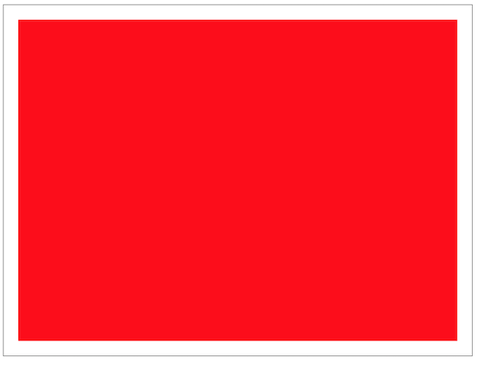

# Canvas 2D Essential Skills 1 - Intro to the Drawing Context

## 0. Video & HW

- The video for this lecture, which walks through the notes and adds a few details, is here --> [Essential Skills - Part I (09:42)](https://video.rit.edu/Watch/330-essential-skills-1)
- See the HW assignment at the bottom of the page (Part V.)

<hr>

## I. About Canvas

### What is it?

- The Canvas API provides a means for drawing graphics via JavaScript and the HTML `<canvas>` element
- `<canvas>` was originally created by Apple in 2004 for use with their "Dashboard Widgets" and the Safari Web Browser
- It was soon picked up by Firefox, Opera, and Chrome. Currently supported  by all modern browsers.
- The "Canvas 2D Context API" has been standardized by [WHATWG](https://html.spec.whatwg.org/dev/canvas.html) and the [W3C](https://www.w3.org/TR/2dcontext/)
- It has a fairly concise API for drawing - the API headers fit on 2 printed pages
- Canvas is highly performant, and is hardware accelerated (GPU) on Chrome, Safari and Firefox - here's an example - http://fhtr.org/gravityring/sprites.html (try clicking on the web browser icons as they appear)

### What is it good for?
- Some of its applications:
  - animation
  - game graphics
  - data visualization:
    - https://people.rit.edu/ajr6974/330/Project2/
  - photo manipulation:
    - https://people.rit.edu/~acjvks/330/shared/fotoshawp/fotoshawp-done.html
  - real-time video processing
    - https://people.rit.edu/~acjvks/330/shared/getImageData-putImageData-demo/video-image-data-demo-3.html (video file)
    - https://people.rit.edu/~acjvks/330/shared/video/webcam-image-data-demo-3.html (webcam)

### The canvas specification
*When in doubt, read the spec!*
- https://www.w3.org/TR/2dcontext/
- https://html.spec.whatwg.org/multipage/canvas.html#2dcontext

### Links
- Overview - https://developer.mozilla.org/en-US/docs/Web/API/Canvas_API
- Wikipedia entry - https://en.wikipedia.org/wiki/Canvas_element
- Many libraries are built on top of canvas - https://developer.mozilla.org/en-US/docs/Web/API/Canvas_API#libraries
- Guide & Tutorials - https://developer.mozilla.org/en-US/docs/Web/API/Canvas_API#guides_and_tutorials

### Other Graphics Technologies (for the web browser)
- https://developer.mozilla.org/en-US/docs/Web/API/WebGL_API
- https://developer.mozilla.org/en-US/docs/Web/SVG
- DOM
  - https://developer.mozilla.org/en-US/docs/Web/CSS/CSS_Animations/Using_CSS_animations
  - https://developer.mozilla.org/en-US/docs/Web/CSS/CSS_Transitions/Using_CSS_transitions
  - https://developer.mozilla.org/en-US/docs/Web/CSS/CSS_Transforms/Using_CSS_transforms
  - https://developer.mozilla.org/en-US/docs/Web/CSS/CSS_Transforms/Using_CSS_transforms#3d_specific_css_properties
  
<hr>

## II. Overview
- Canvas concepts covered:
  - Intro to Canvas2D API
  - Obtaining a drawing context with [`canvas.getContext("2d")`](https://developer.mozilla.org/en-US/docs/Web/API/HTMLCanvasElement/getContext)
  - Canvas2D convenience methods: [`ctx.fillRect()`](https://developer.mozilla.org/en-US/docs/Web/API/CanvasRenderingContext2D/fillRect), [`ctx.strokeRect()`](https://developer.mozilla.org/en-US/docs/Web/API/CanvasRenderingContext2D/strokeRect)
  - Canvas2D property: [`ctx.fillStyle`](https://developer.mozilla.org/en-US/docs/Web/API/CanvasRenderingContext2D/fillStyle), [`ctx.strokeStyle`](https://developer.mozilla.org/en-US/docs/Web/API/CanvasRenderingContext2D/strokeStyle), [`ctx.lineWidth`](https://developer.mozilla.org/en-US/docs/Web/API/CanvasRenderingContext2D/lineWidth)
- Terms:
  - [Canvas](https://en.wikipedia.org/wiki/Canvas_element):
    - *raster-based* - https://en.wikipedia.org/wiki/Raster_graphics
    - *Immediate mode* (sometimes called "painters model") - https://en.wikipedia.org/wiki/Immediate_mode_(computer_graphics)
  - [SVG](https://en.wikipedia.org/wiki/Scalable_Vector_Graphics):
    - https://en.wikipedia.org/wiki/Vector_graphics
    - https://en.wikipedia.org/wiki/Retained_mode
    - https://en.wikipedia.org/wiki/Scene_graph
    
<hr>

## III. Getting Started

- You will need HTML, JavaScript, and usually a little bit of CSS
- Steps to go through before you can draw:

1 - Put a `<canvas>` element on an HTML page

2 - Did the HTML page load?

3 - If so, get a reference to the `<canvas>` element

4 - Get a reference to the "2D drawing context" of the `<canvas>` element

5 - This drawing context is an object that contains the properties and methods of the canvas drawing API - so start drawing!

<hr>

**cs-canvas-1.html**

```html
<!DOCTYPE html>
<html lang="en">
<head>
	<meta charset="utf-8" />
	<title>First Canvas</title>
	<style>
	canvas{
		border:1px solid gray;
	}
	</style>
	<script>
		// #0 - in this class we will always use ECMAScript 5's "strict" mode
		// See what 'use strict' does here:
		// https://developer.mozilla.org/en-US/docs/Web/JavaScript/Reference/Functions_and_function_scope/Strict_mode
		"use strict";
		
		// #1 call the `init` function after the pages loads
		window.onload = init;
	
		function init(){
			console.log("page loaded!");
			// #2 Now that the page has loaded, start drawing!
			
			// A - `canvas` variable points at <canvas> tag
			let canvas = document.querySelector("canvas");
			
			// B - the `ctx` variable points at a "2D drawing context"
			let ctx = canvas.getContext("2d");
			
			// C - all fill operations are now in red
			ctx.fillStyle = "red"; 
			
			// D - fill a rectangle with the current fill color
			ctx.fillRect(20,20,600,440); 
		}
	</script>
</head>
<body>
	<canvas width="640" height="480">
		Get a real browser!
	</canvas>
</body>
</html>
```

<hr>

**Which gives us:**



<hr>

## IV. Demo

- Add a rectangle 400x300 rectangle at x=120 & y=120
- Change the color of the second rectangle
- Specify canvas colors in multiple ways
- Use the `ctx.strokeRect()` method and `ctx.strokeStyle` drawing state property to color the *path* (just the outside) of the inner rectangle:
  - The `ctx.lineWidth` drawing state property will come in handy too!

<hr>

## V. Check it Off!

- Add at least 2 more rectangles to the **cs-canvas-1.html** canvas using both `ctx.fillRect()` and `ctx.strokeRect()`:
  - make sure that the `ctx.strokeStyle` and `ctx.fillStyle` are set so that we can see these new rectangles
  - in the comments field of the dropbox, describe the changes you made
- Rename **cs-canvas-1.html** to ***lastName-firstInitial*-cs-canvas-1.html**
- ZIP and POST ***lastName-firstInitial*-cs-canvas-1.html** into the dropbox
- Put the answers to the following questions into the comments field of the dropbox (-1 point for each incorrect answer):
  
1 - True or False. The canvas API was invented by Apple Computer
 
2 - True or False. The canvas API is hardware accelerated on most modern browsers
 
3 - True or False. Canvas is a *vector-based* graphics system
 
4 - True or False. Canvas comes with a built-in *scene graph* and *display list*

5 - True or False. *raster-based* graphics systems represent graphics as a rectangular grid of pixels
 
6 - List the 3 drawing state *properties* we used in this demo
 
7 - List the 2 drawing state *methods* we used in this demo
 
8 - Give 4 different ways to represent the color *green* as a color in the canvas API
 
9 - Write the one line of code that will change the current fill color to *green*

10 - Write the one line of code that will fill a 100x100 rectangle at x=200, y=50


<hr><hr>

| <-- Previous Unit | Home | Next Unit -->
| --- | --- | --- 
|   :-\  |  [**IGME-330**](../README.md) | [**Skill #2 - Paths & Lines & Arcs**](2-canvas-paths-lines-arcs.md)
