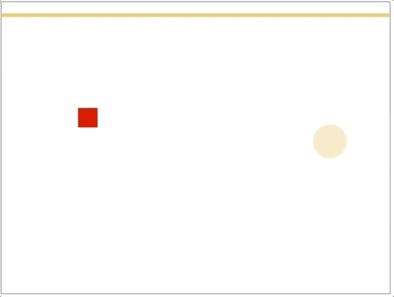

# Canvas 2D Essential Skills #3 - Begin making a screensaver

## 0. Video & HW

- The video for this lecture, which walks through the notes and adds a few details, is here --> [Essential Skills - Part III (07:08)](https://video.rit.edu/Watch/330-essential-skills-3)
- See the HW assignment at the bottom of the page (Part V.)

<hr>

## I. Overview
- Build a [screen saver](https://en.wikipedia.org/wiki/Screensaver) using [`window.requestAnimationFrame()`](https://developer.mozilla.org/en-US/docs/Web/API/window/requestAnimationFrame) to periodically draw random rectangles on the screen

<hr>

## II. Handy Helper Functions

- These will be useful as we build our screen saver - go ahead and copy/paste them into **cs-canvas-3.html**

```js
// handy helper functions!
function getRandomColor(){
  function getByte(){
    return 55 + Math.round(Math.random() * 200);
  }
  return "rgba(" + getByte() + "," + getByte() + "," + getByte() + ",.8)";
}

function getRandomInt(min, max) {
  return Math.floor(Math.random() * (max - min + 1)) + min;
}
```

<hr>

## III. Demo
- add helper functions to **cs-canvas-3.html** and test them in the console
- create the `drawRandomRect()` function
  - draw at random `x`, `y` and `width`, `height`
  - give random `lineWidth` and `strokeStyle` and `fillStyle`
- call `drawRandomRect()` periodically with `requestAnimationFrame()`

<hr>

## IV. Completed versions

We will demo how to draw a variety of shapes in class. Below are some possibile outcomes:




<hr>

## V. Check it off!
- Modify the above "screen saver" in some significant ways (so that it draws differently/looks different)
- Rename **cs-canvas-3.html** to ***lastName-firstInitial*-cs-canvas-3.html**
- Move on to the next skill!

 
 
 
 <hr><hr>

| <-- Previous Unit | Home | Next Unit -->
| --- | --- | --- 
|  [**Skill #2 - Paths & Lines & Arcs**](2-canvas-paths-lines-arcs.md) |  [**IGME-330**](../README.md) | [**Skill #4 - Adding Controls**](4-adding-controls.md)
