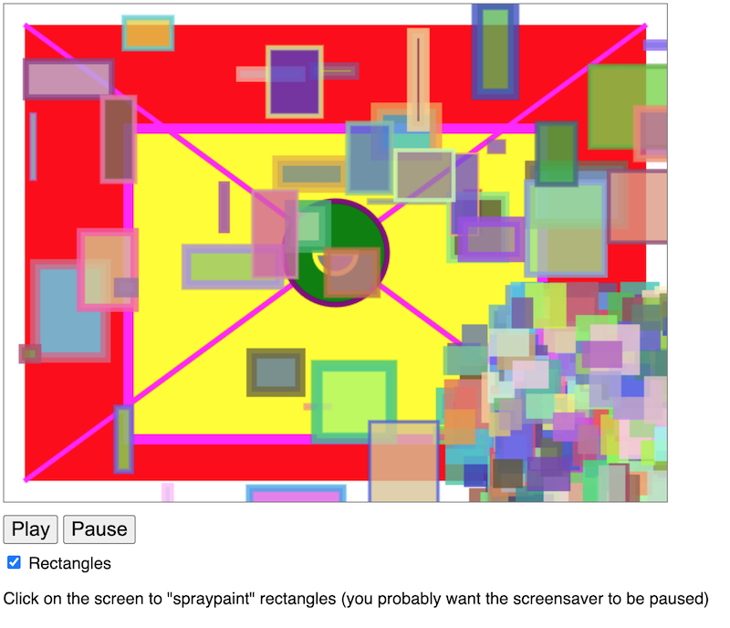

# Canvas 2D Essential Skills #4 - Adding Controls

## 0. Video & Instructions

- The video for this lecture, which walks through the notes and adds a few details, is here --> [Essential Skills - Part IV (17:26)](https://video.rit.edu/Watch/330-essential-skills-4)
- See the HW assignment at the bottom of the page (Part VI.)

<hr>

## I. Overview
- Here we will add interactivity to our screen saver:
  - Play/Pause buttons
  - The ability to click on the screen to "spray paint" on the canvas
  - A checkbox to turn rectangle creation on and off
- Go ahead and rename your file from last time to **cs-canvas-4.html**
- Start coding!

<hr>

## II. HTML/CSS code

- Add the following to your HTML file

### CSS
```css
body{
  font-family: sans-serif;
}
	
button{
  font-size:1.2em;
}
	
section{
  margin:.5em 0 .5em 0;
}
```

### HTML

```html
<section>
  <button id="btnPlay">Play</button>
  <button id="btnPause">Pause</button>
</section>
<section>
  <span>
    <input type="checkbox" id="cbRectangles" checked>
    <label for="cbRectangles">Rectangles</label>
  </span>
</section>
<section>
  <p>Click on the screen to "spraypaint" rectangles (you probably want the screensaver to be paused)</p>
</section>
```

<hr>

## III. Helper Code

```js
function canvasClicked(e){
  let rect = e.target.getBoundingClientRect();
  let mouseX = e.clientX - rect.x;
  let mouseY = e.clientY - rect.y;
  console.log(mouseX,mouseY);
}
```


<hr>

## IV. Demo/Walkthrough

1) Enable the Play/Pause buttons:

    - declare and initialize a `paused` boolean
    - `setupUI()` helper function will enable the `btnPause` and `btnPlay` buttons
    - call `setupUI()` from `init()`
    - modify `update()` loop to utilize `paused` boolean
    - test it
    - now spam the **Play** button - the animation speeds up (unintentionally!):
      - you fix it! (this is a graded part of the HW)
      - hint: one `if` statement will solve the problem
      
2) Enable the "spray paint":

    - hook up `canvasClicked` to the `<canvas>` element and test it:
      - error! Let's fix it together
      - now we should see the logged coordinates when the canvas is clicked on
      - next we will draw 10 small random rectangles clustered around where we clicked the mouse:
        - if we start writing more calls to `ctx.beginPath()` and `ctx.rect()` etc we will be ***repeating a bunch of code***
        - sounds like it's time for a segue to create helper function to draw rectangles - we will return to getting the spray paint working in a little bit
	
3) Create a canvas helper function to draw rectangles - here's the function signature:

    - `drawRectangle(ctx,x,y,width,height,fillStyle="black",lineWidth=0,strokeStyle="black")`
    - note how we have allowed for *optional parameters* for `fillStyle`, `lineWidth` and `strokeStyle` by assigning default values
    - now let's implement this function
    - we'll use `ctx.save()` and `ctx.restore()` here - these will manipulate the canvas [*drawing state stack*](https://developer.mozilla.org/en-US/docs/Web/API/Canvas_API/Tutorial/Transformations) (see image below):
      - these commands will *save* ("push") and *restore* ("pop") the values of drawing state attributes (such as `fillStyle` and `lineWidth`). They also will save the values of canvas *transformations* (i.e. translate/rotate/scale - which we will cover soon)  
      - [`ctx.save()`](https://developer.mozilla.org/en-US/docs/Web/API/CanvasRenderingContext2D/save)
      - [`ctx.restore()`](https://developer.mozilla.org/en-US/docs/Web/API/CanvasRenderingContext2D/restore)
    - now call the `drawRectangle(ctx,x,y,...)` function from `drawRandomRect(ctx)` and get rid of the other drawing code we had there
    - test it - everything should function as before
    
4) Now let's enable the spraypaint

    - Draw 10 rectangles near the location of the mouse

5) Enable the checkbox

    - create a `createRectangles` boolean
    - add a `onclick` event handler to the checkbox which will change the value of `createRectangles` to whatever the `checked` value of the checkbox is
    - in `update()`, write code so that the `createRectangles` boolean has to be `true` for the rectangles to be created
  
<hr>
 


<hr>

## V. Screenshot of done version



<hr>

## VI. Check it off!

- Rubric:
  - (-20%) **Play** button still broken - i.e. *spamming the **Play** button still speeds up the animation*
  - (-20% each) Other broken controls or functionality
- Rename **cs-canvas-4.html** to ***lastName-firstInitial*-cs-canvas-4.html**
- Move on to the next skill!

<hr><hr>

| <-- Previous Unit | Home | Next Unit -->
| --- | --- | --- 
|  [**#3 - Begin making a screensaver**](3-begin-making-screensaver.md) |  [**IGME-330**](../README.md) | [**Skill #5 - Write Some Code!**](5-write-some-code.md)
