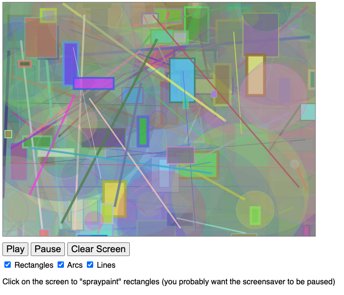

# Canvas 2D Essential Skills #5 - Write some code!

## I. Overview
- There isn't a video this time
- Make a copy of **cs-canvas-4.html** and name it **cs-canvas-5.html**
- You are going to add code and functionality to **cs-canvas-5.html**

## II. Required Canvas Helper functions
- `drawArc(...)` will be similar to `drawRectangle(ctx,x,y,width,height,fillStyle="black",lineWidth=0,strokeStyle="black")` except:
  - it will have a `radius` parameter instead of `width` and `height`
  - it will also have *optional* parameters for `startAngle` and `endAngle`, and these withh default to `0` and `Math.PI *2` respectively
- `drawLine()` will be similar to `drawRectangle(ctx,x,y,width,height,fillStyle="black",lineWidth=0,strokeStyle="black")` except:
  - it will not need `fillStyle` or `width` or `height` parameters
  - it will have `x1`, `y1`, `x2`, and `y2` parameters (e.g. the start and end points of the line)
  - the default `lineWidth` will be `1`
- `drawRandomArc()` will function similarly to `drawRandomRect()`:
  - except that it will call `drawArc(...)`
- `drawRandomLine()` will function similarly to `drawRandomRect()`:
  - except that it will call `drawLine(...)`
- Hints:
  - similar to `createRectangles`, you will need `createArcs` and `createLines` variables
  - test your code frequently, at each step, just like we did in the last part
  - In any of the helper functions that do drawing, be sure that you have calls to `ctx.save()` and `ctx.restore()`
  - (*you don't have to do this, but in my completed version below I gave all of the circles a low opacity by using `ctx.globalAlpha=0.3;`*)

## III. Required new functionality
- there will be 2 more checkboxes called "Draw Arcs" and "Draw Lines":
  - when these are checked, random arcs and lines will be drawn using the above methods
- there will be a "Clear Screen" button:
  - when clicked it will clear out all of the existing drawing:
    - you can use `ctx.fillRect()` or just `ctx.fill()` a canvas-sized rectangle with a solid color
    - or you could use `ctx.clearRect()`

## IV. Required code refactoring
- Re-write all of the drawing code in the `init()` function to use your **Canvas Helper Functions**  - `drawRectangle()`, `drawArc()` and `drawLine()`
- Change the "spraypaint" functionality so that it paints arcs, not rectangles

## V. Screenshot of completed version

## VI. Submission

- Rename **cs-canvas-5.html** to ***lastName-firstInitial*-cs-canvas-5.html**

| <-- Previous Unit | Home | Next Unit -->
| --- | --- | --- 
|  [**#4 - Adding Controls**](4-adding-controls.md) |  [**IGME-330**](../README.md) | [**#6 - Review & More About Paths**](6-review-and-more-about-paths.md)
