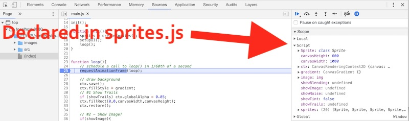
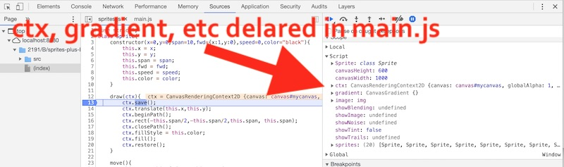
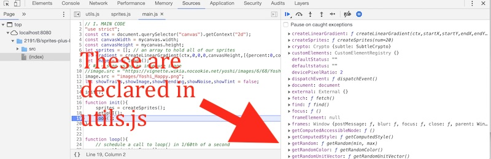
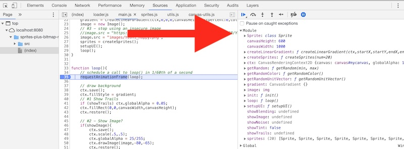
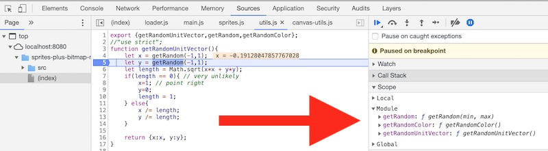
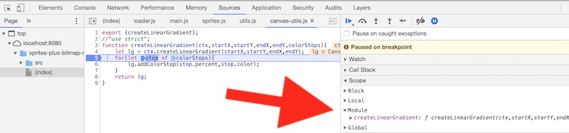

# ES6 Module Pattern

## Overview
Applications that are written in a **modular** fashion are [loosely coupled](https://en.wikipedia.org/wiki/Loose_coupling), with minimal [dependencies](https://en.wikipedia.org/wiki/Dependency_hell) between modules, which makes the process of designing and maintaining them much easier and less error prone. 

**Modular programming** is the process of subdividing a computer program into separate sub-programs. Modules have the following characteristics:
- enforce logical boundaries between components and improve maintainability
- are implemented through *interfaces* (i.e. publicly available methods or properties)
- are designed in such a way as to minimize *dependencies* between different modules

Writing modular code has many benefits:
- it allows many programmers to collaborate on the same application because a small team deals with only a small part of the entire code
- the same code can be used in many applications
- errors can easily be identified, as they are localized to a file, class or function
- the scoping of variables can be easily controlled

The above is adapted from https://www.techopedia.com/definition/25972/modular-programming

We have been getting away with writing "non modular" JavaScript code so far because our programs have been fairly small. But as the size of the program increases, and if more than one developer works on an application, a modular programming architecture becomes essential.

**In this chapter we will apply ES6 module syntax to an application and see these benefits in action.**


## Contents
<!--- Local Navigation --->
I. [Why do we need modularized code?](#section1)

II. [ES6 Modules to the rescue!](#section2)

III. [Adding ES6 Modules to our "sprites plus bitmap manipulation" app](#section3)

IV. [Try it out!](#section4)

V. [Reference](#section5)

VI. [Review Questions](#section6)

<hr>

## I. <a id="section1">Why do we need modularized code?

- Before we get started, grab the demo files: [sprites-plus-bitmap-manip-start.zip](_files/sprites-plus-bitmap-manip-start.zip)
- go ahead and test the files to be sure they work - you probably want to go ahead and run them off of a web server (because you will have to later on to complete this exercise)

<hr>

### I-A. The costs of not using JS modules

* The JS code in the demo is nicely organized and split into 4 files: **main.js**, **sprites.js**, **utls.js** and **canvas-utils.js**
* But is the JS runtime aware of our organizational structure?
  - **TLDR - \*\*EVEN THOUGH we have declared a bunch of variables, functions, and classes and re-factored them into in *separate files*, the Browser's JavaScript runtime is still munging all of these variable into a shared global namespace!\*\***
* Let's check the debugger and see. Place a breakpoint at the top of the `loop()` function of **main.js** and check the web inspector:

**main.js**



- above you can see that the `Sprite` symbol (declared with `class` over in **sprites.js**) is visible in "Script scope"
- this might not seem like such a bad thing, but look at the next example

<hr>

**sprites.js**



- above you can see that the `let` declared variables of **main.js** of `ctx`, `canvasWidth`, `canvasHeight`, and `sprites` are all visible in **sprites.js** file in "Script" scope 
- this means that **sprites.js** can "see" all of the `let` declared  variables in **main.js**. Above we saw that the converse is also true - **main.js** has access to all of the **sprites.js** variables
- Note: classes declared with `class`, and `let` variables declared outside of functions, end up in "Script Scope"

<hr>

### I-B. How about functions?

**utils.js** & **main.js**

- functions declared with with `function` keyword (AND variables that are declared *outside* of a function with the `var` keyword) end up in the *global* scope (PS - they also end up as properties of the `window` object)
- in the two screenshots below, see how functions declared in one file, are visible in the other, and vice-versa:

**utils.js**


**main.js**



- **To see how this kludging together of variables into the same namespace can cause problems, add the following line of code to the top section of *sprites.js***

`let sprites = []; // sprites.js needs an array to cache some sprites! I'll go ahead and add it!` 

- **Reload the page, you will get an error in the console, and nothing drawn to the screen:**

`Uncaught SyntaxError: Identifier 'sprites' has already been declared at main.js:1`

- **So the JS compiler won't allow us to re-declare `let` variables in the same scope**
- **How about if we redeclare a previously declared function in *main.js*:**

```js
// Now I'll just add this local helper method to my code!
function getRandomColor(){
	return `red`;
}
```
- **Reload the page, all the sprites are red:**

- **... which is because the above code overwrote the `getRandomColor()` function from *utils.js***

<hr>

### I-C. Is the above code *modular*?

Clearly not:
- regardless of the script file we write code in, all of our classes and `let` variables are mashed together into the *Script* namespace, and all of our functions and `var` variables are in the *Global* scope
- there are *dependencies* between modules which are not explicit. For example, **classes.js** depends on **utilities.js** for the `getRandomColor()` function. Because this was not explicit, we accidentally overwrote it above with a new implementation. 
- adding variables to one module can cause name collisions with variables in other modules. If one developer added a `gradient` or `screenWidth` variable to **classes.js**, it could easily break what the other developer was doing in *main.js*. In a larger application, these would be hard errors to track down. 
- some of the properies and functions should NOT be visible outside their respective modules - for example all of the `let` variables from **main.js**  - but because of the way the code is written none of these can be **private** to a script

<hr>

## II. <a id="section2">ES6 Modules to the rescue!

[Exploring ES6](http://exploringjs.com/es6/ch_modules.html#sec_overview-modules) has a nice overview of ES6 modules:

- JavaScript has had modules for a long time - however, they were implemented via libraries, not built into the language
- ES6 is the first time that JavaScript has built-in modules
- ES6 modules are stored in files
- ***There is exactly one module per file and one file per module***

### II-A. `export` and `import`
[export](https://developer.mozilla.org/en-US/docs/Web/JavaScript/Reference/Statements/export) is used when creating JavaScript modules to export functions, objects, or primitive values from the module so they can be used by other programs with the import statement.

[import](https://developer.mozilla.org/en-US/docs/Web/JavaScript/Reference/Statements/import) is used to import *bindings* (to functions, objects or primitive values) which are exported by another module.

<hr>

### II-B. A working example
ES6 modules have 2 restrictions:
- they need be hosted on a web server to function (or use the Live Preview mode of Brackets, etc)
- as of Fall 2019, they are supported by recent versions of all major browsers - see this compatibility chart: https://developer.mozilla.org/en-US/docs/Web/JavaScript/Reference/Statements/import#Browser_compatibility)

Here is our first module - we are exporting (i.e. making public and visible) the `addTextToBody()` function, but not the `myPrivateFunction()` function.

**js/utilities.js**

```javascript
export function addTextToBody(text) {
  const div = document.createElement('div');
  div.textContent = text;
  document.body.appendChild(div);
}

function myPrivateFunction(){
  console.log("privateFunction() is not visible outside of utilities.js!");
}
```

We could also write the `export` this way:

```javascript
export {addTextToBody};

function addTextToBody(text) {
  const div = document.createElement('div');
  div.textContent = text;
  document.body.appendChild(div);
}

function myPrivateFunction(){
	console.log("privateFunction() is not visible outside of utilities.js!");
}
```

To use this module from an HTML page, we do the following:

**test.html**
```html
<!DOCTYPE html>
<html lang="en">
<head>
	<meta charset="utf-8" />
	<title>ES6 Module Tester</title>
</head>
<body>
<script type='module'>
  import {addTextToBody} from './js/utilities.js';
  addTextToBody('ES6 modules are functioning!');
</script>
</body>
</html>
```

Be sure to note the following in *test.html*:
- it is not necessary to "import" the *utilities.js* JS file with a &lt;script> tag - as the `import` statement is doing that for us
- we have to explicitly import the `addTextToBody()` function to use it

Try it out:
- here - http://igm.rit.edu/~acjvks/courses/2018-spring/330/code-examples/js-module-demos/ES-6-module-tester/test.html
- test it: You should see - "ES6 modules are functioning!" - in the browser window (if you don't, check the console)
- note: the above example was adapted from here: https://jakearchibald.com/2017/es-modules-in-browsers/
- for your convenience, here are the completed files in a ZIP --> [ES-6-module-tester.zip](./_files/ES-6-module-tester.zip) --> recall that these need a web server (or Firefox Developer) to run

<hr>

### II-C. Checking the web inspector

If we add two breakpoints and step through the code, we can see that we now have "Module" scope and privacy:

**test.html**

Here in *test.html*, the `myPrivateFunction()` is not visible:


**js/utilities.js**

But here in *utilities.js*, both functions are visible:


<hr>

### ** *Try This* **
In *test.html*:
- attempt to call `myPrivateFunction()` - what error message do we get?

<hr>


## III. <a id="section3">Adding ES6 Modules to our "sprites plus bitmap manipulation" app
	
Hopefully you now see the benefits of modules, and how easy it is to implement them in ES6. Let's go ahead convert our "no module" canvas application to ES6 modules. The start files are linked above at the top of Section I. After you download the folder, rename it to **sprites-now-with-modules**

### III-A. Changes to *utils.js*

Add the following to the top:

```js
export {getRandomUnitVector,getRandom,getRandomColor};
```

- you can also delete the `"use strict";` line because ES6 modules always run in strict mode
- above we are making `getRandomUnitVector()` public, but keeping `getRandom()` private to this module
- if you test the app now, will see errors, so just move on


### III-B. Changes to *canvas-utils.js*

Add the following to the top:

```js
export {createLinearGradient};
```

### III-C. Changes to *sprites.js*

Add the following to the top:

```js
export {Sprite};
```

### III-D. Changes to *main.js*

Add the following to the top:

```js
import {Sprite} from './sprites.js';
import {getRandomUnitVector,getRandom,getRandomColor} from './utils.js';
import {createLinearGradient} from './canvas-utils.js';
export {init};
```

- Now delete the *call* to the `init();` function - not the function itself. This single line of code is on or around line 10 or 15. In the next section, we will instead call `init()` from **loader.js**. 
- above we are importing the 3 sprite creation functions we need from **classes.js**
- the only function or variable we are exposing to other scripts is `init()`

### III-E. New file: *src/loader.js*

Make **loader.js** look like this:

```javascript
import {init} from './main.js';
// 1) this script a good place to load fonts, images, sounds and other resources
// 2) start up app
init();
```


### III-F. Changes to the HTML file:


- **Replace these &lt;script> tags:**

```html
<script src="src/canvas-utils.js"></script>
<script src="src/utils.js"></script>
<script src="src/sprites.js"></script>
<script src="src/main.js"></script>
```

- **With this:**
```html
<script src="src/loader.js" type="module"></script>
```

- above we got rid of those 4 &lt;script> tags that were doing the importing
- the HTML file has access to only one method - "`main.init()`" - which it calls once the page loads.


## IV. <a id="section4">Try it out!
- Everything in the app should now run exactly as before (and don't forget that you need to run it off of a web server!)
- Now set some breakpoints and check the inspector:
    - "Script" scope is gone, replaced by "Module" scope
    - all of the dependencies between modules are explicitly specified with `import` and `export`, which will make it easier for multiple developers to work on the app
	
<hr><hr>

**loader.js**

- **only `init` (which was imported from main.js) is visible:**


<hr>

**main.js**

- **everything that we imported from the other modules is visible:**



<hr>

**sprites.js**

- **Only `Sprite` is visible:**


<hr>

**utils.js**

- **Only the 3 local helper functions are visible:**



<hr>

**canvas-utils.js**

- **Only the 1 local helper function is visible:**



<hr>

- Now go ahead and add some "private" new functions and variables to **canvas-utils.js**

```js
const secret = 42;
function amazing(){
  console.log("Doing amazing things here!");
}
```

- and check the debugger - you will see that they are not visible outside of  **canvas-utils.js**

<hr><hr>

## V. <a id="section5">Reference

- Definitely check out how to do *named imports* below (i.e. so you could write `main.init()` instead of just `init()`):
  - https://developer.mozilla.org/en-US/docs/Web/JavaScript/Reference/Statements/import
  - https://developer.mozilla.org/en-US/docs/Web/JavaScript/Reference/Statements/export
  - http://exploringjs.com/es6/ch_modules.html#sec_mixing-named-and-default-exports
  - http://2ality.com/2014/09/es6-modules-final.html
  - https://jakearchibald.com/2017/es-modules-in-browsers/\
  - https://hacks.mozilla.org/2015/08/es6-in-depth-modules/
  - https://blogs.windows.com/msedgedev/2016/05/17/es6-modules-and-beyond/
  - https://www.ecma-international.org/ecma-262/6.0/#sec-imports

	
## VI. <a id="section6">Review Questions
1. Define the software development term *loosely coupled*.
2. Give 3 advantages of using modules when coding substantial JavaScript applications.
3. Give 3 things that could go wrong if you don't use modularized code.
4. Is the `"use strict"` declaration necessary for ES6 modules to run in strict mode?

	

<!--
**[Next Chapter -> JavaScript & the ES5 Revealing Module Pattern (chapter 5)](canvas-sprites-5.md)**
-->

