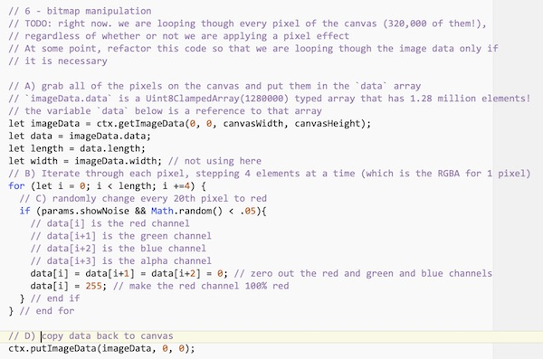
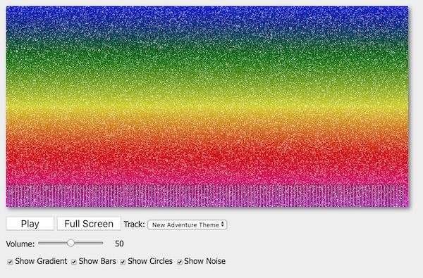

# HW - Audio Visualizer - Part III

[I. Overview](#overview)

[II. Grab some pixels](#section2)

[III. More Pixel Manipulations](#section3)

[IV. Reference](#reference)

[V. Homework](#homework)

<hr><hr>

<a id="overview" />

## I. Overview

- We can grab the RGBA (red, green, blue, alpha) data for the entire canvas, manipulate it, and then copy the modified data back to the canvas
- This allows (for example) Photoshop style filters, chroma key effects, edge detection for motion and object recognition applications, and more
- The methods we’ll use here:
  - [`ctx.getImageData(x,y,width,height)`](https://developer.mozilla.org/en-US/docs/Web/API/CanvasRenderingContext2D/getImageData) - returns an [`ImageData`](https://developer.mozilla.org/en-US/docs/Web/API/ImageData) object for the specified x, y, width, height rectangle on the &lt;canvas>
  - this `ImageData` object has a `.data` property that is an 8-bit typed array (a [`Uint8ClampedArray`](https://developer.mozilla.org/en-US/docs/Web/JavaScript/Reference/Global_Objects/Uint8ClampedArray)) of the rgba values of each pixel of the canvas
- [ctx.putImageData(imageData,x,y)](https://developer.mozilla.org/en-US/docs/Web/API/CanvasRenderingContext2D/putImageData) - copies an `ImageData` object onto the canvas at the specified x,y


<hr>

<a id="section2" />

## II. Grab some pixels

1)  Make a copy of the main project folder (and all of the files/folders that are in it) from Part II, and name this one **web-audio-hw-3**

<hr>

2) Here's the comments you'll need - add these to the bottom of `draw()` in **canvas.js**

```js
// 6 - bitmap manipulation
	// TODO: right now. we are looping though every pixel of the canvas (320,000 of them!), 
	// regardless of whether or not we are applying a pixel effect
	// At some point, refactor this code so that we are looping though the image data only if
	// it is necessary

	// A) grab all of the pixels on the canvas and put them in the `data` array
	// `imageData.data` is a `Uint8ClampedArray()` typed array that has 1.28 million elements!
	// the variable `data` below is a reference to that array 
	
	// B) Iterate through each pixel, stepping 4 elements at a time (which is the RGBA for 1 pixel)

		// C) randomly change every 20th pixel to red
	
			// data[i] is the red channel
			// data[i+1] is the green channel
			// data[i+2] is the blue channel
			// data[i+3] is the alpha channel
			// zero out the red and green and blue channels
			// make the red channel 100% red
		} // end if
	} // end for
	
	// D) copy image data back to canvas
```

<hr>

3) Now type in the actual code yourself (there's not that much, is there?):



<hr>

4) When you are done, it should look something like this (I am drawing white noise so that it shows better on my red dominated background):



<hr>

5) Go ahead and write the code to get the "Show Noise" checkbox working :


<a id="section3" />

## III. More pixel manipulations


<hr>

<a id="section4" />

## IV. Reference (Image Processing Links)

- Image processing is a large field of study - here are some links you might find handy:
  - http://www.techrepublic.com/blog/how-do-i/how-do-i-convert-images-to-grayscale-and-sepia-tone-using-c/#
  - http://stackoverflow.com/questions/1061093/how-is-a-sepia-tone-created
  - http://html5doctor.com/video-canvas-magic/
  - https://archive.org/details/Lectures_on_Image_Processing
  - http://stackoverflow.com/questions/13932855/canvas-flip-half-the-image
  - http://www.html5rocks.com/en/tutorials/canvas/imagefilters/#toc-setup
  - http://lodev.org/cgtutor/filtering.html

- Another application of this (when combined with the webcam) is edge detection, which lets us detect, recognize and track objects and motion, which leads to making a webcam controller that acts like the Kinect. There are JS libraries available that can do this:
  - https://github.com/mtschirs/js-objectdetect
  - http://trackingjs.com/docs.html

<hr>

<a id="homework" />

## V. Homework

- Rubric (out of 10 points):
  - (4 points) everything through to the end of Part II works
  - (1 point) "Show Noise" checkbox works
  - (1 point) change the red noise to a difference color
  - (2 points) "Invert" effect & checkbox works
  - (2 points) "Emboss" effect & checkbox works
  


<hr><hr>

**[Previous Chapter <- Audio Visualizer - Part II](HW-AV-2195-2.md)**
