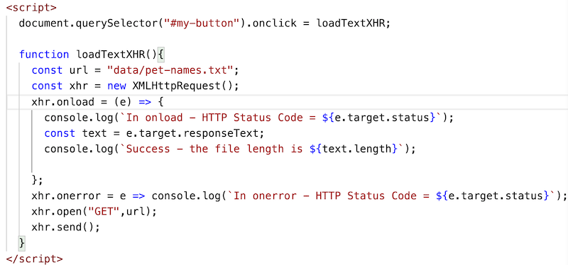

# HW - Ajax-1 - loading and parsing text files

## Overview

- The video walkthrough for this assignment is here --> 
- In this series, we are going to walk through using the browser [`XMLHttpRequest` (aka "`XHR`")](https://developer.mozilla.org/en-US/docs/Web/API/XMLHttpRequest/Using_XMLHttpRequest) and [`fetch`](https://developer.mozilla.org/en-US/docs/Web/API/Fetch_API/Using_Fetch) APIs to download data and display it to the user
- We will download and parse data in multiple formats - plain text, CSV, XML  and JSON
- Note: In 230/235 you have already had some experience with some of this - specifically XHR and JSON - go review those notes now if you wish:
  - https://github.com/tonethar/IGME-230-Master/blob/master/notes/web-apps-10.md
  - https://github.com/tonethar/IGME-230-Master/blob/master/notes/HW-gif-finder.md

<hr>

## I. Start files
- For today's exercise, we will load in a plain-text data file of pet names, and display them on the screen in an unordered list. You can see what the completed version looks like at the end of this document
- Below is your plain-text data file **pet-names.txt** - it consists of the top-20 most popular pet dog names, followed by the 20-most popular pet cat names
- These names are *comma-separated*, and both dog and cat names appear in the one line of text in the file (not a very good structure, and we'll rectify that in **Ajax-2**)
- go ahead and create a **data** folder and place the **pet-names.txt** file into it:

<hr>

**data/pet-names.txt**

```text
Bella,Luna,Charlie,Lucy,Cooper,Max,Bailey,Daisy,Sadie,Lola,Buddy,Molly,Stella,Tucker,Bear,Zoey,Duke,Harley,Maggie,Jax,Oliver,Leo,Milo,Charlie,Simba,Max,Jack,Loki,Tiger,Jasper,Ollie,Oscar,George,Buddy,Toby,Smokey,Finn,Felix,Simon,Shadow
```

<hr>

- Here is our HTML file that has the HTML/CSS/JS to get us started:

**xhr-get-text.html**

```html
<!DOCTYPE html>
<html lang="en">
<head>
	<meta charset="utf-8" />
	<meta name="viewport" content="width=device-width, initial-scale=1, user-scalable=no">
	<title>XHR - Load Text</title>
	<style>
	body{
	  font-family: sans-serif;
	}
	</style>

</head>
<body>
	<h2>XHR - Load Text File</h2>
	<p>The <code>pet-names.txt</code> file contains popular dog and cat pet names, separated by commas.</p>
	<p>Note that because XHR is loading a local file, this and the other examples will have to be run off a web server rather than from your computer's hard drive (e.g. banjo.rit.edu or VSCode's liveserver etc)</p>
	
	<hr>
	<button id="my-button">Load Data</button>
	<p id="output">Click button to load</p>
	

<script>

</script>
</body>
</html>
```

<hr>

## II. Get the XHR working

- Here is the start JS code for you to type in - put this into the `<script>` tag of **xhr-get-text.html**

<hr>



<hr>

- Note that because XHR is loading a local file, this and the other examples will have to be run off a web server rather than from your computer's hard drive (e.g. banjo.rit.edu or VSCode's liveserver etc)
- Test it by reloading the page and clicking the button - you should see a log to the console showing that the file was successfully loaded
- Try breaking the code by changing the <code>pet-names.txt</code> file name - note that XHR's `onerror` handler was not triggered, and that `XHR` reported that it successfully downloaded the file:
  - this is because the web server's "404 file not found" page WAS successfully loaded
  - this behavior will lead to problems in our later versions of this simple app, and we'll need to write "guard code" to always be sure that we downloaded the correct file, and not merely the web server's error page
  - when then, does `onerror` get triggered for `XHR`? One example would be when we try to download a remote file, but our computer is offline and not connected to the Internet


<hr>

## III. Parse the pet names and display the loaded data as an ordered list

- Watch the video to see how we implement this - both the "long way" and as a "one-liner"


<hr>

## IV. Reference

### IV-A. APIs Used
- [`XMLHttpRequest`](https://developer.mozilla.org/en-US/docs/Web/API/XMLHttpRequest/Using_XMLHttpRequest) - <code>XHR</code> objects are used to interact with servers. You can retrieve data from a URL without having to do a full page refresh. This enables a Web page to update just part of a page without disrupting what the user is doing
- [`xhr.responseText`](https://developer.mozilla.org/en-US/docs/Web/API/XMLHttpRequest/responseText) - contains either the textual data received from the `XHR`, or `null` if the request failed
- [`String.split()`](https://developer.mozilla.org/en-US/docs/Web/JavaScript/Reference/Global_Objects/String/split) - turns a string into an array
- [`Array.map()`](https://developer.mozilla.org/en-US/docs/Web/JavaScript/Reference/Global_Objects/Array/map) - creates a new array populated with the results of calling a provided function on every element in the calling array
- [`Array.join()`](https://developer.mozilla.org/en-US/docs/Web/JavaScript/Reference/Global_Objects/Array/join) - returns a new string by concatenating all of the elements in an array

### IV-B. ES6
- [ES6 Arrow Functions](https://www.w3schools.com/js/js_arrow_function.asp)

<hr>

## V. Completed Version


<hr>

## VI. Submission

- See the dropbox for submission instructions
- It is required that you utilize the "one-liner" way of rendering the HTML that we demoed in section III


<hr><hr>

| <-- Previous Unit | Home | Next Unit -->
| --- | --- | --- 
|   :-\  |  [**IGME-330**](../README.md) | [**HW - Ajax II**](HW-ajax-2.md)
