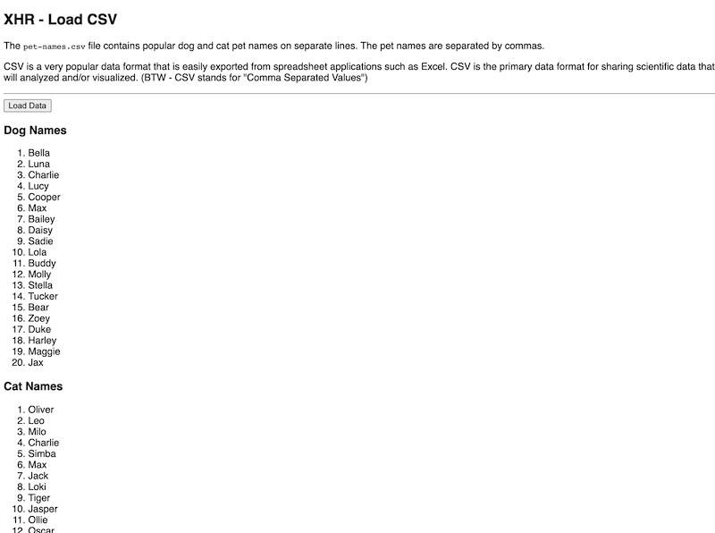

# HW - Ajax-2 - loading and parsing CSV files

## Overview

- The video walkthrough for this assignment is here. You will need to be logged into RIT/myCourses before you can access it:
  - [HW - Ajax-2 (13:16)](https://rit.hosted.panopto.com/Panopto/Pages/Viewer.aspx?id=dda93dac-be59-4230-9e48-ad9401501b9e)
- We will build on what we did last time by modifying our plain-text loading code to instead download and parse a CSV ("**C**omma **S**eparated **V**alues") file
- CSV is a very popular data format that is easily exported from spreadsheet applications such as Excel. CSV is the primary data format for sharing scientific data that will analyzed and/or visualized

<hr>

## I. Start files
- You will want to start by first making a copy of your **lastName-firstInitial-ajax-1** folder from last time, and naming the copy **lastName-firstInitial-ajax-2**
- Go ahead and rename your completed HTML file from last time - from **xhr-get-text.html** to **xhr-get-csv.html** 
- Below is the plain-text data file **pet-names.csv** that we will use this time
- **pet-names.csv** contains popular dog and cat pet names on *separate lines*. The pet names are separated by commas
- go ahead and create the **pet-names.csv** file and put it in your **data/** folder

<hr>

**data/pet-names.csv**

```text
Bella,Luna,Charlie,Lucy,Cooper,Max,Bailey,Daisy,Sadie,Lola,Buddy,Molly,Stella,Tucker,Bear,Zoey,Duke,Harley,Maggie,Jax
Oliver,Leo,Milo,Charlie,Simba,Max,Jack,Loki,Tiger,Jasper,Ollie,Oscar,George,Buddy,Toby,Smokey,Finn,Felix,Simon,Shadow
```

<hr>

## II. Get the CSV parsing working

- We will walk through this together on the video

<hr>

## III. Completed Version (so far)



<hr>

## IV. Your turn
- Go ahead and modify the code so that it displays a list of pet bird names:
  - use the google to get 20 popular names for pet birds, and add them as a new row to the **pet-names.csv** file
  - write code that will display those bird names as an ordered list underneath another `<h3>` subheading (as was done with the dog and cat names)

<hr>

## V. Reference

- again we use [`xhr.responseText`](https://developer.mozilla.org/en-US/docs/Web/API/XMLHttpRequest/responseText) - contains either the textual data received using `XHR`, or `null` if the request failed
- We will also look at [array destructuring](https://developer.mozilla.org/en-US/docs/Web/JavaScript/Reference/Operators/Destructuring_assignment) assignment - this syntax is a JavaScript expression that makes it possible to unpack values from arrays

<hr>

## VI. Submission

- The containing folder must be named **lastName-firstInitial-ajax-2**
- ZIP and post this folder to the myCourses dropbox


<hr><hr>

| <-- Previous Unit | Home | Next Unit -->
| --- | --- | --- 
|   [**HW - Ajax I**](HW-ajax-1.md)  |  [**IGME-330**](../README.md) | [**HW - Ajax III**](HW-ajax-3.md)
