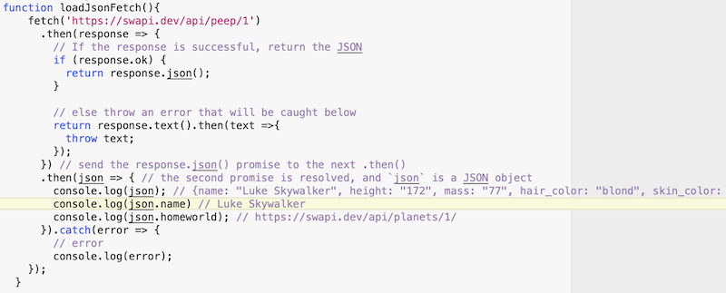
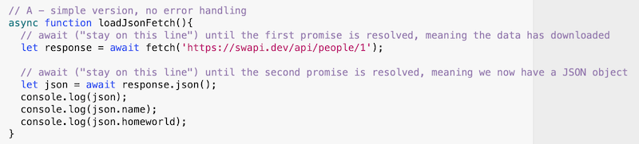
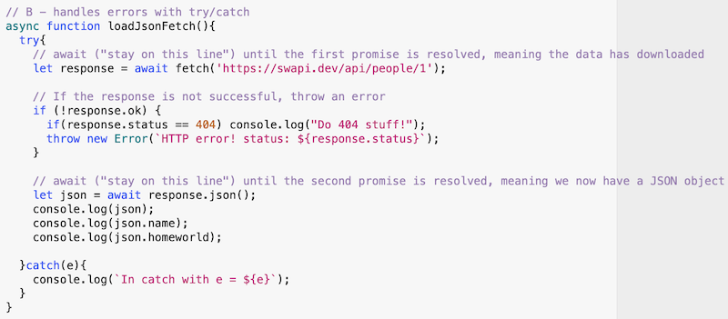
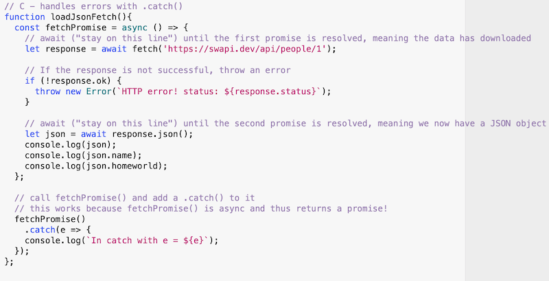

# HW - Ajax-6 - more about the `fetch()` API

## Overview

- If you find the `.then()` and `.catch()` syntax of JS promises somewhat obtuse, you might be ibnterested in learning about `asynch` and `await`, which are also designed to work with promises, and can enable a developer to write much clearer code

## I. `asynch` and `await`

- The `async` and `await` operators allow you to treat asynchronous code like synchronous code - let's walk thtough the beginning of this MDN article - https://developer.mozilla.org/en-US/docs/Learn/JavaScript/Asynchronous/Async_await - th highlights are:
  - An `async` function is a function that knows how to expect the possibility of the `await` keyword being used to invoke asynchronous code
  - An `async` function function always returns a *promise* (which is a function that wraps asynchronous code)
  - The advantage of an `async` function only becomes apparent when you combine it with the `await` keyword
  - Inside an `async` function, you can use the `await` operator in front of asynchronous code (like a `fetch()` call) to tell the function to wait for that operation to complete before executing the next line of code

## II. An example

- Let's convert some of the code from last time to from `.then()` syntax, to `async/await`:

**The final version from last time - `.then()/.catch()` code**

- XXX

### II-A. Simple `async/await` example (no error handling)

- Here we aren't doing any error handling
- GO ahead and change part of the url from "people" to "peep" and see what happens

### II-B. `async/await` example (`try/catch` for error handling)

- XXX

### II-C. `async/await` example (`.then()` for error handling)

- XXX

## III. Reference

- https://developer.mozilla.org/en-US/docs/Web/API/Fetch_API/Using_Fetch
- https://developer.mozilla.org/en-US/docs/Web/API/fetch
- https://developer.mozilla.org/en-US/docs/Learn/JavaScript/Asynchronous/Async_await#the_basics_of_asyncawait
- https://developer.mozilla.org/en-US/docs/Web/JavaScript/Reference/Statements/async_function
- https://developer.mozilla.org/en-US/docs/Web/JavaScript/Reference/Operators/await
- [JavaScript: Async on LinkedIn Learning](https://www.linkedin.com/learning/javascript-async/building-code-using-promises?u=42272537)

| <-- Previous Unit | Home | Next Unit -->
| --- | --- | --- 
|   [**HW - Ajax V**](HW-ajax-5.md)  |  [**IGME-330**](../README.md) | :-\
