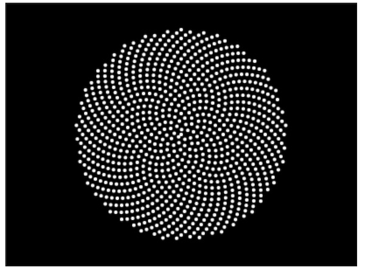
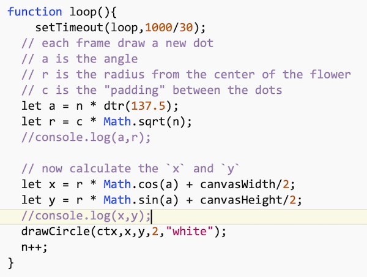

# HW - Algorithmic Botany


## I. Overview

 - In botany, phyllotaxy is the arrangement of leaves on a plant stem - these spirals form a distinctive class of patterns in nature.
 - Today we'll look at one of the [Coding Train's coding challenges written for JS/Processing](https://thecodingtrain.com/Tutorials/), and port it to JS/Canvas.
 - *Thanks to Daniel Shiffman and the Coding Train for creating all of those videos!*
 - This would be a great "starter" for Project 1!
 
## II. Lecture Resources
 - https://en.wikipedia.org/wiki/Phyllotaxis
 - http://www.algorithmicbotany.org
 - http://www.algorithmicbotany.org/papers/abop/abop-ch4.pdf:
   - (page 99) - the numbers of spirals which can be traced through a phyllotactic pattern are often integers of the [Fibonacci sequence](https://en.wikipedia.org/wiki/Fibonacci_number). This angle which is approimately 137.5&deg;, which in our code will be the "divergence angle"
   - (page 100) - the formula we will use to obtain the [polar coordinates](https://en.wikipedia.org/wiki/Polar_coordinate_system) of successive florets
   - (page 101) - an image showing the results of distinct `divergence` values
 
 
## III. Demo Instructions

- For an overview of what we are building and how it works, watch the video - Coding Train [Coding Challenge #30: Phyllotaxis (11:01)](https://thecodingtrain.com/CodingChallenges/030-phyllotaxis.html)
- Grab the start file from [HW-sine-wave.md](./HW-sine-wave.md), name it **phyllotaxis-1.html**, and start coding!

<hr>

1. Add your `window.onload = init;` call to the right place.


2. Create a "script scoped" variable named `n` that keeps track of the number of dots (florets) as we draw them. "script scoped" means that it is declared at the "top level" outside of any functions.

    `let n = 0;`


3. Also go ahead and declare the "divergence angle" in script scope:

    `const divergence = 137.5;`


4. Now create a `loop()` function that looks like this, and call it from the end of the `init()` function:

    ```js
     function loop(){
 	     setTimeout(loop,1000/30);
  
  
       n++;
    }
    ```


5. Each frame we need to draw a new dot (floret) by calculating its polar coordinates (a distance from the center "pole" - `r` below, and an angle `a` below). Add the following to the top of `loop()` - after the call to `setTimeout()`:

    ```js
    // each frame draw a new dot
    // `a` is the angle
    // `r` is the radius from the center (e.g. "Pole") of the flower
    // `c` is the "padding/spacing" between the dots
    let a = n * dtr(divergence);
    let r = c * Math.sqrt(n);
    console.log(a,r);
    ```


6. `c` is a "script scoped" variable - go declare and initialize it now:

    `const c = 4;`


7. Run this in the browser, and check the console to be sure you're getting the angle (in radians) and radius logged out. You should be seeing numbers something like this (comment out the `console.log()` when you are done):

    ```
    0 0
    2.399827721492203 4
    4.799655442984406 5.656854249492381
    7.199483164476609 6.928203230275509
    9.599310885968812 8
    ```


8. Now let's use these polar coordinates (angle and rotation) to calculate the `x` and `y`. To draw everything relative to the center of the window we will add half the width and height of the window to the `x` and `y`. Go ahead and add the following to `loop()`:

    ```js
    // now calculate the `x` and `y`
    let x = r * Math.cos(a) + canvasWidth/2;
    let y = r * Math.sin(a) + canvasHeight/2;
    console.log(x,y);
    ```


9. Run this in the browser, and check the console to be sure you're getting the `x` and `y` logged out. You should be seeing numbers something like this (comment out the `console.log()` when you are done):

    ```
    200 150
    197.0508906527595 152.70236083046265
    200.49302733372974 144.36467178877794
    204.21762289892536 155.4965131749556
    192.12153797590233 148.61081457866456
    ```


10. We've done enough so that we can now draw the dots by calling our helper function - here it is:

    ```js
    drawCircle(ctx,x,y,2,"white");
    ```


11. Run the app. You should see something like this.




12. If your code isn't co-operating, compare your `loop()` to this version.



## IV. A few enhancements

1. Let's try changing the **RGB** color based on the value of `n` - the "age" of a floret basically - run the code and see the changes:

    ```js
    let color = `rgb(${n % 256},0,255)`;
    drawCircle(ctx,x,y,2,color);
    ```
    
  
2. Try this for `color` instead - here we are changing **RGB** based on the angle of the dot:

    ```js
    let aDegrees = (n * divergence) % 256;
    let color = `rgb(${aDegrees},0,255)`;
    ```

3. Here we can vary the hue in **HSL** (Hue-Saturation-Lightness) based on what quadrant the floret is located in. Recall that the first argument of **HSL**, the hue, is a value between 0 and 360:

    ```js
    let aDegrees = (n * divergence) % 361;
    let color = `hsl(${aDegrees},100%,50%)`;
    ```

- P.S. Try out the **HSL** color picker here: https://www.w3schools.com/colors/colors_hsl.asp
 
4. Here we slowly ramp the hue based on the value of `n`

    ```js
    let color = `hsl(${n/5 % 361},100%,50%)`;
    ```

## V. Try it!

- Convert some of the ["magic numbers"](https://en.wikipedia.org/wiki/Magic_number_(programming)#Unnamed_numerical_constants) (unnamed literals like the radius of the drawn dot, and the fps of the app) to variables or constants
- Crank up the framerate - can you get the FPS to 120?
- Come up with something cool - here are some ideas, or come up with your own:
  - change the values of `c` and `divergence`, one at a time, and see what happens:
  - in `loop()`, slowly ramp up the values of  `c` and `divergence`, and of the radius of the florets
  - for some meaningful divergence angles, see page 101 of this PDF: http://www.algorithmicbotany.org/papers/abop/abop-ch4.pdf
  - periodically clear the screen and start over
  - draw a flower wherever the user clicks on the screen 

## VI. Submission
 
 - See dropbox for submission instructions
