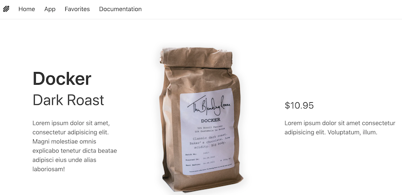
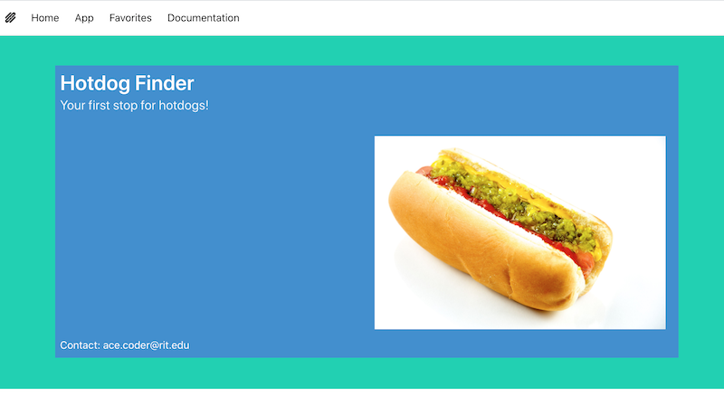

# HW - Bulma I - Intro to Bulma

## Overview
- You are going to build a fully responsive Bulma site that you can use as a starter for Project 1:
  - scroll to the end of this page to see what it will look like
  - of course, you will "add some flare" to the fonts and colors!

<hr>

- The Bulma library is here: https://bulma.io/
- "Bulma is a free, open source framework that provides ready-to-use front-end components that you can easily combine to build responsive web interfaces."
- Bulma is mobile friendly & responsive by default
- Bulma is modern - built with Flexbox - but with a much more intuitive and easy-to-use syntax for building a grid system
- Bulma doesn't use any JavaScript (unlike Bootstrap) - it's up to the developer to add it. This makes it very easy to integrate with VanillaJS, web components, Vue.js, React etc
- Using Bulma is required for Project 1
- Below, we are going to take advantage of a pre-existing YouTube tutorial on Bulma:
  - the [Net Ninja Bulma Tutorial series](https://www.youtube.com/playlist?list=PL4cUxeGkcC9iXItWKbaQxcyDT1u6E7a8a)
  - but we're not just going to say "watch this and figure out Bulma on your own"
  - instead, we'll have some companion notes for you as we walk through the first seven videos in the series, and a walkthrough on how to adapt this tutorial so that you can create a multipage responsive web site with Bulma (as a "starter" for Project 1)

<hr>

## I. Get Started - #1 - *Bulma Intro & Setup*

- Here is the link to the 1st tutorial - [Bulma CSS Tutorial (Product Page Build) #1 - Intro & Setup (07:07)](https://www.youtube.com/watch?v=SCSAExGFK1E&list=PL4cUxeGkcC9iXItWKbaQxcyDT1u6E7a8a&index=2)
- This one you can breeze through pretty quickly, but there are a few things to note (some of this repeats what we wrote above):
  - Bulma is CSS only, no JS (unlike Bootstrap)
  - Bulma is “mobile first”, so everything generally looks good on mobile by default
  - Not opinionated on how things are done, meaning it has no JS to do things like (for example) changing button states
  - Walks though/quickly demos:
    - installing VSCode’s LiveServer (which you should already have installed)
    - using Emmet (an autocomplete API that VSCode uses) - https://emmet.io/
  - Setting up the **index.html** start page:
    - Starter Template is here - https://bulma.io/documentation/overview/start/
    - note that we need the `<link>` tag to import the Bulma library
    - note that Bulma has styles that override the default browser styles - these are applied by default:
      - see the changes to the `<h1>` "Hello Bulma!!!" text in the window
      - look in the web inspector, you can see that Bulma styles `<h1>`, `<h2>`, `<h3>` through `<h6>` tags the same
      - also see how links are styled differently - there's no underline, and you have a default `:hover` affect applied
    - for your convenience, here is the starter code:

**index-1.html**

```html
<html lang="en">
<head>
  <meta charset="UTF-8">
  <meta http-equiv="X-UA-Compatible" content="IE=edge">
  <meta name="viewport" content="width=device-width, initial-scale=1.0">
  <title>Ninja Coffee</title>
  <link rel="stylesheet" href="https://cdn.jsdelivr.net/npm/bulma@0.9.3/css/bulma.min.css">
</head>
<body>
  <h1>Hello Bulma!!!</h1>
</body>
</html>
```

- all of the course files are here (look for the pull-down to access the files for each video): https://github.com/iamshaunjp/bulma-ui-build
- that's it - go ahead and save the changes to **index-1.html** and move on

<hr>

## II. #2 - *Bulma Fonts & Colours*
- Here is the link to the 2nd tutorial - [Bulma Tutorial (Product Page Build) #2 - Fonts & Colours (09:52)](https://www.youtube.com/watch?v=j9ijz7u_M_o&list=PL4cUxeGkcC9iXItWKbaQxcyDT1u6E7a8a&index=2)
- This tutorial will walk through how to specify different font styles and colors
- Make a copy of **index-1.html** and name it **index-2.html**
- Paste the following into the `<body>` of **index-2.html** (get rid of the `<h1>` and `<a>` tags from the previous video)
- Preview **index-2.html** in the browser, note how Bulma has styled all of the text of these elements to be the same size
- We are going to change that - follow along with the video and add the various Bulma classes to the elements below

```html
  <!-- fonts -->
  <h1>Hello, Bulma</h1>
  <h2>Hello, Bulma</h2>
  <h3>Hello, Bulma</h3>
  <h4>Hello, Bulma</h4>

  <p>Hello again</p>
  <p>Hello again</p>
  <p>Hello again</p>
  <p>Hello again</p>

  <h2>Title</h2>
  <h3>Subtitle</h3>

  <!-- colours -->
  <p>I'm primary text</p>
  <p>I'm warning text</p>
  <p>I'm danger text</p>
  <p>I'm info text</p>
  <p>I'm success text</p>
  <p>I'm dark text</p>
  <p>I'm light text</p>
```

### II-A. Summary

**Typography & Color Docs here:**
- https://bulma.io/documentation/helpers/typography-helpers/
- https://bulma.io/documentation/helpers/color-helpers/

<br>

- `is-size-1` through `is-size-7` - 1 is the largest
- `is-uppercase` & `is-italic` & `is-lowercase` - there is also  `is-capitalized` & `is-underlined`
- `has-text-weight-bold` & `has-text-weight-light` - *light* is a color qualifier, *bold* is a text weight qualifier
- `title` & `subtitle` - *title* is large and bold, *subtitle* is smaller and less bold
- BTW - I don't think it's mentioned in the video, but elements can belong to (i.e. apply) multiple CSS classes - multiple class names will need to be separated by a space

<br>

- `has-text-centered` & `has-text-right`

<br>

- `has-text-primary` - greenish text
- `has-text-warning`  - yellowish test
- `has-text-danger` - reddish text
- `has-text-info`  - blueish text
- `has-text-success` - light-green text
- `has-text-dark` - dark text
- `has-text-light` - light gray text (we can't see it on a white background)

<br>

- `has-text-danger-dark` - dark red text
- `has-text-danger-light` - light red text

<br>

- `has-background-light` - light gray background
- `has-background-danger` - reddish background
- `has-background-danger-light` - can still use color qualifiers on background
- `has-background-primary-dark` - can still use color qualifiers on background


**That's It! Be sure to save these changes to index-2.html, and look over the Typography & Color documentation pages linked above!**

<hr>

## III. #3 - *Spacing & Containers*

- Here is the link to the 3rd tutorial - [Bulma Tutorial (Product Page Build) #3 - Spacing & Containers (06:18)](https://www.youtube.com/watch?v=--gQv_IXcMw&list=PL4cUxeGkcC9iXItWKbaQxcyDT1u6E7a8a&index=3)
- This tutorial will walk through how to add margin and padding to elements using Bulma, and will introduce us to the `section` and `container` classes
- Make a copy of **index-2.html** and name it **index-3.html**
- Paste the following into the `<body>` of **index-3.html** (first, get rid of the tags from the previous video)

```html
<!-- spacing -->

<h1 class="">Hello, Bulma</h1>
<h1 class="">Hello, Bulma</h1>
<h1 class="">Hello, Bulma</h1>
```

### III-A. Summary

**Spacing Docs here:**
- https://bulma.io/documentation/helpers/spacing-helpers/
- https://bulma.io/documentation/layout/section/
- https://bulma.io/documentation/layout/container/

<br>

- `px-6` - padding x (left AND right)
- `py-6` - padding y (top AND bottom)
- `mx-6` - margin x (left AND right)
- `my-6` - margin y (top AND bottom)
- `mt-6` - margin top
- `mb-6` - margin bottom
- `ml-6` - margin left
- `mr-6` - margin right
- `pt-6` - padding top
- `pb-6` - padding bottom
- `pl-6` - padding left
- `pr-6` - padding right

<br>

- `section` class:
  - note use of Emmet & `lorem30`
  - adds padding around the element - check the browser window and web inspector to see how much
  - `section` class can be applied to a `<div>` to, not just a `<section>` tag
  - note that the `section` class makes the element stretch across the screen

<br>

- `container` class:
  - adds centering with `margin-right: 0` & `margin-left: 0`
  - has a `max-width` of `960px`


**That's It! Be sure to save these changes to index-3.html, and look over the Spacing documentation page linked above!**

<hr>

## IV. #4 - *Navbar (desktop)*

- Here is the link to the 4th tutorial - [Bulma Tutorial (Product Page Build) #4 - Navbar (desktop) (06:40)](https://www.youtube.com/watch?v=HmfQq0suMSA&list=PL4cUxeGkcC9iXItWKbaQxcyDT1u6E7a8a&index=4)
- This tutorial will walk through how to build a Bulma `Navbar`
- Make a copy of **index-3.html** and name it **index-4.html**
- Delete all of the elements in the `<body>` of **index-4.html** and start fresh


### IV-A. Summary

**Navbar Docs here:**
- https://bulma.io/documentation/components/navbar/
- Structuring these is a little confusing, so pay close attention to the video, and look at the examples in the link above

<br>

- In this video will build a simple `Navbar` with a logo and 2 links 
- `navbar` class - the **main** container
  - look in web inspector - see that it uses `position: relative`
- `navbar-brand` - the **left side**, always visible, which usually contains the logo and optionally some links or icons
- `navbar-item` -  each **single item** of the navbar, which can either be an `<a>` or a `<div>`
  - BTW - the Ninja Coffee logo is here: https://github.com/iamshaunjp/bulma-ui-build/tree/lesson-4/assets
  - `style="max-height: 70px"` increases the height of the item, and thus the entire navbar
  - `class="py-2 px-2”` added some padding for us
- `navbar-menu` - the **right side**, hidden on touch devices, visible on desktop
- `navbar-start` - the **left part** of the menu, which appears next to the navbar brand on desktop
- `navbar-end` - the **right part** of the menu, which appears at the end of the navbar
- added `has-shadow` to `<nav>` to give it a very light shadow on its border
- added `is-primary` and then `is-white` to `<nav>`

<br>

- all done - be sure to save all of the changes
- notice that when the window width is less that `1024px` the right side menu items disappear - what happens is that the `<div>` of class `navbar-menu` becomes `display: none`
- this is normal Bulma behavior, and in the next part we'll add mobile support by putting these links under a hamburger menu

<hr>

## V. #5 - *Navbar (for mobiles)*

- Here is the link to the 5th tutorial - [Bulma Tutorial (Product Page Build) #5 - Navbar (for mobiles) (04:59)](https://www.youtube.com/watch?v=qvn2SxGvyPs&list=PL4cUxeGkcC9iXItWKbaQxcyDT1u6E7a8a&index=5&pp=QAFIAw%3D%3D)
- This tutorial will walk through how to build a burger icon to show the `navbar-menu` links on smaller screened mobile devices
- Make a copy of **index-4.html** and name it **index-5.html**


### V-A. Summary

**Navbar Docs here:**
- https://bulma.io/documentation/components/navbar/
- We will need to write JavaScript to show/hide the burger icon - Bulma won't do that for us

<br>

- `navbar-burger` - the **hamburger** icon, which toggles the `navbar-menu` on touch devices
  - test it in the browser, on window sizes of less than `1024px`, the `navbar-menu` will disappear and be replaced by `navbar-burger` 
- if we look in the inspector, we can see that when the window is mall and the hamburger is visible, the `navbar-menu` items are not visible by default
  - but if `navbar-menu` has an `is-active` class, it IS visible
  - so - all our JS has to do to get the `navbar-menu` to show up is to toggle the `is-active` class
  - we will do this when the burger is clicked

<br>

- Create **index.js** and link to it from your HTML
- Complete the code, and don't forget to add an `id="burger"` to your HTML
- **Power Tip** - make sure that the `#burger` link does NOT have an `href` attribute
- When it's working perfectly, save everything and move on


<hr>

## VI. #6 - *Breadcrumbs*

- Here is the link to the 6th tutorial - [Bulma Tutorial (Product Page Build) #6 - Breadcrumbs (05:04)](https://www.youtube.com/watch?v=Kt8_Uu77_tg&list=PL4cUxeGkcC9iXItWKbaQxcyDT1u6E7a8a&index=6)
- This tutorial will walk through how to build a breadcrumb navigation system
- Make a copy of **index-5.html** and name it **index-6.html**

### VI-A. Summary

**Breadcrumb Docs here:**
- https://bulma.io/documentation/components/breadcrumb/

<br>

- `breadcrumb` - The Bulma `breadcrumb` is a simple navigation component that only requires a breadcrumb container and a `<ul>` list. The dividers are automatically created in the content of the `::before` pseudo-element of `<li>` tags
- `has-bullet-separator`
- `has-arrow-separator`
- `is-active` - You can inform the current page using the `is-active` modifier in a `<li>` tag
- `has-text-grey`

<br>

- This one won't take too long, save it and move on

<hr>

## VII. #7 - *Grid Columns*

- Here is the link to the 7th tutorial - [Bulma Tutorial (Product Page Build) #7 - Grid Columns (08:24)](https://www.youtube.com/watch?v=feGMqVSRnmI&list=PL4cUxeGkcC9iXItWKbaQxcyDT1u6E7a8a&index=7)

- This tutorial will walk through how to set up a 3 column gird, with different width columns
- Make a copy of **index-6.html** and name it **index-7.html**

### VII-A. Summary

**Columns Docs here:**
- https://bulma.io/documentation/columns/
- https://bulma.io/documentation/columns/basics/
- https://bulma.io/documentation/columns/sizes/

<br>

- Bulma uses CSS flexbox to create a grid system where we can easily specify the number of columns
- Building a columns layout with Bulma is very simple:
  - Add a columns container
  - Add as many column elements as you want
  - Each column will have an equal width, no matter the number of columns
  - Below is an example of a 4-column layout (you don't need to type this in)

```html
<div class="columns">
  <div class="column">
    First column
  </div>
  <div class="column">
    Second column
  </div>
  <div class="column">
    Third column
  </div>
  <div class="column">
    Fourth column
  </div>
</div>
```

<br>

**Demo code from video:**

- `column` - brings everything into a central column (as mentioned back in Video #3) 
- `columns`  - a container for 1 or more `column` elements
- Bulma typically uses a 12 column grid layout, and we can specify the width of the column (as a fraction of 12) if we don't want them all to be the same width
  - `column is-2`, `column is-7`, `column is-3` - adds up to 12
- Note that when we shrink the window to mobile size, these columns aiutomatically stack on top of each other:
  - the next video gets into how to get more fine-grained control over how columns display in different screen sizes
- BTW - "Product" image is here - https://github.com/iamshaunjp/bulma-ui-build/tree/lesson-7/assets
- `has-text-centered` - here we used it to center the image
- `columns is-vcentered` - used to vertically center all of the `column` elements

<br>

- When you are done, be sure to check out all of that responsiveness you got for free!
- Save the file and continue

<hr><hr>

## Wrap up - let's create a Project 1 Bulma Template

- There are 8 more videos - covering things such as the styling of form fields and buttons - and you might want to look at these at some point
- But let's stop watching these videos for now, and build out our Project 1 Bulma Template

- Make a copy of **index-7.html** and name it **home.html** and then go through the following steps:

### Step #1

- Change the page `<title>` to "Hotdog Finder"

<hr>

### Step #2

- Delete the entire breadcrumb `<div>`

<hr>

### Step #3

- Let's work on the `<nav>`

#### Step #3A

- For the `navbar-brand` - let’s use font awesome instead of an image
- https://fontawesome.com/v5.15/icons/hotdog?style=solid
- Replace the `navbar-item` (the one inside of `navbar-brand` with:

```html
<a class="navbar-item" href="home.html">
  <i class="fas fa-hotdog"></i>
</a>
```

- You will also need to import the font-awesome library:

```html
<link rel="stylesheet" href="https://cdnjs.cloudflare.com/ajax/libs/font-awesome/5.15.3/css/all.min.css" integrity="sha512-iBBXm8fW90+nuLcSKlbmrPcLa0OT92xO1BIsZ+ywDWZCvqsWgccV3gFoRBv0z+8dLJgyAHIhR35VZc2oM/gI1w==" crossorigin="anonymous" referrerpolicy="no-referrer" />
```

- Test it to be sure that the hotdog icon is appearing on the left side of the navbar

#### Step #3B

- Leave `#burger` alone

#### Step #3C

- Replace the contents of the `#nav-links` div with this:


```html
<div class="navbar-start">
	<a class="navbar-item">
		Home
	</a>

	<a class="navbar-item is-hoverable" href="app.html">
		App
	</a>

	<a class="navbar-item is-hoverable" href="favorites.html">
		Favorites
	</a>

	<a class="navbar-item is-hoverable" href="documentation.html">
		Documentation
	</a>
</div> <!-- end navbar-start -->
```

- Note that because we are now using the class of `navbar-start` instead of `navbar-end`, the menu is now on the left side of the page, rather than the right side
- Save and load the page, it should look like this



<hr>

### Step #4 - Do you want to be a `hero` ?

- Being that this is the home page, let's replace the 3-column layout with a one column layout and a `hero`
  - A **hero** is an imposing banner to showcase something
  - https://bulma.io/documentation/layout/hero/
- Replace the 3 `column` divs with this single `column`:
  
```html
<div class="column">  
	<div class="hero is-large is-info p-2">
		<div class="hero-head">
			<p class="title">
			  Hotdog Finder
			</p>
			<p class="subtitle">
			  Your first stop for hotdogs!
			</p>
			
		</div>
		<div class="hero-footer">Contact: ace.coder@rit.edu</div>
	</div>
</div>
```

- add `has-background-primary` to the `section`

- Save and load the page, it should look like this



- if the 2-tone landing page leaves you cold:
  - delete the `<section class="section ...` and `<div class="container">` elements
  - on the `hero`, change `is-info` to `is-primary`
  - BTW - there is a `hero-body` class that might come in handy in your future "hero" work
  - now it should look like this - with a full-sized `hero` filling the bottom of the page:


- And here is the responsive version:


<hr>

### Step #5
- Now it's all up to you!
- Duplicate these pages and give them the appropriate file names
- Come up with your own styles and custom font(s)!
- **IMPORTANT**:  ditch the `hero` on the other 3 pages - and use a multi-column layout where appropriate - refer back to **index-7.html** to recover the necessary HTML/CSS
- **IMPORTANT**: be sure to have "You are here" cues on each page - hint: `<h1 class="title is-size-4">Hotdog Finder App</h1>` could go on **app.html**

<hr><hr>

Next --> [**Bulma II - Bulma & Web Components**](HW-bulma-2.md)  
