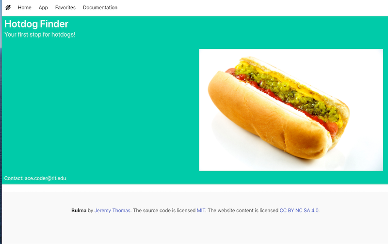
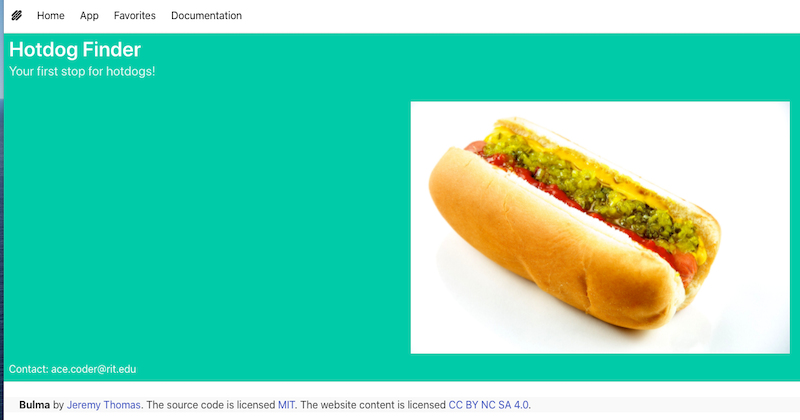
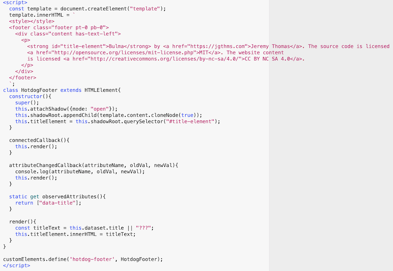
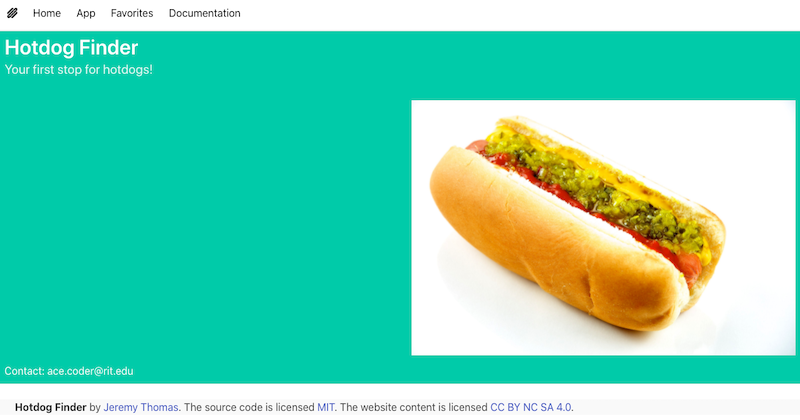

# HW - Bulma II - Bulma & Web Components

## Overview

- We are going to run through how to add a Web Component to **home.html** from last time

## I. Create a Bulma `footer`

- Let's add a `footer` to our P1 Bulma Template
- The Bulma **footer** is a simple container, with lots of bottom padding, making it great as the last element of any webpage.
- Make a copy of **home.html** and name it **home-wc.html**

### Step #1 - get the HTML

- We will make it easy for ourselves and grab the `footer` code from the Bulma web site:
  - https://bulma.io/documentation/layout/footer/
  - grab the example, and paste it into **home-wc.html**, AFTER the closing `<div>` of `columns`
  - and here it is, just in case the docs get changed anytime soon:

```html
<footer class="footer">
  <div class="content has-text-centered">
    <p>
      <strong>Bulma</strong> by <a href="https://jgthms.com">Jeremy Thomas</a>. The source code is licensed
      <a href="http://opensource.org/licenses/mit-license.php">MIT</a>. The website content
      is licensed <a href="http://creativecommons.org/licenses/by-nc-sa/4.0/">CC BY NC SA 4.0</a>.
    </p>
  </div>
</footer>
```

- go ahead and preview it - you should see the following - note how the text is centered and that there is a large amount of white space at the bottom of the page:



### Step #2 - Add some Bulma classes

- let's tighten this up and get rid of some of that white space
  - to remove the top and bottom padding in the `<footer>`,  add `pt-0 pb-0` to the `<footer>` element's `class=`
  - look for `has-text-centered` and change it to `has-text-left`
  - it should look like this:



<hr>

## II. Convert it to a Web Component

- Now we will convert this "Bulma footer" to a web component

### Step #1 - Get ready

- Comment out all the `<footer></footer>` HTML
- Replace it with:

```html
<hotdog-footer data-title="Hotdog Finder"></hotdog-footer>
```

### Step #2 - Create the `<hotdog-footer>` component code

- Below is the `HotdogFooter` component code - the HTML part you can copy/paste from the previous `<footer>` code - and note that we've added a `id="title-element"` to that HTML



- Once it's working, it should look like the screenshot below
- Note that many of the Bulma styles have "broken through" the shadow DOM (where the root styles have been redeclared by Bulma)


- ... but ... the alignment and padding are off from what we hand before
- how to fix it?
- the simplest way is to import Bulma into the component directly - go ahead and add the `<link>` tag for the Bulma librrary to the top of the `<template>` HTML, right above the `<style>`
- Preview it one more time, you should be good to go!




<hr><hr>

[**&lt;-- Previous - Bulma I - Intro to Bulma**](HW-bulma-1.md)
