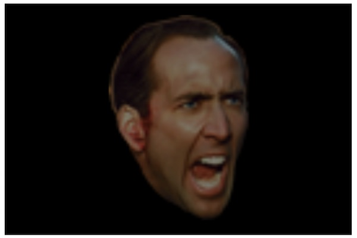
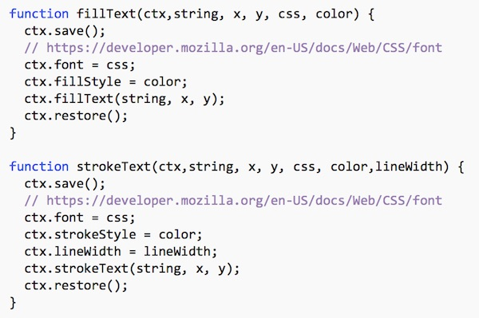
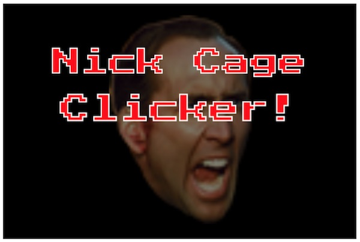
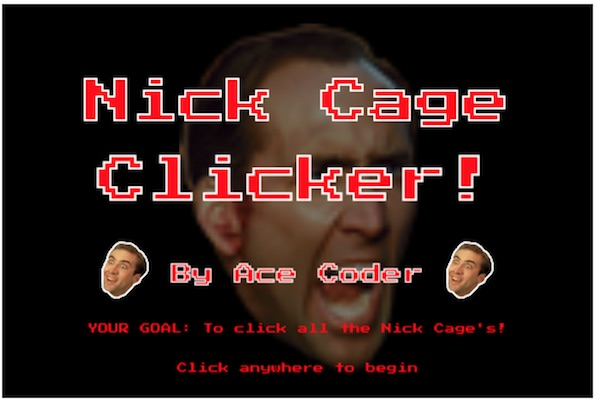

# HW - *Cage Clicker* Canvas Game


## I. Overview
You will build this "Nick Cage" clicker game as an exercise. It will cover the following concepts:

- ES6 Modules & Classes
- Custom Sprites
- Custom Fonts
- Playing Sound
- Handling mouse events
- Game "screens" (start, main, level over, game over) handled with a simple state machine
- Scoring
- A countdown timer
- Game Levels
- Transpiling from ES6 to ES5 


- A completed version of the game can be seen and played here: http://igm.rit.edu/~acjvks/courses/2018-spring/330/code-examples/js-module-demos/HW-cage-clicker-dist/
- The done files are here: [HW-cage-clicker-done.zip](./_files/HW-cage-clicker-done.zip)

## II. Architecture

First, [download the start files](./_files/HW-cage-clicker-start.zip), then open them up to see how they are organized:

<pre>
  - index.html
  - images
      - cage-55x80.png
      - cage-167x206.png
      - ... 
  - sounds
      - bonk.mp3
      - fireball.mp3
      - ...
  - src
      - helpers.js
      - ImageSprite.js
      - loader.js
      - main.js
      - Rect.js
      - Sprite.js
      - utilities.js
</pre>

- **index.html** - links to the custom font, and points at *loader.js*
- **helpers.js** - will have `loadImages()` and `creaetImageSprites()` helper methods
- **ImageSprite.js** - to be created, contains the `ImageSprite` class
- **loader.js** - the entry point to the application - it pre-loads all of the images we need before calling `init()` (which is located in `main.js`, and starts the game)
- **main.js** - manages the game state, game screens, scoring, and so on
- **Rect.js** - to be created, contains the `Rect` class, which is a "convenience" class that is used when we check to see which sprite has been clicked 
- **Sprite.js** - to be created, contains the `Sprite` class
- **utilities.js** - contains `getRandomUnitVector()`, `getRandom()`, and `getMouse()`

## III. Run the start files
- because we are using ES6 modules, you will need to run this project off of a web server
- when you load the page, you should see a black rectangle in the window - this is the main game screen.
- open the console, you should see logs indicating that 6 of the images have loaded:
    - `loadImages()` is called in *loader.js*, and is defined in *helpers.js*. Look this code over so that you understand what is going on.
    - Once the images are loaded, `init(imageData)` is called, which passes the loaded images to the `init()` method in *main.js*
    - in *main.js*, you will see that the game loop is set up, and `drawHUD()` is called
    - `drawHUD()` has a switch statement that draws the UI based on what the current `gameState` is. Currently that value is `GameState.START`
    
    
 ## IV. Get started! Pre-load a different image.
 
 1. Find another image on the web (around 80x80 in size) that you would like to use as in lieu of one of the "not Cage" images.
 1. Add that image to your *images* folder
 1. In *loader.js*, add a key:value to the `imageSources` object that will enable this image to be loaded
 1. Check the console to verify that the image loaded
 1. At some point before you complete *Cage Clicker*, utilize this image instead of one of the default images we gave you.
 
 
 ## V. Get working on the Start Screen
 
 - We are first going to work on implementing parts of `drawHUD()` - note the `gameState` switch.
 - Note that we have already created a "constant" object called `GameState`, and gave it value of type `Symbol` - which is a new primitive type for ES6.
 
 ```js
 // fake enum
const GameState = Object.freeze({
    START:      Symbol("START"),
    MAIN:       Symbol("MAIN"),
    LEVELOVER:  Symbol("LEVELOVER"),
    GAMEOVER:   Symbol("GAMEOVER")
});
 ```
 
 Every `Symbol` value returned from `Symbol()` is unique.  Another really cool use case is that values of this type can be used to make object properties that are anonymous. 
 
 - https://developer.mozilla.org/en-US/docs/Web/JavaScript/Reference/Global_Objects/Symbol
 - https://developer.mozilla.org/en-US/docs/Glossary/Symbol
 
 ### V-A. Now Head to `drawHUD()`

In the  `case GameState.START:` case of `drawHUD()`, let's get our start screen working.

1. First we will draw the background image (which is `imageData.cage2`, a pre-loaded image)

```js
// Draw background
ctx.translate(screenWidth/2,screenHeight/2);
ctx.scale(6,6);
ctx.globalAlpha = 0.5;
ctx.drawImage(imageData.cage2,-20,-30,41,59);
ctx.restore();
```

- Note that above we are using translate(), scale, and drawImage() in those very clever ways we have previously discussed to get them to draw the image from the center. 

**Reload the page, you should see this:**




2. To draw the text, you need to create a couple of handy helper functions - `fillText()` and `strokeText()` - we are going to make you type these in yourself (add them to the end of *main.js*):



- Reload the page to be sure you don't have any syntax errors

3. Now you can call these functions and create the game title text - continue working in the `case GameState.START:` case of `drawHUD()`:

```js
// Draw Text
ctx.textAlign = "center";
ctx.textBaseline = "middle";
fillText(ctx,"Nick Cage", screenWidth/2, screenHeight/2-100, "36pt 'Press Start 2P', cursive", "red");
strokeText(ctx,"Nick Cage", screenWidth/2, screenHeight/2-100, "36pt 'Press Start 2P', cursive", "white",2);
fillText(ctx,"Clicker!", screenWidth/2, screenHeight/2-20, "38pt 'Press Start 2P', cursive", "red");
strokeText(ctx,"Clicker!", screenWidth/2, screenHeight/2-20, "38pt 'Press Start 2P', cursive", "white",2);
```

**Reload the page, you should see the title text:**




4. To get the two additional "cage" images that are shown in the completed version (linked above in **I. Overview**), add this code:

```js
ctx.drawImage(imageData.cage1,100,screenHeight/2+40,50,60);
ctx.drawImage(imageData.cage1,screenWidth-100-50,screenHeight/2+40,50,60);
```

**Reload the page, you should see see two more cage images**

5. You will now need to write the code to display:
- the game creator's name - use your own name or a pseudonym
- the "YOUR GOAL" text
- the "Click anywhere to begin" text

**Reload the page, it should look something like this:**



**PS - If you want to change the font choices, colors, and screen layout -  feel free!!**

## VI. Navigating from the Start Screen to the Main Screen

- The "main screen" is where the game will be played
- We already have a `onmousedown` event handler for the `canvas`, and a `doMousedown` function that gets called
- Click on on the canvas and check the console, note how coordinates are logged out twice:
    - the first log is the mouse event in `window` coordinates
    - the second log is the mouse event in `canvas` coordinates, which we will need later when we need to determine if a sprite was clicked on or not. The `getMouse()` helper function makes this window->canvas conversion for us.
- Let's write code that recognizes when the player clicks anywhere on the start screen, the app will navigate to the game screen:

1. In `doMousedown()`, add the following switch statement for `gameState`:

```js
switch(gameState){
			case GameState.START:
				currentLevel = 1;
				totalScore = 0;
				levelScore = 0;
				cageCount = 0;
				gameState = GameState.MAIN;
				loadLevel(currentLevel);
				break;
				
			case GameState.MAIN:
				// TODO
				break;
				
			case GameState.LEVELOVER:	
					// TODO
				break;
				
			case GameState.GAMEOVER:
				gameState = GameState.START;
				break;
				
			default:
				throw new Error(MyErrors.mousedownSwitch);
	} // end switch
```

**Reload the page and test it by clicking on the screen**
- Error! If you check the console, you will see that `totalScore`, `levelScore`, and `cageCount` were never declared
- Go to the top section of *main.js* and declare them now - use 'let'
- Reload the page, when you click you should now get that initial black rectangle, and we hope this means that the `drawHUD()` case of `case GameState.MAIN:` has been reached - but you should put in a breakpoint to be sure.


**Once everything works, move on to the next chapter, where we will begin to code the main game screen**

## VII. New Concepts Covered

Some new concepts that we covered in this chapter:
- Creating constant values with `const` (which prohibits changing a reference) and `Object.freeze()` (which prohibits modifying or adding properties to an object)
- Using `Symbol()` to create unique values for our "enum"
- An image `pre-loader` - we didn't talk about how the code works, but you need to go look at it!

<hr><hr>

**[Next Chapter -> Cage Clicker Part II](HW-cage-clicker-2.md)**
