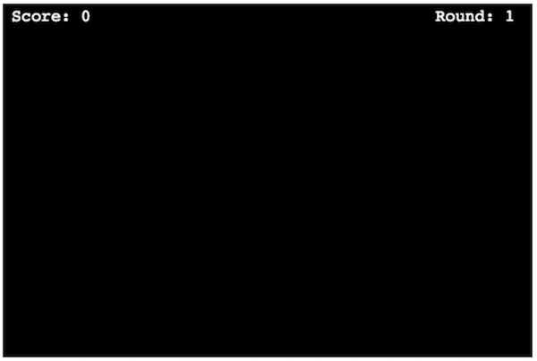
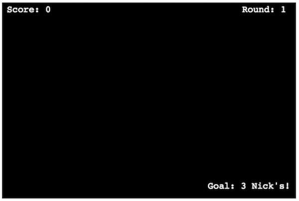
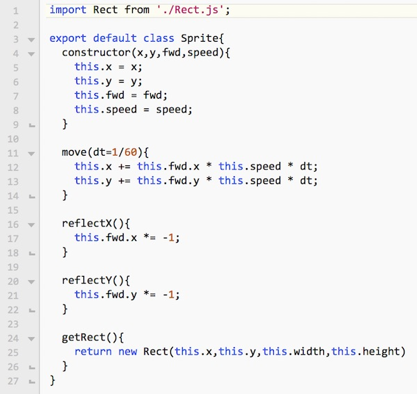
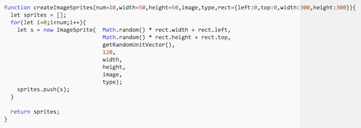
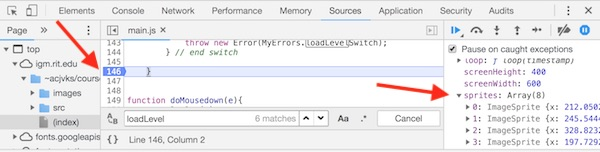
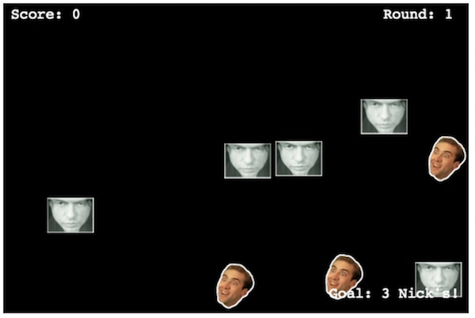
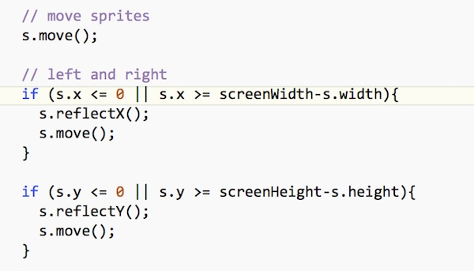

# HW - *Cage Clicker* Part II

Here we will add:
 - a visible game screen with:
   - a HUD that displays information on the game such as the game round, level goal, the score, and (eventually) the time remaining for the level
   - visible game elements that we can interact with - i.e. sprites!

## I. Drawing the HUD for the main screen

Let's start by drawing the HUD (score, level, etc) for the main screen:

1. Add the following to `case GameState.MAIN` in `drawHUD()`:

```js
fillText(ctx,`Score: ${levelScore}`, 10, 20, "14pt courier", "white");
fillText(ctx,`Round: ${currentLevel}`, screenWidth - 110, 20, "14pt courier", "white");
```

- Note: above we are using [ES6 Template Literals](https://developer.mozilla.org/en-US/docs/Web/JavaScript/Reference/Template_literals), rather than string contatenation, to create the score and round strings.

**Reload the page, click on the start screen, the main screen should load and look like this:**




2. Here's another part of the HUD - the "goal" - i.e. the number of "cages" we need to click on to get through a level.

```js
fillText(ctx,`Goal: ${levelGoal} Nick's!`, screenWidth-180, screenHeight-20, "14pt courier", "white");
```

- When you reload the page you will get an error and not see the text - because `levelGoal` was never declared - go ahead and do so near the top of *main.js* - like you did with those other module variables in chapter 1. If you don't give it a value, the HUD will say it's `undefined`, biut that's OK because we are going to give it a value (depending on the `currentLevel`) next.

## II. Implementing `loadLevel()`

- Next up is implementing `loadLevel()`.
- Recall that `loadLevel()` is getting called in `doMousedown()` whenever we click the mouse on the start screen
- Currently  `loadLevel()` is an empty stub, let's go add some code now!

1. Add the following to `loadLevel()`:

```js
levelScore = 0;
cageCount = 0;
let margin = 50;
let rect = {left: margin, top: margin, width: screenWidth - margin*2, height: screenHeight-margin*3}
sprites = [];
switch(currentLevel){
		case 1:
		// 3 Nick Cage's, 5 others
		/*
		sprites = sprites.concat(	
			createImageSprites(3,50,60,imageData.cage1,"cage",rect),
			createImageSprites(5,60,45,imageData.tommy1,"tommy",rect)
		);
		*/
		levelGoal = 3;
		levelTarget = "cage";
		vectorChangeProb = .005;
		levelTimeLimit = 5;
		break;
				
		default:
		throw new Error(MyErrors.loadLevelSwitch);
} // end switch
```
- Note that we are deliberately commenting out the calls to `createImageSprites()` for now
- When you reload the page, error! There are more variables you need to declare!

2. As before, declare `levelTarget`, `vectorChangeProb` and `levelTimeLimit` at the top of *main.js* - we will be using these variables soon!

**To verify that our level data has been loaded, reload the page, you should now see a "Goal" of 3 displayed in the bottom right corner:**




## III. Creating our Sprite classes

We actually have 3 sprite classes that need to be implemented:

- `Rect` - has `.x`, `.y`, `.width`, and `.height` fields
- `Sprite` - inherits from `Rect` - adds `move()`, `reflectX()`, and `reflectY()` methods
- `ImageSprite` - inherits from `Sprite` - adds a `draw()` method - so we can actually see it on the screen

1. The base class for our sprite objects (e.g. the Cage, Tommy, Garofolo, and Franco sprites) is going to be named `Rect` and contained in a new file named **Rect.js**, it looks like this:

**src/Rect.js**
```js
export default class Rect {
  constructor(x,y,width,height) {
  	this.x = x;
  	this.y = y;
  	this.width = width;
    this.height = height;
  }
  
  // http://24bitjs.com/2014-11-how-to-detect-if-a-point-is-inside-a-rectangle-in-javascript/
	containsPoint(point) {
		if (this.width <= 0 || this.height <= 0) return false;
		return (point.x >= this.x && point.x <= this.x + this.width && point.y >= this.y && point.y <= this.y + this.height);
	}
  
}
```

2. Next, here is our `Sprite` class that inherits from `Rect` - we are going to give you the pleasure of typing it in:

**src/Sprite.js**




3. Lastly, this is our `ImageSprite` class that inherits from `Sprite` - we are going to give you the pleasure of typing it in:

**src/ImageSprite.js**


4. And now we need to implement our helper method that will create instances of `ImageSprite` for us. Add the following to *helpers.js*:



- **IMPORTANT:** Be sure to add code in *helpers.js* that will `import` the `ImageSprite` class from `ImageSprite.js`


## IV. Creating `ImageSprite` instances

1. In *main.js* go ahead and uncomment the code that calls our helper method, creates the sprites and adds them to the `sprites` array

- Reload the page. You should get an error - **`Uncaught ReferenceError: createImageSprites is not defined`**

2. Oops, we forgot to **export** `createImageSprites()`:
  - head back to *helpers.js* and do that now
  - you will also need to **import** `createImageSprites` at the top of *main.js*

3. Reload the page, and click the start screen to advance to the main screen. We won't see any sprites on the screen yet (because we haven't drawn them yet), but how can we be sure that the `sprites` array has been populated?
  - Go ahead and open the JavaScript console and type in `sprites` to see if that works like it used to. FAIL! **`ReferenceError: sprites is not defined`** - this happens because all of our code is scoped to the module where it was declared.
  - Instead, set a breakpoint at the end of `loadLevel()`, and then verify that the contents of the `sprites` array contains multiple `ImageSprite` instances:



## IV. Drawing our `ImageSprite` instances

- Now let's write code that calls the `draw()` method of `ImageSprite` - add the following to `loop()` in *main.js*:

```js
// draw game sprites
if (gameState == GameState.MAIN){
	// loop through sprites
	for (let s of sprites){
		// draw sprites
		s.draw(ctx);
	
	} // end for
} // end if
```

- Reload the page, you should now see our 8 `ImageSprite` instances are drawn to the screen:




## V. Moving our `ImageSprite` instances

- To get these sprites moving and "bouncing", add the following code to the "iterate over sprites array" loop above, right before we call `s.draw()`:



- to get these sprites periodically changing direction (and making them harder to click), add this line of code to the sprite loop:

```js
if (Math.random() < vectorChangeProb)	s.fwd = getRandomUnitVector();
// note: getRandomUnitVector() is imported at the top from utilities.js
```


<hr><hr>

**[Previous Chapter <- Cage Clicker Part I](HW-cage-clicker-1.md)**

**[Next Chapter -> Cage Clicker Part III](HW-cage-clicker-3.md)**
