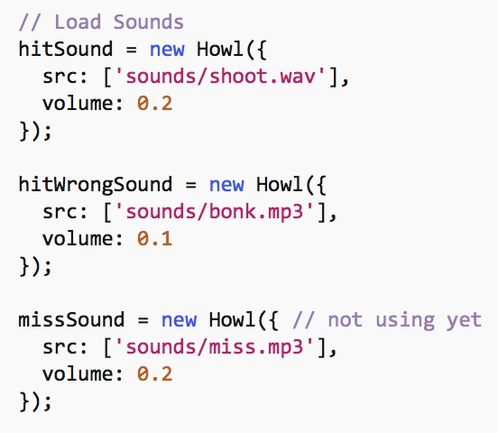
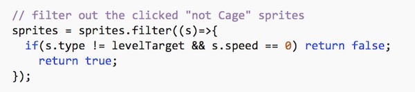
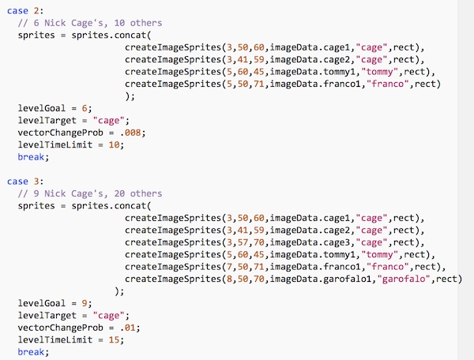

# HW - *Cage Clicker* Part III

In this chapter we will:
  - add the ability to click the sprites
  - add incidental sound
  - remove the clicked "not-cage" sprites from the screen
  - advance to a new level of the game when all of the cages are clicked
  - end the game once we have completed the 3 levels
  

## I. Clicking Sprites

- The `doMousedown` function is already handling navigating from the *start screen* to the main game screen - that code is in the `case GameState.START` section
- We now want to get the code handling clicking on the *main game screen*. Every time the use presses the mouse button, we will check to see if they clicked a sprite

1. Add the following to the `doMousedown` function, under `case GameState.MAIN:`

```js
// we are going to loop through the array backwards so we check the sprites that are "on top" first
for (let i = sprites.length - 1; i >= 0; --i) {
	let s = sprites[i];
	if (s.getRect().containsPoint(mouse)){
		if (s.speed == 0) continue; // don't score the sprite if it's already been clicked
		if (s.type != levelTarget){
			// don't score the sprite if it is the wrong type
			levelScore --;
			totalScore --;
			s.speed = 0;
		//	hitWrongSound.play(); // we will write the sound code later
			break; // break out of loop so that we only penalize one sprite per click
		}
		s.speed = 0;
		cageCount ++;
		levelScore ++;
		totalScore ++;
	//	hitSound.play(); // we will write the sound code later
		break; // break out of loop so that we only score one sprite per click
	}
} // end for loop
```

- The starter code is really helping you out here as sprites already have a `getRect()` method, and rects already have a `containsPoint()` method. Be sure to take a look at this code in both *Sprite.js* and *Rect.js*
- when we click a sprite:
  - if the Sprite's `.type` is NOT equal to `levelTarget` (which equals `"cage"`) then:
    - set the speed to zero
    - lower the score
    - play a sound (to be done soon)
  - if the Sprite's `.type` IS equal to `"cage"` then:
    - set the speed to zero
    - raise the score
    - up the `cageCount`, which determines when the level is over
  - also check out `loadLevel`, where `levelGoal`, `levelTarget`, `vectorChangeProb` and `levelTimeLimit` are going to be defined with unique values for every level of the game
  
2. To test this, reload the page, and test the main game screen by clicking all of the sprites. You should earn one point for each "cage", and -1 point for each not-cage. Giving you a final score of -2.


## II. Playing Sound

- In the completed version of the game we have 1 sound playing for clicking a "cage", and another playing when clicking a not-cage. Let's get this working

1. To play sound, we are going to use the Howler JS library - you can read about it here: https://howlerjs.com

To import this library, add this line of code to the &lt;head> section of *index.html*, which will pull in Howler from a CDN:

```js
<script src="https://cdnjs.cloudflare.com/ajax/libs/howler/2.0.9/howler.min.js"></script>
```

2. In the `init()` function of *main.js*, add the following code:



3. You will also have to declare these 3 variables outside of the `init()` function, up top with the others

4. Uncomment the `hitWrongSound.play();` and `hitSound.play();` lines in `doMousedown`

5. Test it - you should now hear these sounds play when you click the sprites


## III. Removing Sprites

When the non-cages are clicked, we need to remove them from the screen. 

1. Add the following code to the end of the `doMousedown` function, under `case GameState.MAIN:`:



- Note that this code uses [array.filter()](https://developer.mozilla.org/en-US/docs/Web/JavaScript/Reference/Global_Objects/Array/filter) - which creates a new array with all elements that pass the test implemented by the provided function - which means that unmoving (clicked on) non-cage sprites will not be in the new array.

2. Reload the page and test it. Clicking on the not-cage sprites will remove them from the array, which means that they won't get draw anymore and will disappear.


## IV. Ending the level

Once we have clicked the cages, we would like to end the level, and then move on to the next one

1. Add these 2 constants to the top of *main.js*:

```js
const maxLevel = 3;
const maxScore = 18;
```

2. Add the following to the end of the `doMousedown` function, under `case GameState.MAIN:`:

```js
if (cageCount == levelGoal && currentLevel >= maxLevel){
	gameState = GameState.GAMEOVER;
	break;
}

if (cageCount == levelGoal){
	gameState = GameState.LEVELOVER;
}
```

- the first `if` statement will end the *game* if we hit the goal of clicking 3 cages AND we have finished all 3 levels
- the second `if` statement will end the *level* if we hit the goal of clicking 3 cages

3. Reload the page and test it. Clicking on all 3 cages will end the level, and load a blank screen (for now)

## V. Loading and drawing the next level

Now we would like to load in a new level and display it.

1. Here's the code that will handle the `LEVELOVER` game state - add this to the `doMousedown` function:

```js
case GameState.LEVELOVER:	
currentLevel ++;	
cageCount = 0;
levelScore = 0;
loadLevel(currentLevel);
gameState = GameState.MAIN;
break;
```

2. To **draw** the *level over* screen, you will need to add this code - go ahead and put it where it belongs:

```js
case GameState.LEVELOVER:
ctx.textAlign = "center";
ctx.textBaseline = "middle";
fillText(ctx,`Round #${currentLevel} over!`, screenWidth/2, screenHeight/2 - 50, "30pt courier", "red");
fillText(ctx,`Level Score: ${levelScore} out of ${levelGoal}`, screenWidth/2, screenHeight/2, "26pt courier", "white");
fillText(ctx,"Click to Continue!", screenWidth/2, screenHeight/2 + 50, "12pt courier", "red");
break;
```

3. And here's the code that describes what levels 2 and 3 look like - go ahead and type this into `loadLevel()`:



4. Reload the page and test it:
- click all of the cages on level 1, you should now advance to level 2
- when you click all of the cages on level 2 you will advance to level 3
- when you click all of the cages on level 3 you will advance to the *game over* screen (which is currently blank)


## VI. Drawing the Game Over Screen

1. Here's the code!

```js
ctx.textAlign = "center";
ctx.textBaseline = "middle";
fillText(ctx,"Game Over!", screenWidth/2, screenHeight/2 - 65, "38pt courier", "red");
fillText(ctx,`Total Score: ${totalScore} out of ${maxScore}`, screenWidth/2, screenHeight/2, "26pt courier", "white");
fillText(ctx,"Click to play again!", screenWidth/2, screenHeight/2 + 55, "20pt courier", "red");
```

2. Test it. 
- The game states (screens) should now all be functioning, and if you click on all of the cages you will get to the game over screen and see your final score.
- When you click the mouse on the *Game Over* screen, you will returned to the *Start Screen*


<hr><hr>

**[Previous Chapter <- Cage Clicker Part II](HW-cage-clicker-2.md)**

**[Next Chapter -> Cage Clicker Part IV](HW-cage-clicker-4.md)**
