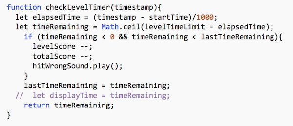

# HW - *Cage Clicker* Part IV

- In this chapter we will finish up the game by adding a "countdown timer" that displays how much time is left to complete the current level


## I. Reason for adding a countdown timer
- The game works fine, but it has a real problem, it's fairly easy to get a perfect score, but only if the player is patient enough to wait for a "safe" time to click
- This is a tedious and boring way to play a game - so let's fix this issue!
- To make the game more interesting, we are going to give the player a certain number of seconds per level to click on all of the cages
- If they successfully do so before the time is up, then they will get full points 
- But if they fail to click on all of the cages in time, penalty points will begin to accrue, 1 per second
- Thus the "tedious and boring" strategy of waiting for the perfect moment to click a cage will fail, and the player will instead be forced to take risks

## II. Getting Started

1. To get going on our countdown timer, go ahead and add these 3 variables to the top section of *main.js*:

```js
let startTime;
let lastTimeRemaining = 0; // time remaining in integer seconds
let displayTime;
```

2. To draw the time remaining, add this code to `drawHUD()` at `GameState.MAIN`:

```js
// draw level timer
let displayColor = "white";           // normal color is white
if (displayTime < 0) displayTime = 0; // don't display negative time remaining
if (displayTime <= 3) displayColor = "yellow"; // "warning - running out of time" color
if (displayTime == 0) displayColor = "red"  // "out of time and losing points!" color
fillText(ctx,`Time remaining: ${displayTime}`, 10, screenHeight-20, "14pt courier", displayColor);
```

3. Reload the page and play the game. You should see "Time Remaining: undefined" in the lower left side of the screen.


## III. Get the timer working

1. Add the following to `loop()`, right after the call to `requestAnimationFrame(loop)`:

```js
if (!startTime) startTime = timestamp; // this runs only once, when the game starts up
```

- `timestamp` is a [DOMHighResTimeStamp](https://developer.mozilla.org/en-US/docs/Web/API/DOMHighResTimeStamp) that is passed by `requestAnimationFrame()` to `loop()`, and is the current timestamp in milliseconds

2. Here is a helper method we will use to both calculate the remaining time for the current level, and penalize the player if they are out of time. Add this to the bottom of *main.js*:



3. Call `checkLevelTimer()` in `loop()`, at the end of the `if (gameState == GameState.MAIN){` conditional:

```js
displayTime = checkLevelTimer(timestamp);
```

4. At the end of `loadLevel()`, reset the `startTime` variable:

```js
startTime = performance.now();	
```

5. Test it. The countdown timer should now function, the player's score will be negatively impacted if they run out of time, and a sound will play every second as they lose points

6. You are done. ZIP and Post to the dropbox.

## IV. Improvements to this game

There are many, many potential improvements you could make to this game, here are some possibilities:

1. **Usability/Feedback:**
  - add a distinct sound "miss" sound for when the player clicks on the background instead of a sprite 
  - when the player clicks on a not-cage, animate that sprite's removal from the screen
  - when the user clicks on a cage, change its appearance slightly (blurred out or altered in some way)
  - when the user has exceeded that level's time limit, change the appearance of the sprites
  
2. **Game Mechanics:**
  - at higher levels, the sprites periodically change their image to camoflauge themselves 
  - as the timer counts down, change the appearance and behavior of the sprites to make the game harder
  - sprites will get smaller on later screens, and move differently ("wrap", follow a pre-set path, follow other  sprites, etc...)
  - on special levels, cages have to be clicked in the proper order
  - powerups that can collected and triggered:
    - freeze all cages for 3 seconds
    - freeze all not-cages for 2 seconds
    - remove 5 random non-cages from screen
  - powerdowns that will be triggered randomly or when the user makes an error:
    - the cage sprites shrink, the non-cage sprites grow
    - the sprites speed up
    - an extra 5 non-cage sprites are added to the screen
  
3. **Scoring & Achievements:**
  - high score screen, with the top 5 scores saved to WebStorage - there's a tutorial on WebStorage here:  https://github.com/tonethar/IGME-230-GDD-Spring-2018/blob/master/notes/web-apps-9.md
  - a score bonus for completing the level quickly
  - achievements:
    - *"Completed the Game"* - completed all levels and ended with a positive score
    - *"Perfect Level 1"*, *"Perfect Level 2"*, *"Perfect Level 3"*
    - *"Speedy"* - completed all levels with at least 3 seconds remaining
    - *"The Flash"* - completed all levels with at least 5 seconds remaining
    - *"Crackerjack Timing"* - completed all levels with 1 second or less remaining
    - *"At least you tried"* - completed a level with a negative score
    - *"Proud Underachiever"* - ended the game with an overall negative score
    - *"Militant Underachiever"* - completed every level with a negative score

4. **Change the goal of the game:**

*Could you use this basic mechanic, but create a different kind of game?*

- a math game where an answer is displayed, and the player has to click on all the correct equations
- a trivia style game - "You Don't Know Jack"-ish


<hr><hr>

**[Previous Chapter <- Cage Clicker Part III](HW-cage-clicker-3.md)**
