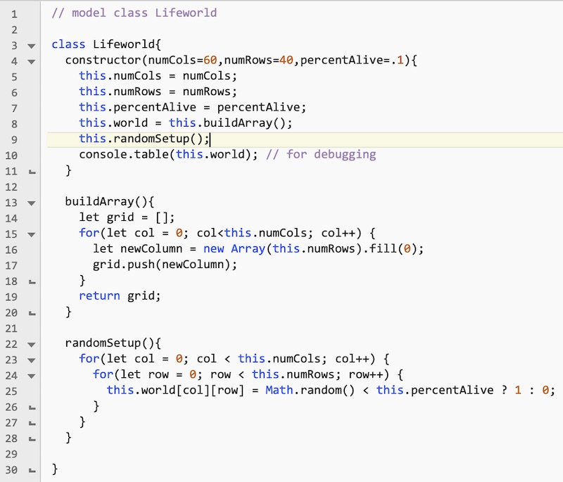
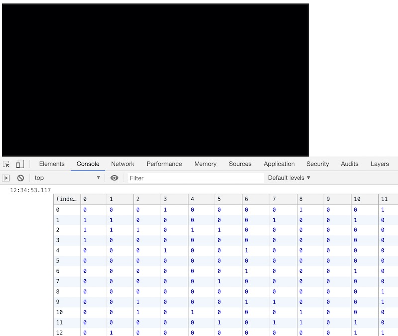
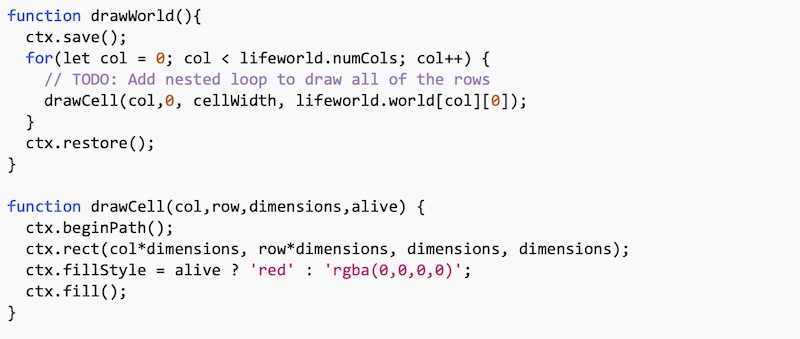
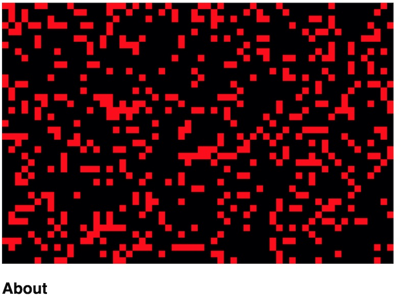
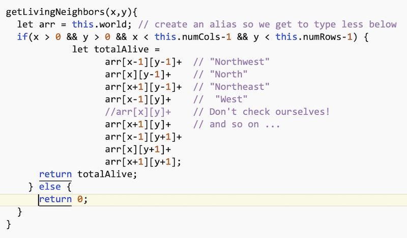
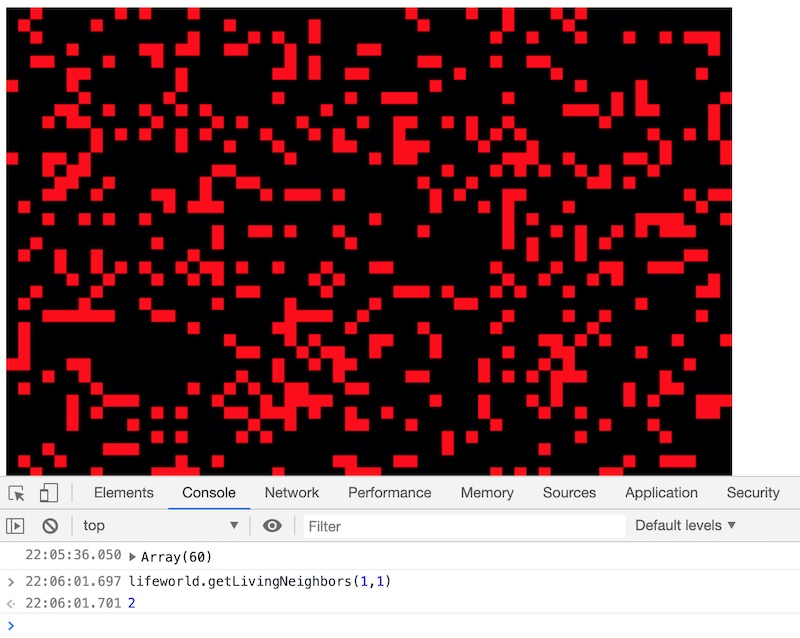
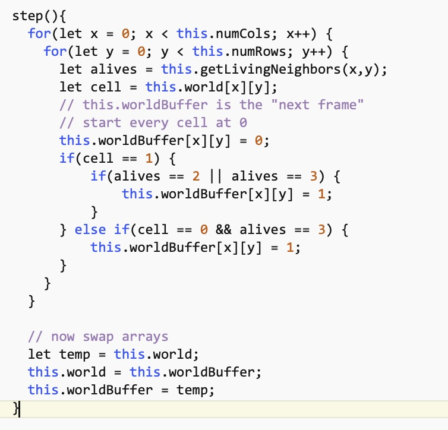

# Conway's Game of Life (utilizing Canvas!)

## I. Overview
- Some info about *Conway's Game of Life* and cellular automata is below: 
  - https://en.wikipedia.org/wiki/Conway%27s_Game_of_Life
  - https://en.wikipedia.org/wiki/Cellular_automaton


***Here is a GIF of the Life "Glider Gun" pattern:***


- Here are the rules to Life:
  - Any live cell with fewer than two live neighbours dies, as if caused by underpopulation.
  - Any live cell with two or three live neighbours lives on to the next generation.
  - Any live cell with more than three live neighbours dies, as if by overpopulation.
  - Any dead cell with exactly three live neighbours becomes a live cell, as if by reproduction.
  

## II. Done Version
 
 HW-life-animated-GIF.gif
 


## III. Start Files

**life-HW-start.html**

```html
<!DOCTYPE html>
<html lang="en">
<head>
	<meta charset="utf-8" />
	<title></title>
	<style>
		body{
			font-family: sans-serif;
		}
		canvas{
			background-color: #0000AD;
		}
	</style>
	<script src="src/Lifeworld.js"></script>
	<script src="src/main.js"></script>
</head>
<body>
	<canvas></canvas>
	
	<h2>About</h2>
	<ul>
	<li><a href="http://www.ibiblio.org/lifepatterns/october1970.html"><i>MATHEMATICAL GAMES - The fantastic combinations of John Conway's new solitaire game "life"</i></a> by Martin Gardner</li>
	<li><a href="https://en.wikipedia.org/wiki/Conway%27s_Game_of_Life">Wikipedia entry about Conway's Game of Life</a></li>
	<li><a href="https://en.wikipedia.org/wiki/Oscillator_(cellular_automaton)">https://en.wikipedia.org/wiki/Oscillator_(cellular_automaton)</a></li>
	<li><a href="https://conwaylife.com/forums/viewtopic.php?f=7&t=20">https://conwaylife.com/forums/viewtopic.php?f=7&t=20</a></li>
	</ul>
	
</body>
</html>
```

**main.js**

```js
let canvas, ctx;
const canvasWidth = 600, canvasHeight = 400;
const cellWidth = 10;
const fps = 12;
let lifeworld;

window.onload = init;

function init(){
	canvas = document.querySelector("canvas");
	canvas.width = canvasWidth;
	canvas.height = canvasHeight;
	ctx = canvas.getContext("2d");
	// TODO: init lifeworld
	loop();
}

function loop(){
	setTimeout(loop,1000/fps);
	// TODO: update lifeworld
	drawBackground();
	drawWorld();
}

function drawBackground(){
	ctx.save();
	ctx.fillStyle = "black";
	ctx.globalAlpha = 4/fps;
	ctx.fillRect(0,0,canvasWidth,canvasHeight);
	ctx.restore();
}

function drawWorld(){
	// TODO: implement
}

function drawCell(col,row,dimensions,alive) {
	// TODO: implement
}
```

**Lifeworld.js**

```js
// model class Lifeworld
// TODO: Write code
```


## IV. Instructions

- The overall app structure is:
  - **life-HW.html** will contain the HTML/CSS and HTML elements
  - **Lifeworld.js** will contain all of the JS *code/logic* for the Life sim - ex. setting up the 2D arrays, counting up all of the neighbors for each cell to determine if they are dead or alive, loading patterns and so on
  - **main.js** will contain all of the JS code for *drawing* the Life sim into the canvas element. It will also be responsible for the UI (Play, Pause, Restart Sim etc)

<hr>

1) Go ahead and create all of the above files and then preview them in a web browser. You should see a black 600 x 400 rectangle in the browser window.

<hr>

2) Add the following to **Lifeworld.js**:



- Above, we can see that a 2D array has been created, and that there is code to loop though this array and randomly place 0's and 1's in it. 

<hr>

3) In **main.js**, add the following to `init()`

`lifeworld = new Lifeworld(60,40,.2);`

<hr>

4) Test the code, and check the console. You should see the 2D array we are using has been created and populated with random 0's and 1's. Note that `console.table()` draws that cool table.



<hr>

5) We have now completed the foundational code for Lifeworld - so let's head over to **main.js** and work on visualizing this array in the canvas. Go ahead and add update the `drawWorld()` and `drawCell()` functions in **main.js**:



- Which will look like this when you run the code:


<hr>

6) Note that we're only drawing the top row. You will need to finish off the nested loop so that the whole 2D array get's drawn. The 1's are drawn as red cells and are considered "alive", the 0's are considered "dead".  When you are done it looks something like this:



<hr>

7) Let's work on wrapping up **Lifeworld.js** - here's the code for adding up each cell's neighbors. This is going to be called on every element of the 2D `world` array by the `step()` function. 



<hr>

8) We can test the `getLivingNeighbors()` method in the browser - below we are checking the cell at x=1,y=1 ("over 1, down 1") - and see that the code correctly says that the cell has 2 neighbors (in this case at NE and SE)



<hr>

9) Now we can implement `step()`, which loops through all of the cells and calls `getLivingNeighbors()`, and determines if that particular cell should be alive in the next generation. We are going to need a new array to write this information (a 0 or a 1) to. If we call `lifeworld.step()` in the console, we'll get an error because while `step()` is referencing that "world buffer" array in the code, we never declared it. So be sure to do so in the `Lifeworld` constructor by using the `buildArray()` helper method.

`this.worldBuffer = this.buildArray();`

- Now here's the `step()` code:



- Make sure that everything works and that reloading the HTML page gives you a new random screen of red cells

<hr>

10) Now go ahead and call `lifeworld.step()` multiple times from the console. You should see that the randomness of the distribution of the "live" cells is *decreasing*, and that some classic [life oscillator patterns](https://en.wikipedia.org/wiki/Oscillator_(cellular_automaton)) such as *blinkers* are starting to appear


<hr>

11) Now call `lifeworld.step()` from the **main.js** `loop()` function, and you should see the life animation kicking off at 12 FPS. Note that the cells fade out in about a second - rather than immediately - which is a feature rather than a bug of the code, and is done in `drawBackground()`

- You should also be able to "re-seed" the world by reloading the browser, which will give you a new starting array of living cells

<hr>

## V. More features
