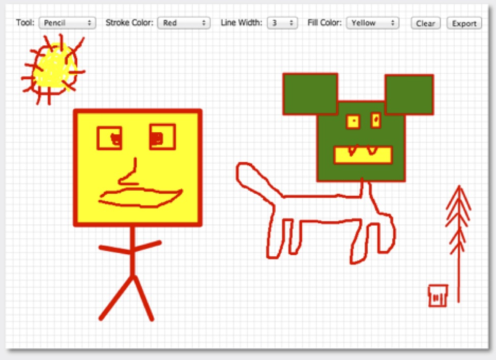
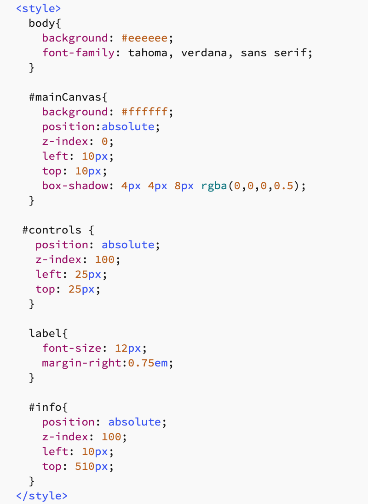
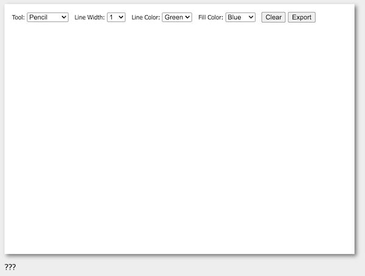
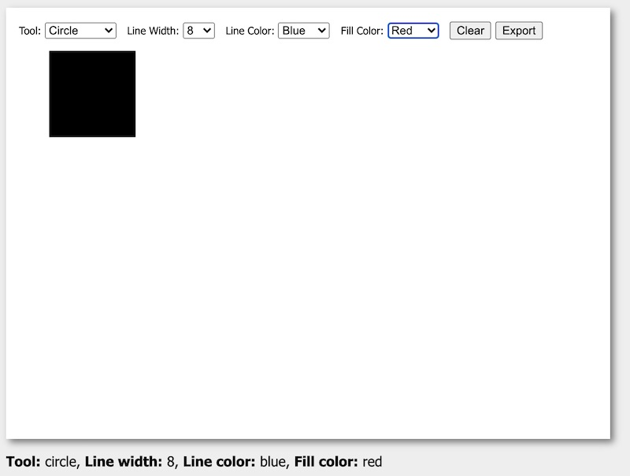

# HW - Canvas Paint App - Part 1

## I. Overview

- Over the next week or so, we're going to build a canvas paint app - it looks like this:



<hr>

## II. Start Code

- Here's the HTML for your "copy/paste" pleasure!

**canvas-paint.html**

```html
<!DOCTYPE html>
<html lang="en">
  <head>
    <meta charset="utf-8" />
    <title>Canvas Paint App</title>
    <style></style>
    <script></script>
  </head>
<body>
  <canvas id="mainCanvas" width="700" height="500">
  Get a real browser!
  </canvas>
    
  <section id="controls">
    <label>Tool:
      <select id="chooserTool">
        <option value="pencil" selected>Pencil</option>
        <option value="rectangle">Rectangle</option> 
        <option value="line">Line</option>
        <option value="circle">Circle</option>
      </select>
    </label>
    	
    <label>Line Width: 
      <select id="chooserLineWidth">
        <option value="0" >0</option>
        <option value="1" selected>1</option>
        <option value="5">5</option>
        <option value="10">10</option>
      </select>
     </label>
		
    <label>Line Color: 
      <select id="chooserStrokeStyle"> 
        <option value="red">Red</option>
        <option value="green" selected>Green</option>
        <option value="blue">Blue</option>
      </select>
    </label>
        
      <span><input id="btnClear" type="button" value="Clear"/></span>
      <span><input id="btnExport" type="button" value="Export"/></span>
  </section>
    
  <section id="info">
    <p>???</p>
  </section>

		
</body>
</html>
```

<hr>

## III. CSS

- Here's the CSS for your typing pleasure!



<hr>

## IV. Modifying a control

- Modify `#chooserLineWidth` so that it has more `<option>` tags, with all the integer values between 0 and 10 inclusive
- That means when the user pulls down on the **Line Width** `<select>`, they will see the numbers 0 through 10

<hr>

## V. Adding another control

- Go ahead and add another `<select>` that will allow the user to choose the **Fill Color** of a tool:
  - give it an `id` of `chooserFillStyle`
  - give it 3 `<option>` elements with values of "red", "green", and "blue"
  - the "blue" option will be `selected` by default
- It will look like this when you are done with parts III., IV. & V.


  

<hr>

## VI. Get the *Export* button working

- We need to write code that will convert the contents of the canvas to a PNG, and display it in a new browser window (or tab)
- It's kind of odd to do this *first*, because at this point the canvas is blank, but it's fairly easy to do
- Here's the code that accomplishes this - for your copy/paste pleasure:

```js
function doExport(){
  // https://developer.mozilla.org/en-US/docs/Web/API/HTMLCanvasElement/toDataURL
  // https://www.w3schools.com/jsref/met_win_open.asp
  const data = canvas.toDataURL(); 
  const newWindow = window.open();
  newWindow.document.body.innerHTML = `<iframe src="${data}" frameborder="0" style="border:0; top:0px; left:0px; bottom:0px; right:0px; width:100%; height:100%;" allowfullscreen></iframe>`;
}
```

- What other JavaScript must we write?
  - we need a `canvas` variable in what Chrome calls *script scope* (e.g. declared at the top of the `<script>` tag) - use the `let` keyword
    - we need to wait until the page loads before we initialize this value - write an `init()` function that get called when the page loads
  - we need to get a reference to the "Export" `<button>`:
    - we need to wait until the page loads before we can get a reference to the button - do so in your `init()` function 
    - when the button is clicked, `doExport()` is called, you should get a new tab opening
      - but it's blank!
      - to be sure everything is working - put the following code in your `init()` function - after you initialize `canvas` - this code will draw a 100x100 black square that will be visible both in the canvas and in the exported PNG:
        - `canvas.getContext("2d").fillRect(50,50,100,100);`
 
 <hr>
    
 ## VII. Get the four `<select>` elements updating the `#info` paragraph
 
 - When the value of any of the four `<select>` elements is changed, this value will be displayed in the `#info` paragraph
 - What JavaScript must we write?
   - we'll need 4 *script scope* variables to keep track of these values - use `let` to declare these variables -  `currentTool`, `lineWidth` ,`strokeStyle` and `fillStyle` 
   - be sure to initialize these variables with default values
   - every time the value of any of the four `<select>` elements is changed (HINT: the `onchange` event:
     - update the value of the applicable variable
     - update the `#info` paragraph with the value of all 4 variables
   - HINT: a "helper function" named `updateInfo()` (or similar) will really help out
 - It will look like this when you are done with parts VI. & VII. (see the `#info` paragraph on the bottom of the image)
 
 
  
