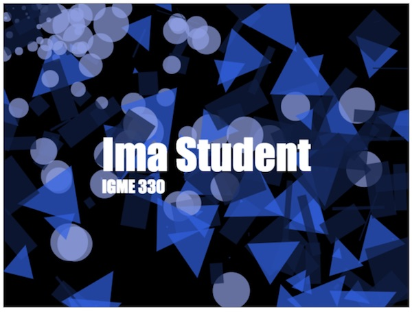

# HW - *Hello Canvas*

## I. Overview
- This exercise will cover the following concepts:
  - the canvas drawing state:
    - drawing state attributes: `.font`, `.shadowColor`, `shadowOffsetX`, `.shadowOffsetY`, `.shadowBlur`, `textAlign`, `textBaseline`
  - drawing state methods:
    - `ctx.measureText()`
  - methods of the drawing context that push and pop the *drawing state stack*:
    - `ctx.save()`
    - `ctx.restore()`
  - preloading a web font for canvas to use:
    - the exercise gives you one technique to accomplish this that involves utilizing invisible divs
    - another way to do so is the use the [webfontloader](https://github.com/typekit/webfontloader) project - here is a post - [Stack Overflow - Load Custom Font](https://stackoverflow.com/questions/46218500/pixijs-load-custom-font/47299469#47299469) - that explains how to do this for both PixiJS and canvas
  
## II. Example

In this example the placement of the shapes is random.

## III. Submission
- the start files and instructions are here -> [Hello-Canvas-start-files.zip](_files/Hello-Canvas-start-files.zip)
- see mycourses.rit.edu for due date
