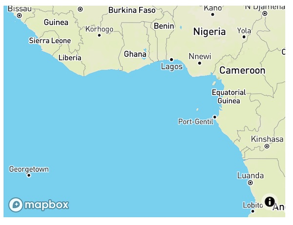
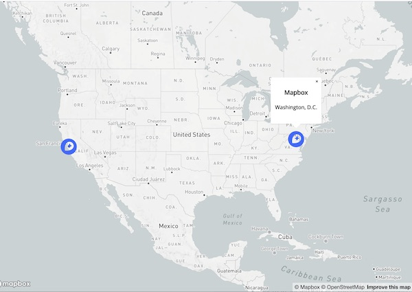
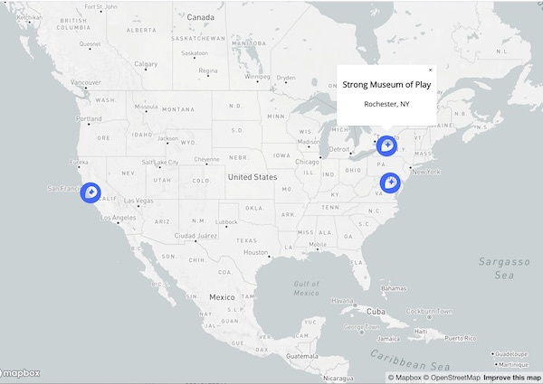
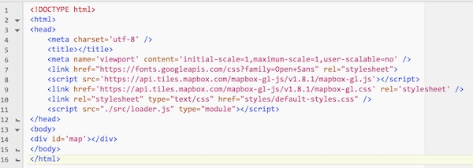

# Mapbox Intro


- A nice alternative to the Google Maps API is Mapbox - let's check it out.


## I. Get Started

1. Sign up for an account here: https://account.mapbox.com/auth/signup/
2. On the account page - https://account.mapbox.com
3. Next to the large "Start by designing a map" button (under "Or install the Maps SDK"):
    - Choose "JS Web"
    - Choose "Use the Mapbox CDN"
    - Create an empty HTML page named **mapbox-start.html**
    - Follow the instructions and add the `<link>`and `<script>` tags, as well as the JS and HTML, to the page
    - Note that you will be given your Mapbox access token - keep a copy of it somewhere


**Here's what the HTML page will look like - you'll need to add your *access token* to it:**

**mapbox-start.html**

```html
<!DOCTYPE html>
<html lang="en">
<head>
	<meta charset="utf-8" />
	<title>Map Start</title>
	<script src='https://api.mapbox.com/mapbox-gl-js/v1.8.1/mapbox-gl.js'></script>
	<link href='https://api.mapbox.com/mapbox-gl-js/v1.8.1/mapbox-gl.css' rel='stylesheet' />
</head>
<body>
<div id='map' style='width: 400px; height: 300px;'></div>
<script>
	mapboxgl.accessToken = 'ACCESS-TOKEN-GOES-HERE-GO-GET-YOUR-OWN!';
	var map = new mapboxgl.Map({
	container: 'map',
	style: 'mapbox://styles/mapbox/streets-v11'
	});
</script>

</body>
</html>
```

<hr>

## I-A. Test it

Screenshot of **mapbox-start.html**:

<hr>



<hr>

## I-B. Some things to try

1) Change the `center` and `zoom` of the map to the Rochester area:

```js
map.setZoom(9);
map.setCenter([-77.6799,43.083848]); // note the order - it's longitude,latitude - which is opposite of Google Maps
```

2) Go to this landing page --> https://www.mapbox.com/install/js/cdn-complete/
    - Now navigate to the [Add controls](https://docs.mapbox.com/mapbox-gl-js/example/navigation/) page to add a visible controller to your map (it's one line of code)

3) Head back to the landing page
    - Now navigate to [Style Animation](https://docs.mapbox.com/mapbox-gl-js/example/setstyle/) page:
    - You don't need to set up the radio buttons, but go ahead and change you map's style from  `streets-v11` to: 
      - `light-v10` OR
      - `dark-v10` OR
      - `outdoors-v11` OR
      - `satellite-v9`
    - You can also write code to change the style like this: `map.setStyle('mapbox://styles/mapbox/satellite-v9');`
  
4) ZIP and POST the **mapbox-start.html** file to the dropbox

<hr><hr>

## II. Create a map with clickable markers

1) Create a folder named **custom-marker**

2) Inside of the **custom-marker** folder, create an empty file named **index.html**

3) Follow the "Add custom markers in Mapbox GL JS" tutorial here: https://docs.mapbox.com/help/tutorials/custom-markers-gl-js/
    - Don’t neglect to download the provided **mapbox-icon.png** file
    - Read through the tutorial, just don’t copy/paste!
    
4) When you are done, it looks like this:

<hr>



<hr>

5) Let’s think about adding a marker - and to do that, we need to add in some "place data". The `geojson` object in the code is using a format called - you guessed it - GeoJSON. MapBox expects that "point of interest" type data is encoded this way. Note the `features` array is an array of object literals that contains `coordinate`, `title`, and `description` information.

6) Here’s some info about the GeoJSON format: 
    - https://geojson.org
    - http://geojson.io/ - a GeoJSON "builder" - one thing you can do is to drop markers on the map and this will write the GeoJSON for you 

7) So, go ahead and add another object literal to the `features` array:
    - you’ll need `coordinate`, `title`, and `description` information
    - in the example screenshot below, I added info for the Strong Museum of Play
    - where can you get coordinate information? 
      - One place would be to try the tool at --> http://geojson.io/ 
      - Or try --> https://www.latlong.net


<hr>



<hr>

- Let's move on!

<hr><hr>

## III. Refactoring the code to ES6 Modules

1) Next let’s do some code refactoring - believe it or not - when we're done with this (in Maps Part II) - you will have some nicely structured "starter code" for Project 3

- Although we like `array.forEach()` as much as the next guy, let’s convert `geojson.features.forEach(…)` to a `for…of` loop - `for (let feature of geojson.features){ …}` and don’t forget to change the parameter name in the code from `marker` to `feature`

2) Change both `var` declarations to `let`

3) Create a folder named **images** and put **mapbox-icon.png**  into it. Adjust your `.marker{...}` CSS so that the icon still shows up on the map

4) Now create a folder named **styles** and put a file named **default-styles.css** in it

5) Move the style rules from **index.html** to **default-styles.css**, and &lt;link> to it. Fix the URL in your `.marker{...}` CSS again :-|

6) Create a **src** folder, and put 2 empty files in it - **loader.js**, and **main.js**,

7) In **index.html**, add this tag to the &lt;head> section:

`<script src="./src/loader.js" type="module"></script>`

8) Make **loader.js** look like this:

```js
import * as main from "./main.js";

window.onload = () => {
	// load fonts, sounds, whatever ...
	main.init();
};
```

9) Move all of the JS code from **index.html** to **main.js**. Delete the &lt;script> tag that held the JS code as you won’t need it anymore. This is what **index.html** should look like:



10) In **main.js**

- Wrap all of the code in an `init()` function (which is lame, but we’ll improve on that very soon), and `export` that function.

**main.js**

```js
function init(){…}
export {init};
```

11) Test it in a web browser - it should work the same as before - remember that we’re using ES6 modules now - so you have to run it off of a web server

- What - you’ve just been FTPing everything to banjo? You really ought to set up a local testing server so you don’t have to do that:
    - https://developer.mozilla.org/en-US/docs/Learn/Common_questions/set_up_a_local_testing_server
    - https://gist.github.com/jgravois/5e73b56fa7756fd00b89
    - https://flaviocopes.com/local-web-server/

- Or, you can use the “Live Server” or “Live Preview” plugins on your favorite IDE


<hr><hr>

## IV. Submission

- Submit your files and get the credit you deserve:
  - POST the **custom-marker**  folder to the web
  - ZIP up the **custom-marker** folder and submit it to myCourses
  - Type the link to the **custom-marker**  in the comments field of the dropbox
  - Don't forget to ZIP and POST the **mapbox-start.html** file from Part I!


<hr><hr>

**[Next Chapter -> Mapbox Part II](HW-mapbox-2.md)**


