# Mapbox-2 - *RIT Coffee Finder*

***For all of the steps going forward, keep the debugger console open to be sure that you don’t have any errors***

***This exercise could be a nice "starter" for Project 3!***

## I. Get Started

1) Duplicate the **custom-marker** folder and name the copy **rit-coffee-finder**

2) Download this icon (right-click and save) and put it into the **rit-coffee-finder/images** folder --> 

3) Modify your CSS to use the new icon, and change the `width` and `height` to 30px

4) In **src/main.js**, delete the contents of the `features` array (inside the `geojson` object) - it should look like this:

```js
let geojson = {
  type: 'FeatureCollection',
  features: []
};
```
    
5) Now move the `let geojson = {…};` code OUTSIDE of the `init()` method. Reload the page - the markers should be gone.
    

6) Change the `center` and `zoom` properties of the map to zoom in on RIT - `[-77.67454147338866,43.08484339838443]` and `15.5`

    - Reload the page - the map should be zoomed in on RIT

7) Now create a function named `initMap()`:

    - move the `mapboxgl.accessToken = …` and `const map = new mapboxgl.Map({…});` code into it
    - ***IMPORTANT -->*** you’ll need to declare `map` at the top of **main.js** now, with a `let` declaration

8) Now call `initMap()` from the top of `init()`

    - Test your code in the browser, it should work the same

9) Now create a new function named `addMarkersToMap()` and move the marker creation code into it

10) In `init()`,  call `addMarkersToMap()` right after you call `initMap()`

    - Test your code in the browser, it should work the same

11) This is what **src/main.js** should look like (I’ve folded some code, obviously):

<hr>

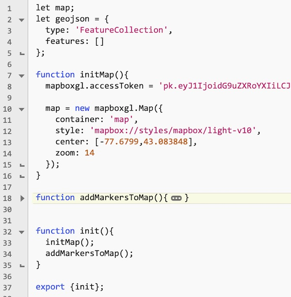

<hr><hr>

## II. Add some markers

- Now that we've done some refactoring, it will be easy to load in some location data (RIT Coffeeshop locations and names)

1) In **src/main.js**, let’s create a new function named `loadMarkers()` - it will look like this - thank goodness for copy/paste - eh?:

```js
function loadMarkers(){
  const coffeeShops = [
        {
		latitude:43.084156,
		longitude:-77.67514,
		title:"Artesano Bakery & Cafe"
	},

	{
		latitude:43.083866,
		longitude:-77.66901,
		title:"Beanz"
	},

	{
		latitude:43.082520,
		longitude:-77.67980,
		title:"Starbucks"
	},

	{
		latitude:43.086678,
		longitude:-77.669014,
		title:"The College Grind"
	},

	{
		latitude:43.082634,
		longitude:-77.68004,
		title:"The Cafe & Market at Crossroads"
	},

	{
		latitude:43.08382,
		longitude:-77.674805,
		title:"RITZ Sports Zone"
	},

	{
		latitude:43.086502,
		longitude:-77.66912,
		title:"The Commons"
	},

	{
		latitude:43.08324,
		longitude:-77.68105,
		title:"The Market at Global Village"
	},

	{
		latitude:43.08384,
		longitude:-77.67457,
		title:"Brick City Cafe"
	},

	{
		latitude:43.084904,
		longitude:-77.6676,
		title:"Corner Store"
	},

	{
		latitude:43.08464,
		longitude:-77.680145,
		title:"CTRL ALT DELi"
	},

	{
		latitude:43.08359,
		longitude:-77.66921,
		title:"Gracie's"
	}
];
	
	// now convert this data to GeoJSON

}
```

<hr>

2) Here’s the rest of the code - you can type this:

<hr>

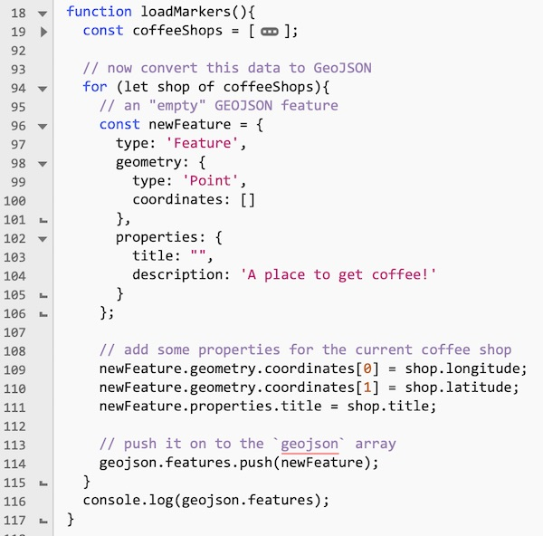

<hr>

3) Now put a call to `loadMarkers()` in the `init()` function, right between `initMap();` and `addMarkersToMap()`

4) Reload the page, you should see the markers. Check the console, you should see the `geojson` logged out:

<hr>


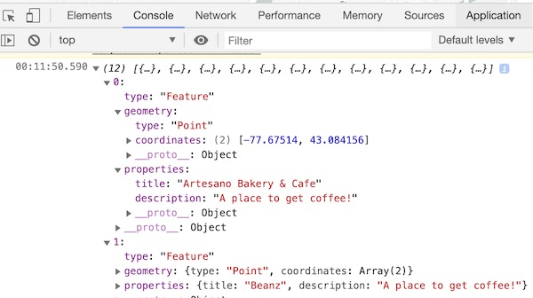

<hr><hr>

## III. Create a ***map.js*** module

- We are going to being adding a lot of "map code" and "UI code" soon, so let's go ahead and break out all of the map-related JS into a separate file. If we don't do this, **main.js** is going to get really messy, really fast!

1) Create a **map.js** file and put it in the **src** folder

2) Move all of the map-related code from **src/main.js** to **src/map.js**

3) Add the following to the bottom of **src/map.js**

    - `export {initMap,loadMarkers,addMarkersToMap};`
    
4) Now you need to add an `import` to the top of **src/main.js** - and call the code located in **src/map.js** with the `map` namespace - **src/main.js** should now look like this:

**src/main.js**

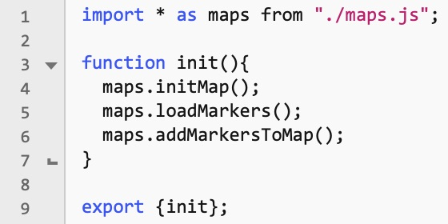

5) Reload the page, it should work as before

<hr><hr>

## IV. Add some map controls

- We are going to add controls to the screen that will let the user zoom in and out and move the center of the map

1) Here's the HTML:

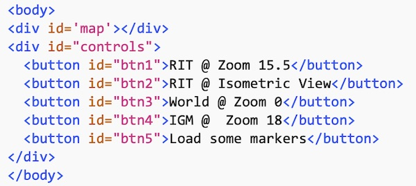

2) Here's the CSS:

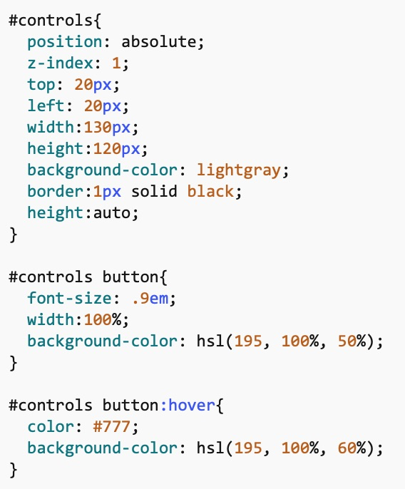

3) Reload the page, you should see this:

<hr>

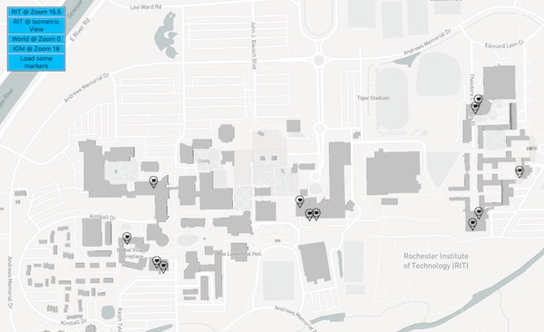

<hr>

4) Now we need to add some functions to our **map.js** module:

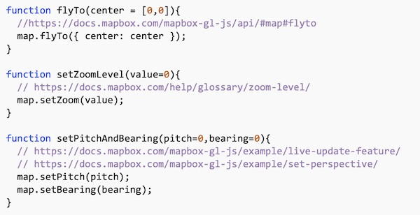

- these 3 functions control the center, zoom level, and viewing angle (perspective) of our map
- note that we have given the function parameters *default values* that will be used if no value is passed in
- see the documentation and examples here:
  - https://docs.mapbox.com/mapbox-gl-js/api/#map#flyto
  - https://docs.mapbox.com/help/glossary/zoom-level/
  - https://docs.mapbox.com/mapbox-gl-js/example/live-update-feature/
  - https://docs.mapbox.com/mapbox-gl-js/example/set-perspective/
- be sure to export these three functions, or you won't be able to use them outside of **map.js**!

5) Now we need to write some code in **main.js** that can call these functions when the buttons are clicked on. Here's the first part for your copy/paste pleasure:

```js
function setupUI(){
  // it's easy to get [longitude,latitude] coordinates with this tool: http://geojson.io/
  const lnglatRIT = [-77.67454147338866, 43.08484339838443];
  const lnglatIGM = [-77.67990589141846, 43.08447511795301];
}
```

- Don't forget to call `setupUI()` from the bottom of `main.init()` !
- Here's the rest of `setupUI()` for you to type in:

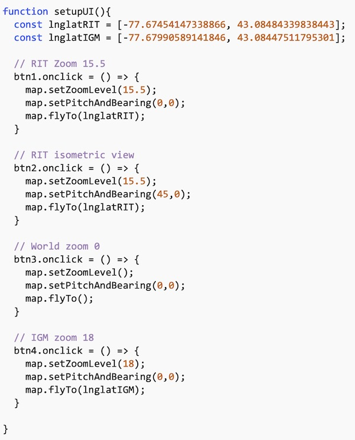


6) Reload the page - and test out the first 4 buttons - here's what the "RIT @ Isometric View" looks like:

<hr>

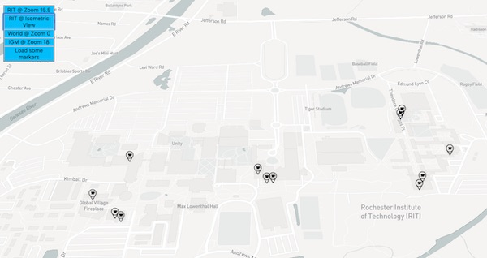

<hr><hr>


## V. Add a map layer

1) Now let's add a map layer - https://docs.mapbox.com/mapbox-gl-js/style-spec/layers/
    - Here we'll add a `paint` layer of type `fill-extrusion` to the map that will allow Mapbox to draw buildings in 3D
    - The code to do this is straight out of a Mapbox example:
      - the example is here: https://docs.mapbox.com/mapbox-gl-js/example/3d-buildings/
      - this is a simple copy/paste - you will need to copy ALL of the code in the "map onload call":
        - beginning here: `map.on('load', function() {`
        - and ending here: `});`
    - put this code at the bottom of the `initMap()` function in the **maps.js** module - when you paste this code all of the formatting will be gone, so try to indent and pretty it up at some point


2) Reload the page to see the difference - below I am in the "RIT @ Isometric View", and slightly zoomed in - note that the extruded buildings give a nice 3D effect:

<hr>

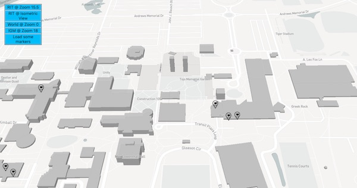

<hr><hr>

## VI. Load some external data via Ajax

- Let's walk through how easy it is to load new data from the Internet and then display it on the map

1) Here's the data we'll be downloading - nothing much - just the the location data for the IGM main office and the GCCIS Dean's office: https://igm.rit.edu/~acjvks/courses/shared/330/maps/igm-points-of-interest.php

<hr>


<hr>

2) Let's write some Ajax code to download the contents of this simple web service. Go ahead and create a new file named **ajax.js** and put it into your **src** folder

3) Inside of **ajax.js**, implement the `downloadFile()` function and export it:

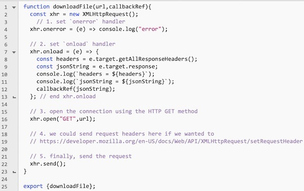

4) Over in **main.js**:

    - add an `import` statement at the top: `import * as ajax from "./ajax.js";`

5) To **main.js**, let's add a `poi` array as a module scoped variable, and a `loadPOI()` helper function:

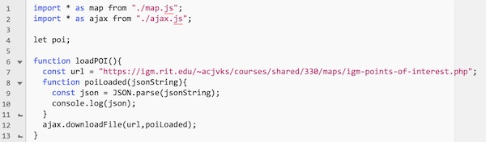

6) Now let's add some button event handling code to `setupUI()` - this last button will now call the `loadPOI()` function when it is clicked:

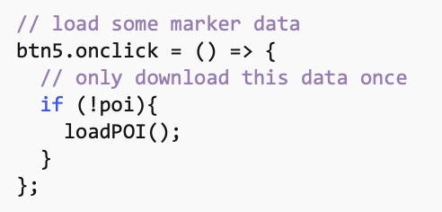

7) Test this in the browser, clicking the "Load some markers" button once should log out the array of object literals that was downloaded from the web service (clicking it a second time will do nothing):

<hr>

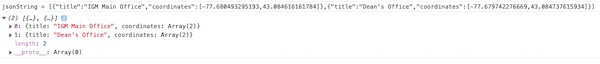

<hr>

8) Now we need to create some markers with this coordinate data - this is best done over in **map.js**. Go ahead and create the `addMarker()` function over in **map.js**:
    - and don't forget to  `export` it!

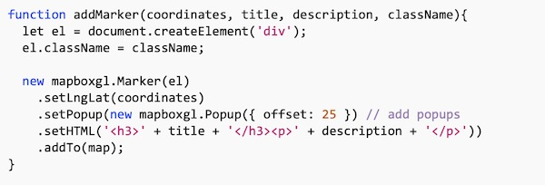

9) In **main.js**, call `addMarker()` in the `poiLoaded()` callback function

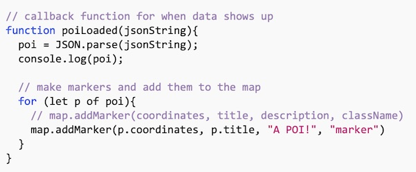

10) Now test it, you should see the IGM and Dean's office markers are now on the map!

<hr>

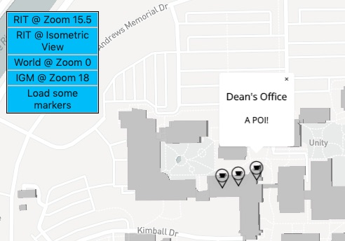

<hr><hr>

## VII. Finish it up

- Right now these new POIs are still using the "coffee" icon. Go ahead and and write some CSS and JS code so that the markers we just created use the **mapbox-icon.png** file:
  - name the new style rule `poi`
  - modify your code in the `poiLoaded()` callback function to use the `poi` class name
- Over in **map.js** we have some duplicated code that violates the D.R.Y. ("Don't Repeat Yourself) principle:
  - Go ahead and refactor the `addMarkersToMap()` function to use the `addMarker()` function - that will fix this issue
- Optional: There's one (at least) bug in this code. If a user clicks the "Load some markers" button multiple times, and quickly, they might end up calling the POI loading code twice. Fix that bug if you want - it will take one line of code to do so
- See the screenshot below for an example of what the map with the new `#poi` markers should look like
- You're DONE! - ZIP and POST the **rit-coffee-finder** folder to the dropbox!

<hr>

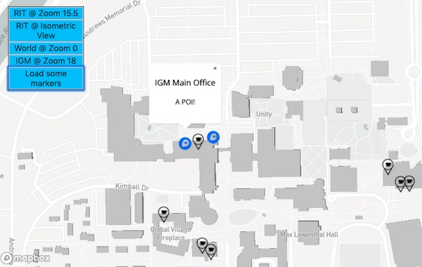

<hr><hr>

**[Previous Chapter <- Mapbox Part I](HW-mapbox-1.md)**

**[Next Chapter -> Mapbox Part III](HW-mapbox-3.md)**

