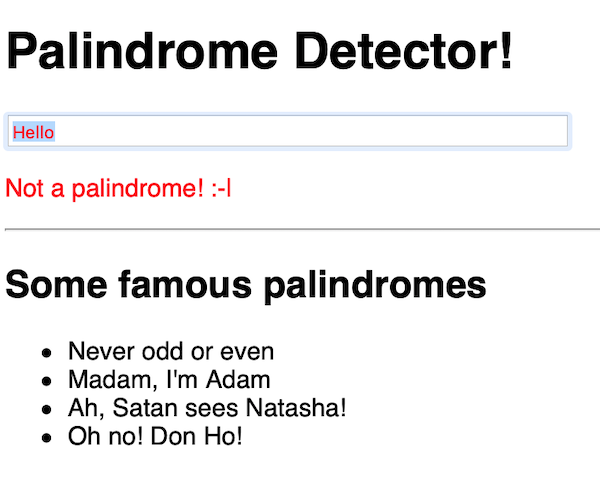
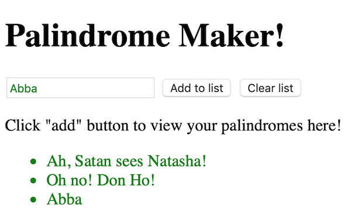

# HW - Palindrome Detector

## I. Overview

- A *palindrome* [(wikipedia)](https://en.wikipedia.org/wiki/Palindrome) is a word, number, phrase, or other sequence of characters which reads the same backward as forward, such as *madam* or *racecar* or the number 10801. Sentence-length palindromes may be written when allowances are made for adjustments to capital letters, punctuation, and word dividers, such as:
  - "A man, a plan, a canal, Panama!", "Was it a car or a cat I saw?" or "No 'x' in Nixon"
  - Here are some more: https://genius.com/Weird-al-yankovic-bob-lyrics
- Composing literature in palindromes is an example of *constrained writing*.

**Below is the required functionality:**

**A. Not a palindrome!**

- the text is red, and there is an *error message*

**B. Found a palindrome!**

- the text is green, and there is a *success message*

**C. Not required, but here's an enhanced version that lets you keep track of your palindromes**

## II. Hints

- use the [*load-text-input.html*](text-1.md#I-A) start code
- basically, are the string, and the same string but in reverse, the same?:
  - does "hello" == "olleh"? - NO!
  - does "abba" == "abba"? - YES!
- make sure that you convert the string to all lowercase letters before you do the string reversal and comparison
- the code snippets we used in our demo will help with stripping out spaces and punctuation, so that our palindrome detector will catch examples like *Madam, in Eden, I'm Adam.*
