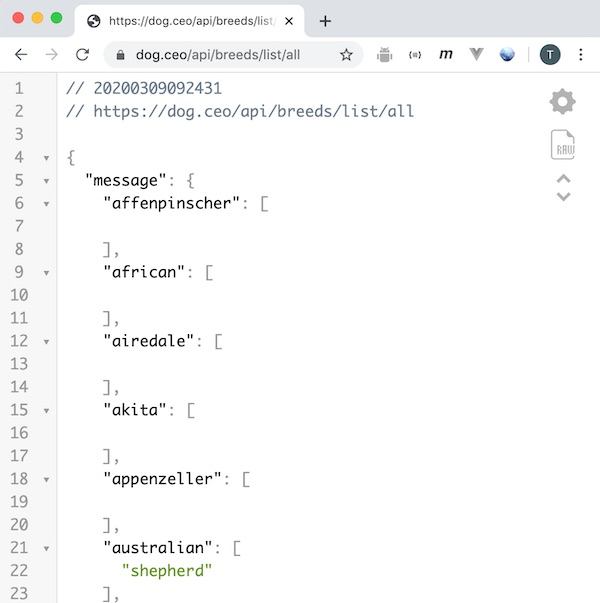
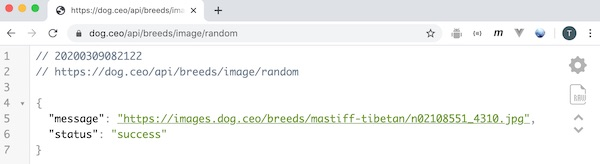
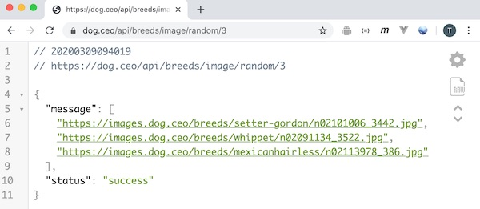
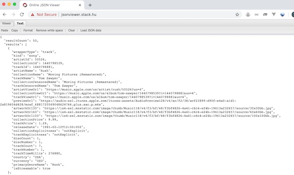

# PHP Web Service Part I - What is a web service?

[I. Overview](#overview)

[II. Example - "List all Breeds"](#example1)

[III. Example - "Random Dog Image"](#example2)

[IV. Example - "iTunes Search API"](#example3)

[V. CORS - Cross-origin Resource Sharing](#cors)

[VI. Seven things we'll need to create our web service](#need)

[VII. What's Next?](#next)

<a id="overview" />

## I. Overview

- In this series, we will *build our own web service* using the PHP programming language
- You have *used* web services before - by writing HTML/JS apps to download data from *existing web services*, and then formatted and displayed the results for your users
- You did this back in IGME-230/235 - go review those notes now:
  - [Web Apps 10 - Web Services](https://github.com/tonethar/IGME-230-Master/blob/master/notes/web-apps-10.md)
  - [Homework: GIF Finder](https://github.com/tonethar/IGME-230-Master/blob/master/notes/HW-gif-finder.md)
  - [Web Service App - Examples & Starters](https://github.com/tonethar/IGME-230-Master/blob/master/notes/web-service-app-starters.md)
  
### What's a web service, again?
  - The beginning of Wikipedia's [web service](https://en.wikipedia.org/wiki/Web_service) entry is very general and states that a web service is "a service offered by an electronic device to another electronic device, communicating with each other via the World Wide Web"
  - Web services can be a part of applications built around the [Client-server](https://en.wikipedia.org/wiki/Client–server_model) model, where a *server* provides a service (specialized data) to multiple *clients*
  - Here's what we'll be building by the end of this series - in PHP - and although the theme is somewhat silly, it has the foundational capabilities you see in all web services:
    - This returns a random joke:
      - http://igm.rit.edu/~acjvks/courses/shared/330/php/get-random-joke.php
    - This returns an array of random jokes - it we don't specify how many we want we always get 2:
      - http://igm.rit.edu/~acjvks/courses/shared/330/php/get-jokes.php
    - Here we will specify that we want an array of 5 jokes by using the `limit` parameter:
      - http://igm.rit.edu/~acjvks/courses/shared/330/php/get-jokes.php?limit=5
    - Here we will specify a very large number for `limit`, but will instead get all of the jokes back:
      - http://igm.rit.edu/~acjvks/courses/shared/330/php/get-jokes.php?limit=9999
      
    - ***(Is your JSON not formatted as nicely as mine? Go download the [JSON Viewer](https://chrome.google.com/webstore/detail/json-viewer/gbmdgpbipfallnflgajpaliibnhdgobh?hl=en-US) Chrome extension)***
    
    
    - Finally, here is the *client* application that uses XHR to download from the **get-random-joke.php** service everytime the user clicks the button:
      - http://igm.rit.edu/~acjvks/courses/shared/330/php/joke-client.html
    
    
  - More specifically, in this class:
    - the service we will build and use in this class will return data in the [JSON](https://developer.mozilla.org/en-US/docs/Web/JavaScript/Reference/Global_Objects/JSON) (**J**ava**S**cript **O**bject **N**otation) format 
    - the service will be a simple *read-only* web service that will return data, but cannot be written to or updated by the user of the service
    - we will pass in parameters (i.e. values that help the user of the service specify or filter the information they want back) to our web service using the [query string](https://en.wikipedia.org/wiki/Query_string)
    - we will also build a "client" (an HTML/JavaScript app, like GIF Finder) to download the web service via the [`XMLHttpRequest`](https://developer.mozilla.org/en-US/docs/Web/API/XMLHttpRequest) object and then display the results to a user

<a id="example1" />

## II. What do web services look like? Example #1
- Here's a very simple web service that you might have seen in IGME-235, the [Dog API](https://dog.ceo/dog-api/)
- Let's look at the "List All Breeds" [endpoint](https://rapidapi.com/blog/api-glossary/endpoint/) - first. The documentation for this endpoint is here: 
  - https://dog.ceo/dog-api/documentation/
- and the actual endpoint (that gives you the data) is here:
  - https://dog.ceo/api/breeds/list/all
  - when we open this url up in a browser, we can see that this endpoint gives us a an array of dog breeds, nested inside of a JavaScript object literal - which is the JSON (**J**ava**S**cript **O**bject **N**otation) format.
  - For this url, there are no additional *parameters* to pass in, we ask for the "breeds/list/all" endpoint (also called a "route"), and we get back the full list of breeds

\*\* ***Does your JSON (below) not look as good in the browser as mine? Then go download the [JSON Viewer](https://chrome.google.com/webstore/detail/json-viewer/gbmdgpbipfallnflgajpaliibnhdgobh?hl=en-US) extension for Chrome*** \*\*

- [JSON](https://developer.mozilla.org/en-US/docs/Web/JavaScript/Reference/Global_Objects/JSON) consists of ***key : value*** pairs, where the **key** is a string, and the **value** is one of these types: 
  - `Number`  - `123`, `1.23` etc
  - `String` - "Hello World" etc
  - `Boolean` - `true` or `false`
  - `Array` - `[1,2,3]`, `["Hello", "World"]` etc
  - `Object` -  *key* : *value* pairs - `{"name" : "Fred"}`
  - `null`

<a id="example2" />

## III.  What do web services look like? Example #2
- Here's the [Dog API](https://dog.ceo/dog-api/) again
- This time we'll look at the "Random image" endpoint - here is the documentation
  - https://dog.ceo/api/breeds/image/random
- and the actual endpoint (that gives you the data) is here:
  - https://dog.ceo/api/breeds/image/random
  - when we open this url up in a browser, we can see that this endpoint gives us a random url to a picture of a dog, formatted in JSON again
  - the `"message"` key contains a string, which is a URL to an image of a dog
  

  

 

  
- But one thing that makes this "Random image" endpoint different from the "List All Breeds" endpoint is that we can pass *parameters* into the service and modify the results we get, in this case, we can specify that we want more than one random image.
- This is done by a number at the end of the URL - like this:
  - https://dog.ceo/api/breeds/image/random/3
  - now the `"message"` key contains an array instead of a string
- Specifying parameters in this way - as part of the url path - is a "Restful" technique - https://en.wikipedia.org/wiki/Representational_state_transfer

- Note: When we build our PHP API - we will actually being passing parameters as a [query string](https://en.wikipedia.org/wiki/Query_string) - as can be seen in the next example
  
 

 
 <a id="example3" />
 
 ## IV.  What do web services look like? Example #3
 
 - Now let's look at the iTunes Search API - the documentation is here:
   - https://developer.apple.com/library/archive/documentation/AudioVideo/Conceptual/iTuneSearchAPI/Searching.html
   - Here's an example call to the web service:
     - https://itunes.apple.com/search?media=music&entity=song&term=rush
     - this give us back textual information, thumbnail images and preview links for song tracks related to the search term "rush", formatted as a JSON string
     - Note that our values for the `media`, `entity` and `term` paramters are getting passed over in the [query string](https://en.wikipedia.org/wiki/Query_string):
       - the beginning of the query string is denoted with a question mark - `?`
       - the form of the query string is `name=value`, where multiple name:value pairs are separated by ampersands - `&`
    
 

    
 
   
 

 
<a id="cors" />
 
## V. CORS - Cross-origin resource sharing

 - If you tried to load the iTunes web service in a browser, you might have noticed that it didn't appear in the browser window like the Dog API did, but instead downloaded as a separate file (which we then had to view in a different JSON previewer, above)
 - This is because the iTunes Search API is not set up to use CORS (Cross-origin resource sharing) and thus cannot be downloaded directly by the `XMLHttpRequest` object:
   - https://developer.mozilla.org/en-US/docs/Web/HTTP/CORS
   - BTW - In a future exercise, we'll use PHP to create a "proxy server" - which download this iTunes service for us 
   
 ### How do we know if CORS is on or off?
 
 - CORS needs to be enabled for web services we want to use with a JavaScript/HTML client that uses `XMLHttpRequest` (like GIF Finder does) - so how to we know that CORS is enabled?
 - Easy! - take a look at the HTTP headers that the web service sends back:
   - if the web service has set the `access-controll-allow-origin: *` header - then CORS is "on" - meaning that a browser using `XMLHttpRequest` will then be allowed to access it
 
 

    
 
   

- BTW - how can you see the **HTTP headers** that the server sent as we did above?
  - Navigate to the web service's URL like we did above 
  - Open the JavaScript Debugger
  - Select the *Network* tab
  - Reload the web page
  - Select the file (on the left)
  - Then select the *Headers* tab (on the right)
- While you are here, check out the other headers:
  - headers are *meta data* about a request - https://developer.mozilla.org/en-US/docs/Web/HTTP/Headers
  - *Request* headers are sent by the *client*, which is the computer that is requesting the data 
  - *Response* headers are sent by the *server*, which is the computer that is sending the data 

<a id="need" />

## VI. Seven things we'll need to create our web service

- Based on the examples & discussion above, what issues will we need to consider when we create our own web service?

#1 - our web service needs to be *hosted* somewhere on the Internet (on a *server*) so that any client machine that wants to can connect to it:
  - our web service will be hosted on banjo, and available through our regular web accounts `http://people.rit.edu/abc124/`

#2 - we'll need *data* of some kind that we want to share:
  - our web service will be very simple, and for our test data we will use corny jokes - something like these --> https://www.rd.com/funny-stuff/short-jokes/
  
#3 - the data will have to be *stored* in some fashion on our server:
  - if we had a very large data set, we'd probably store it in a database (banjo actually supports SQLite), but in this case we are going to keep it simple and put all the jokes in a large array
  
#4 - we will have to choose a programming language to create the web service in:
  - On banjo, we could use use Perl, PHP, Python, or even shell scripts to create our web service
  - PHP is the well-suited to constructing our simple web service (as we will see as we start coding it), so that's what we are going to use
  
#5 - we need a way for the client app to pass *parameters* to our web service - the choices are:
  - ["Restful"](https://en.wikipedia.org/wiki/Representational_state_transfer) - where the parameters are passed as part of the url "path" - like in the "Random Image" endpoint above. (This is how we will be doing web services in IGME-430)
  - [POST](https://en.wikipedia.org/wiki/Hypertext_Transfer_Protocol#Request_methods) - which is an HTTP method - where the parameters are passed as additional *data* - basically as a separate file. (We will be using this technique in IGME-430)
  - [GET](https://en.wikipedia.org/wiki/Hypertext_Transfer_Protocol#Request_methods) - where the parameters are passed as part of the *query string* - like in the iTunes Search example above:
- ***For our web service, we will be using GET and the query string***

#6 - we need to **return** the data to the client application that is requesting it - and we need to do so in at least one standardized format  - here are the top three:
  - plain, unstructured *text*
  - XML
  - JSON (this is currently the most common for web services, so this is what we'll use)

#7 - we need to make sure our service is available to web browsers that are using `XMLHttpRequest` to download data - i.e. CORS needs to be turned ON:
  - Easy! - we just need to be sure that we are sending the `access-control-allow-origin: *` header
  

<a id="next" />

## VII. What's next?

- We have pretty much answered the 7 questions about our web service above
- Now we just need to work on coding it - in PHP - so let's move on!

**[Next Chapter -> PHP Web Service - Part II](HW-php-web-service-2.md)**

