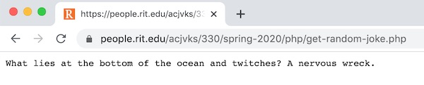
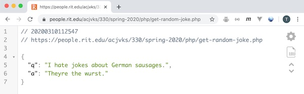
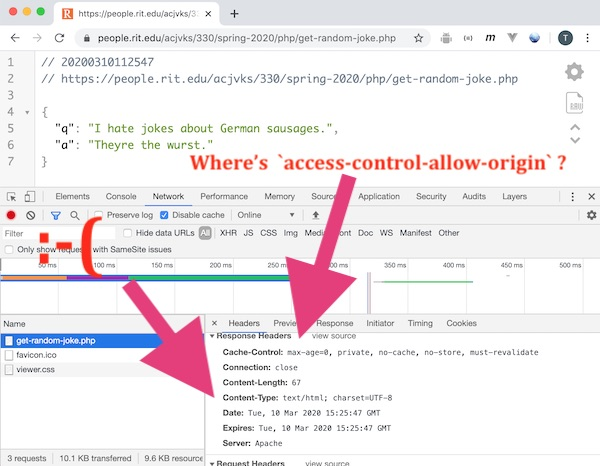
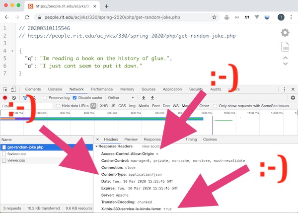
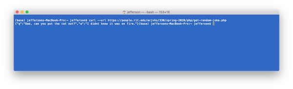
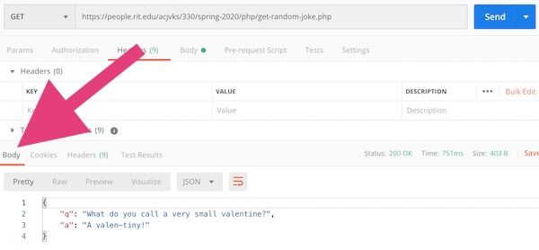
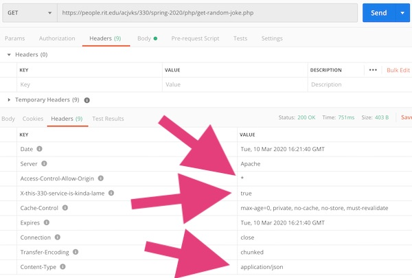
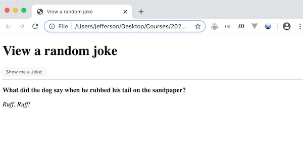
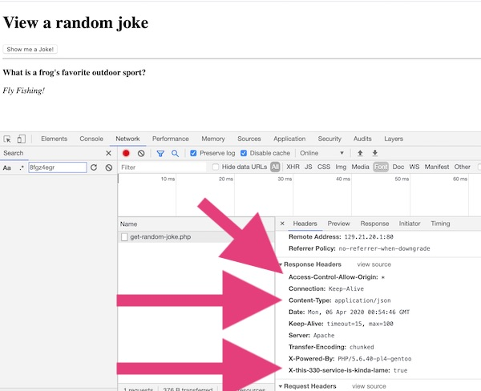

# PHP Web Service Part III - Coding `get-random-joke.php`

[Overview](#overview)

[I. Get Started](#get-started)

[II. Add some content](#add-some-content)

[III. Get a random joke](#get-a-random-joke)

[IV. `echo()` a JSON string](#echo-a-json-string)

[V. Sending HTTP headers](#sending-http-headers)

[VI. A client app for testing your web service](#client-app)

[VII. Submission](#submission)

<hr><hr>

<a id="overview" />

## Overview
- Now that you know about PHP, we can finally get coding our web service!
- We are going to start out with **get-random-joke.php** - which returns a single random joke in JSON format
- Here's a "done" version you can check out: http://igm.rit.edu/~acjvks/courses/shared/330/php/get-random-joke.php

<hr>

<a id="get-started" />

## I. Get Started

- Here is your start file - go ahead and get this posted to banjo
- Open it up in your web browser, and be sure that you get similar output as the screenshot below before you continue

**get-random-joke.php**

```php
<?php
	/*
		Name: get-random-joke.php
		Description: Returns a single random joke in JSON format
		Author: 
		Last Modified: 
	*/
	
	// $jokes contains our data
	// this is an indexed array of associative arrays
	// the associative arrays are jokes -  they have an 'q' key and an 'a' key
	$jokes = [
		["q"=>"What do you call a very small valentine?","a"=>"A valen-tiny!"],
		["q"=>"What did the dog say when he rubbed his tail on the sandpaper?","a"=>"Ruff, Ruff!"],
		["q"=>"Why don't sharks like to eat clowns?","a"=>"Because they taste funny!"],
		["q"=>"What did the fish say when be bumped his head?","a"=>"Dam!"]
	];


	// Debugging - comment all these `echo()` statements out after you verify that everything works
	// print the first joke
	echo $jokes[0]["q"] . " " . $jokes[0]["a"]; 
	// print a blank line
	echo "\n\n"; 
	// print the entire array to the window
	print_r($jokes); 

?>
```


<hr>


<hr>

<a id="add-some-content" />

## II. Add some content

- Go ahead and add 6 (or more) jokes to the array - the *minimum* total is 10 jokes
- Please keep them SFW - ***Safe For Work!***
- Preview your web service in Chrome to be sure that you didn't break anything

<hr>

<a id="#get-a-random-joke" />

## III. Get random joke

- Use PHP's [`array_rand()`](https://www.php.net/manual/en/function.array-rand.php) function to pull a random joke out of the array

```php
  // get a random element of the $jokes array
  // https://www.php.net/manual/en/function.array-rand.php
  // there are a bunch more PHP array functions at: http://php.net/manual/en/ref.array.php
  $randomKey = ...
  $randomJoke = ...
```

- comment out the "debug" `echo()` statements
- now echo out just a single random joke
- it should now look like this when you load it in a browser - reload the page multiple times to be sure that you're getting a single random joke - in regular "plain text":

<hr>



<hr>

<a id="echo-a-json-string" />

## IV. Echo a JSON string

- Now we are successfully echoing a random joke - but it's just in an unstructured text format
- Although it is quite possible to code a client app to use *plain text*, web services almost always return data in either the XML or JSON formats
- **get-random-joke.php** is going to return the data in JSON format
- do you remember or know about `JSON.stringify()` in JavaScript? It turns any *object* - like an object literal or an array (because in JavaScript, arrays *are* objects) - into a string of JSON
- PHP has similar method called `json_encode()` - which turns PHP associative arrays (which is what `$jokes` and `$randomJoke` are) into a string of JSON
- So this is really easy - here's the code for you:

```php
  // json_encode() turns an associative array into a string of well-formed JSON
  // https://www.php.net/manual/en/function.json-encode.php
  $string = json_encode($randomJoke);
  echo $string;
```

- And here's what you should see in the browser (thanks for the nice formatting, JSON Viewer!)

<hr>



<hr>

<a id="sending-http-headers" />

## V. Sending HTTP headers

- remember the **list of seven issues** we needed to consider as we built our web service? --> [HW-php-web-service-1.md#need](./HW-php-web-service-1.md#need)
- so we have "knocked off" issues #1-#6 (we actually skipped #5 for now because we don't need it YET)
- that leaves #7 - which was about turning on CORS - so that browsers could download the JSON directly with `XMLHttpRequest` without using a proxy server
- take a look at our current situation with the [response headers](https://developer.mozilla.org/en-US/docs/Glossary/Response_header) that our web service is sending:
  - we are missing the `access-control-allow-origin: *` header
  - we are also sending the WRONG content-type header - PHP is sending `text/html` (the default) - instead of `application/json` (which is the correct value)
 
 
<hr>



<hr>

- here's the fix:

```php
// Send HTTP headers
// https://www.php.net/manual/en/function.header.php
// DO THIS **BEFORE** you `echo()` the content!
header('content-type:application/json');      // tell the requestor that this is JSON
header("Access-Control-Allow-Origin: *");     // turn on CORS
header("X-this-330-service-is-kinda-lame: true");   // a custom header - by convention they begin with 'X'
```

- now test your web service in the browser - it should look like this:

<hr>



<hr>
 

<a id="client-app" />

## VI. A client app for testing your web service

- So we have now constructed our web service - but will it work with a client application?

### A quick test with `curl`

- If you have [`curl`](https://curl.haxx.se) installed, you can do a quick test from the command line:
  - `curl --url <path-to-service-on-banjo>`
  - below I am using Mac OS and the Terminal application - on Windows you can use Powershell or GitBash:
  
<hr>



<hr>

- if you add a `-v` flag you will get *verbose* output which includes the request and response headers:
  - `curl -v --url <path-to-service-on-banjo>`
  
### A quick test with Postman

- Postman is a fantastic & free utility for testing web services --> https://www.postman.com
- Here we are trying it out on our new web service to verify the content and the headers

<hr>



<hr>

<hr>



<hr>


### A quick test with an HTML/JS client

- we could write our client in any programming language (C/C#/C++/Java/Kotli/Python/Swift/...), for any device that's connected to the internet (a PC, an iPhone, Android, a smart toaster, etc) ...
- but we'll just do it in HTML/JS - here's the code - it's all completed for you  - you are welcome - don't forget to replace the placeholder `url` below with your own:

**joke-client.html**

```html
<!DOCTYPE html>
<html lang="en">
<head>
	<meta charset="utf-8" />
	<title>View a random joke</title>
	<script>
	window.onload = ()=>{
	
		jokeBtn.onclick = (e)=>{
			// 1. Clear UI
			setup.innerHTML = "Fetching a joke now!";
			punchline.innerHTML = "";
			
			// 2. Create an XHR object to download the web service
			// https://developer.mozilla.org/en-US/docs/Web/API/XMLHttpRequest/
			const xhr = new XMLHttpRequest();
			const url = "PATH-TO-YOUR-WEB-SERVICE-ON-BANJO/get-random-joke.php";
			
			// 3. set `onerror` handler
			xhr.onerror = (e) => console.log("error");
			
			// 4. set `onload` handler
			xhr.onload = (e) => {
				const headers = e.target.getAllResponseHeaders();
				const jsonString = e.target.response;
				console.log(`headers = ${headers}`);
				console.log(`jsonString = ${jsonString}`);
				
				// update the UI by showing the joke
				const json = JSON.parse(jsonString);
				setup.innerHTML = `<b>${json.q}</b>`;
				punchline.innerHTML = `<i>${json.a}</i>`;
			}; // end xhr.onload
			
			// 5. open the connection using the HTTP GET method
			xhr.open("GET",url);
			
			// 6. we could send request headers here if we wanted to
			// https://developer.mozilla.org/en-US/docs/Web/API/XMLHttpRequest/setRequestHeader
			
			// 7. finally, send the request
			xhr.send();
			
		}; // end onclick
		
	}; // end window.onload
	
	</script>
</head>
<body>
	<h1>View a random joke</h1>
	<button id="jokeBtn">Show me a Joke!</button>
	<hr>
	<p id="setup">???</p>
	<p id="punchline">!!!</p>
</body>
</html>
```

- The above code should be familiar to you, as we used XHR back in IGME-235 (and you had a project that used it!)
- But if you don't understand everything in this code - you are likely not alone - so ASK!

<hr>



<hr>

**We can also inspect the file that XHR returned to the browser:**



<hr>

<a id="submission" />

## VII. Submission

- POST **get-random-joke.php** and **joke-client.html** to your banjo account (they will probably be in the same folder, but they don't have to be!
- ZIP and POST **get-random-joke.php** to the myCourses dropbox
- Type the banjo links to **get-random-joke.php** and **joke-client.html** into the comments field of the dropbox


<hr><hr>

**[Previous Chapter <- PHP Web Service - Part II](HW-php-web-service-2.md)**

**[Next Chapter -> PHP Web Service - Part IV](HW-php-web-service-4.md)**
