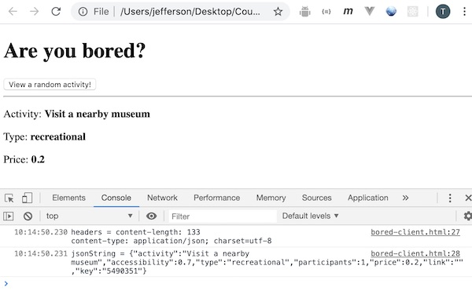
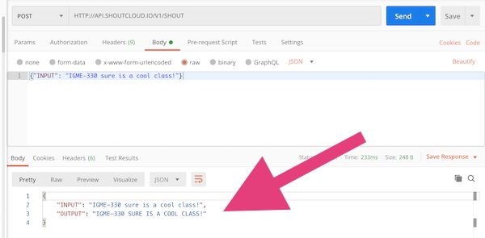
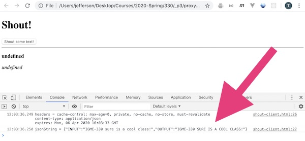

# PHP Web Service Part V - creating a proxy server


[Overview](#overview)

[I. Get Started](#get-started)

[II. Introducing SHOUTCLOUD](#intro-shoutcloud)

[III. Creating *shout-proxy.php*](#shout-proxy)

[IV. Test *shout-proxy.php*](#test-it)

[V. Submission](#submission)


<hr><hr>

<a id="overview" />

## Overview

- Here we are going to learn how to create a web *proxy server* with PHP, and also get a little more practice with using the [XHR](https://developer.mozilla.org/en-US/docs/Web/API/XMLHttpRequest) API to download data
-  *a proxy server is a server application or appliance that acts as an intermediary for requests from clients seeking resources from servers that provide those resources* - https://en.wikipedia.org/wiki/Proxy_server#Web_proxy_servers
- Below we will learn how to create such a server and have PHP fetch a web service that the browser (i.e the XHR object) is unable to directly access. This could happen for the following reasons:
  - the web service does not have [CORS](https://developer.mozilla.org/en-US/docs/Web/HTTP/CORS) enabled ("cross origin resource sharing") - which means that the browser will not allow the client-side XHR or [Fetch](https://developer.mozilla.org/en-US/docs/Web/API/Fetch_API) objects to download data from that service
    - recall that if a web service wants to "turn CORS on" it needs to send this HTTP response header:
      - `Access-Control-Allow-Origin: *`
  - the web service is only available via `http` (rather than `https` - the "s" stands for *secure*), which means our banjo.rit.edu server will not allow our app to use that service
- You might be wondering - how common is it for web services to have CORS turned off?
  - one popular API - [Yelp](https://www.yelp.com/developers/documentation/v3/get_started) - has CORS turned off, and requires developers to send their API key as an HTTP header, which means you have to use a server-side script of some kind to accomplish this. BTW - we do (or will soon) have Yelp sample code - with a functioning proxy server - up in myCourses for your perusal and potential use 
  - another advantage of using a proxy-server is that the developer can "hide" their web service API key on the server, rather than having it exposed in the client-side JavaScript
  
### Videos
- These are optional - they walk through the notes below - you might prefer to get through the notes and assignment below without them:
  - [PHP and Web Services-5: Building a PHP proxy server I. (11:21)](https://video.rit.edu/Watch/php-proxy-server-1)
  - [PHP and Web Services-5: Building a PHP proxy server II. (12:40)](https://video.rit.edu/Watch/php-proxy-server-2)

<hr>

<a id="get-started" />

## I. Get Started - a little XHR review

- First, let's practice getting a web app working with simple web service that doesn't require a proxy server. We'll let you try this on your own

1) Grab the **joke-client.html** code from the bottom of [PHP Web Service Part III - Coding get-random-joke.php](./HW-php-web-service-3.md#client-app) and put it in a file named **bored-client.html**

2) Now utilize the `https://www.boredapi.com/api/activity` web service to download a random activity for bored people. Go ahead and open that URL up in a web browser to see what the JSON looks like. Here are the app requirements: 

    - when the user clicks the button, a random activity will be downloaded
    - the value of the "activity", "type", and "price" keys will be displayed to the user
    - when the user clicks the button, the old activity will be removed and a new one will be shown
  
3) The final result will look something like this:

<hr>



<hr>

4) When you are done, ZIP up **bored-client.html** and POST it to the myCourses dropbox

<hr>

<a id="intro-shoutcloud" />

## II. Introducing SHOUTCLOUD - a "service" that XHR can't download

1) Now make another copy of **joke-client.html** and name it **shout-client.html**

2) We are going to be using this web service - http://shoutcloud.io - which doesn't do anything for us we couldn't just write one line of JavaScript to do. But it's a great example for us here because it's designed to be hard to access:
    - it doesn't have CORS turned on
    - it requires us to use the [HTTP POST method](https://developer.mozilla.org/en-US/docs/Web/HTTP/Methods)
    - it uses `http` instead of `https`, so banjo will try to block the call to the service if we try to access it via JavaScript
    - so, it's totally useless and hard to use - so why did we pick this web service? Because it's a good way to *challenge* us and demonstrate how to work with more difficult web services
  
3) Let's test the service to see what it can do. Because it requires the POST method, if we try it in the browser's location box we get this:

`404 page not found`

- **instead, we'll look at it using `curl` on the command line:**

```
curl -X POST -d '{"INPUT": "IGME-330 sure is a cool class!"}' -H 'Content-Type: application/json' HTTP://API.SHOUTCLOUD.IO/V1/SHOUT`

{"INPUT":"IGME-330 sure is a cool class!","OUTPUT":"IGME-330 SURE IS A COOL CLASS!"}
```

- **and the [Postman](https://www.postman.com) application:**

<hr>



<hr>

- as you can see, we pass in a string, and we get back a JSON object with an "OUTPUT" string that has converted the "INPUT" string to ALL CAPS (yeah that's all it does...)

<hr>


4) So let's try this service out in **shout-client.html** by changing the value of the `url` variable to `HTTP://API.SHOUTCLOUD.IO/V1/SHOUT` - and then clicking the button which calls the service

5) This is what we'll get back in the console:

    - `Access to XMLHttpRequest at 'http://api.shoutcloud.io/V1/SHOUT' from origin 'null' has been blocked by CORS policy: No 'Access-Control-Allow-Origin' header is present on the requested resource.`
    - so yeah, CORS isn't turned on. If we go back and look at the header in the Postman app example above, we'll see that `Access-Control-Allow-Origin: *` is not present
  
6) So we need to create a PHP proxy server - let's move on ...

<hr>

<a id="shout-proxy" />

## III. Creating *shout-proxy.php*

1) Here's our first attempt - you are going to have to post this up on banjo:


**shout-proxy.php**

```php
<?php
  $url = "HTTP://API.SHOUTCLOUD.IO/V1/SHOUT";
  $string = file_get_contents($url);
  echo $string;
?>
```

 - Normally, this code would work fine because PHP's [`file_get_contents()`](https://www.php.net/manual/en/function.file-get-contents.php) defaults to using the `GET` method when contacting a web server, which is what most web services use
 - However, SHOUTCLOUD's API expects the client to use POST method, which is different:
   - parameters are sent in the *query string* when using GET, but are sent in a *separate file* when using POST
   - here is a brief explanation of HTTP methods --> https://www.w3schools.com/tags/ref_httpmethods.asp
   
2) This fails with the following message!

`Warning: file_get_contents(HTTP://API.SHOUTCLOUD.IO/V1/SHOUT): failed to open stream: HTTP request failed! HTTP/1.1 404 Not Found in shout-proxy.php on line 3`

3) Here is our fix, note that we have to do a little more work to configure `file_get_contents()`:

**shout-proxy.php**

```php
<?php
	// 1) The URL to the web service
	$URL = "HTTP://API.SHOUTCLOUD.IO/V1/SHOUT";

	// 2) The text we'll be "SHOUTIFYING"
	// this is hard-coded for now, but we'll pass it in as a query string parameter soon
	$text = "IGME-330 sure is a cool class!"; 

	// 3) The name of the parameter shoutify expects is "INPUT"
	$params = ["INPUT" => $text];

	// 4) Convert it to JSON, because Shoutify wants data passed to it as JSON
	$jsonToSend = json_encode($params);

	// 5) The `stream_context_create()` function is where we can specify the POST method
	// https://www.php.net/manual/en/context.http.php

	$opts = array('http' =>
			array(
					'method'  => 'POST',
					'header'  => 'Content-Type: application/json',
					'content' => $jsonToSend
			)
	);
	$context = stream_context_create($opts);


	// 6) Call the web service
	$result = file_get_contents($URL, false, $context);

	// 7) Echo results 
	header('content-type:application/json'); // tell the requestor that this is JSON
	header("Access-Control-Allow-Origin: *"); // turn on CORS for that shout-client.html can use this service
	echo $result;
?>
```

4) Test this in the browser, you should see that **shout-proxy.php** has successfully downloaded the JSON data, and has returned it to the browser. It should look something like this:

```json
// 20200406115632
// https://people.rit.edu/acjvks/330/spring-2020/php/proxy-example/shout-proxy.php

{
  "INPUT": "IGME-330 sure is a cool class!",
  "OUTPUT": "IGME-330 SURE IS A COOL CLASS!"
}
```

<hr>

<a id="test-it" />

## IV. Test *shout-proxy.php*

1) Now you need to verify that **shout-proxy.php** will work in concert with **shout-client.html**

    - In **shout-client.html**, go ahead and change the value of the `url` variable to point at **shout-proxy.php** up on banjo
    - Test it. Although we haven't updated the interface to use the SHOUTIFY data, the console will still show us whether we have been successful or not.

<hr>



<hr>

2) So now we have a functioning proxy server (**shout-proxy.php**) and a client application (**shout-client.html**) that is able to use it. The client was unable to download the web service directly, but the PHP running on the server was - problem solved! See below for submission instructions and extra credit opportunities


<hr>

<a id="submission" />

## V. Submission

1) As was mentioned earlier, you need to ZIP up **bored-client.html**  and POST it to the myCourses dropbox

2) Also ZIP up **shout-proxy.php** and post it to myCourses. Put the url where it is located on banjo in the comments field of the dropbox so that we can test it

3) **Optional Extra credit opportunity (worth 1 HW assignment)**

    - The hard-coded `$text` variable is pretty lame. Rename **shout-proxy.php** to **shout-proxy-improved.php** and modify it accept a `text` parameter so that the user of the service can pass in a string of text that will get shoutified. Be sure to do some error checking and use a default value if nothing is passed in
    - Add a text field to **shout-client.html** so that the user can type in a value to be shoutified, and modify the JS so that this value is sent to **shout-proxy-improved.php**
    - Take a look at the GIF Finder HW from 230/235 - which is linked from here - [HW - Improved Gif Finder](https://github.com/tonethar/IGME-330-Master/blob/master/notes/HW-improved-gif-finder.md) - for a reminder on how to grab user input from a form field - and don't forget to use [`encodeURIComponent`](https://developer.mozilla.org/en-US/docs/Web/JavaScript/Reference/Global_Objects/encodeURIComponent) to handle the issue with spaces
    - ZIP up **shout-proxy-improved.php** and **shout-client.html** and post them to mycourses. Give us the urls in the comments field of the dropbox as usual so that we can test them

<hr><hr>

**[Previous Chapter <- PHP Web Service - Part IV](HW-php-web-service-4.md)**
