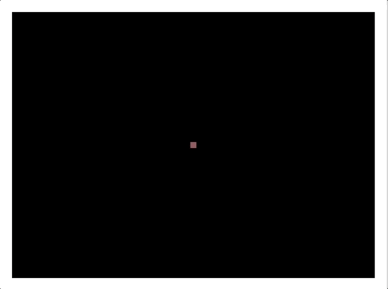

# HW - Random Walker

Random walks are a process consisting of a sequence of steps of whose characteristics (such as magnitude and direction) is determined by chance - https://en.wikipedia.org/wiki/Random_walk

Random walks are studied in many fields:
- the "random walk hypothesis" is used to model shares prices and other factors.
- random walks describe the statistical properties of genetic drift
- random walks are used as simplified models of physical Brownian motion and diffusion such as the random movement of molecules in liquids and gases
- random walks are used to describe individual animal movements

## I. Assignment & Start Code

Try to do something interesting by adding on to the code below - ideas:
- multiple walkers & colors
- biased movements  - ex. tend to move right and down
- "wrapping" or "bouncing" walkers
- user controls

**walker-1.html**

```html
<!DOCTYPE html>
<html lang="en">
<head>
	<meta charset="utf-8" />
	<title>Walker-1</title>
	<style>
	canvas{
		border:1px solid gray;
	}
	</style>
	<script>
	
	let walker = {
		x:320,
		y:240,
		color: "black",
		width: 5,
		move(){
			if(flipWeightedCoin()){
				this.x += flipWeightedCoin() ? -this.width : this.width;
			}else{
				this.y += flipWeightedCoin() ? -this.width : this.width;
			}
		}
	};
	
	
		// #0 - in this class we will always use ECMAScript 5's "strict" mode
		// See what 'use strict' does here:
		// https://developer.mozilla.org/en-US/docs/Web/JavaScript/Reference/Functions_and_function_scope/Strict_mode
		'use strict';
		let ctx;
		// #1 call the init function after the pages loads
		window.onload = function(){
			console.log("page loaded!");
			// #2 Now that the page has loaded, start drawing!
			
			// A - canvas variable points at <canvas> tag
			let canvas = document.querySelector('canvas');
			
			// B - the ctx variable points at a "2D drawing context"
			ctx = canvas.getContext('2d');
			
			// C - all fill operations are now in red
			ctx.fillStyle = 'green'; 
			
			// D - fill a rectangle with the current fill color
			ctx.fillRect(20,20,600,440); 
			
			setInterval(drawWalker,1000/12);
	//		setInterval(cls,5000);
		}
		
		
		function drawWalker(){
			ctx.fillStyle = walker.color;
		//	ctx.globalAlpha = 0.2;
			ctx.fillRect(walker.x-walker.width/2,walker.y-walker.width/2,walker.width/2,walker.width/2);
			walker.move();
		}
		
		// UTILS
		function getRandomColor(){
			function getByte(){
				return 55 + Math.round(Math.random() * 200);
			}
			return "rgba(" + getByte() + "," + getByte() + "," + getByte() + ",.8)";
		}
		
		function cls(){
			ctx.clearRect(0,0,640,480);
		}
		
		function flipWeightedCoin(weight = 0.5){
			return Math.random() < weight;
		}
	</script>
</head>
<body>
	<canvas width="640" height="480">
		Get a real browser!
	</canvas>
</body>
</html>
```

## II. Screenshots

**walker-1.html**


**walker-2.html**

 - multiple walkers in an array
 


**walker-4.html**

- "biased" walkers that tend to go either left, right, up, or down


**walker-6.html**

- controls!


