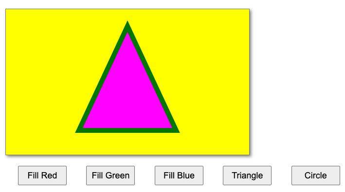

# HW - Shape Viewer

## I. Overview

- Canvas Concepts (In-class exercise):
  - Shape Viewer:
    - Drawing State Properties: `ctx.fillStyle` & `ctx.strokeStyle` & `ctx.lineWidth`
    - Draw rectangles with `ctx.fillRect()` & `ctx.strokeRect()`
    - Draw rectangles with `ctx.beginPath()`, `ctx.closePath()`, `ctx.rect()`
    - Draw circles with `ctx.arc()`
    - Draw polygons with `ctx.moveTo()`, `ctx.lineTo()`, `ctx.fill()`

<hr>

## II. Start File

**shape-viewer.html**

```html
<!DOCTYPE html>
<html lang="en">
<head>
	<meta charset="utf-8" />
	<title>Shape Viewer START!</title>
	<style>
	body {font-family: Arial, Helvetica, sans-serif;}
	canvas{
		border:1px solid gray;
		margin-left: 10px;
		margin-top: 10px;
		box-shadow: 3px 3px 6px rgba(0,0,0,0.5);
	}
	
	button{
		margin-left:2em;
		margin-top:1em;
		width:100px;
		height:40px;
		font-size:18px;
	}
	
	</style>
	
	<script>
		// #0 - in this class we will always use ECMAScript 5's "strict" mode
		// See what 'use strict' does here:
		// https://developer.mozilla.org/en-US/docs/Web/JavaScript/Reference/Functions_and_function_scope/Strict_mode
		'use strict';
		
		// #1 call the init function after the pages loads
		// this is called an "event handler"
		window.onload = init;
	
		let ctx;
		function init(){
			// #2 Now that the page has loaded, start drawing!
			console.log('init called');
			
			// A - canvas variable points at <canvas> tag
			const canvas = document.querySelector('canvas');
			
			// B - the ctx variable points at a "2D drawing context"
			ctx = canvas.getContext('2d');	
			
			// C - all fill operations are now in yellow
			ctx.fillStyle = 'yellow'; 
			
			// D - fill a rectangle covering the entire canvas with the current fill color
			ctx.fillRect(0,0,500,300); 
			
			// #3 Hook up buttons
			document.querySelector('#red').onclick = drawRedBox;
		}
		
		function drawRedBox(){
			const color="red";
			ctx.save();
			ctx.fillStyle = color;
			ctx.fillRect(20,20,460,260); 
			ctx.restore();
		}
		
	</script>
</head>
<body>
	<canvas width="500" height="300">
	Get a real browser!
	</canvas>
	
	<section id="controls">
	  <button id="red">Fill Red</button>
	</section>
	
	
	<h2>Shape Viewer!</h2>
	<section id="assignment">
		<p>Stuff to do:</p>
		<ol>
			<li>Create a new style rule that will increase the vertical space between <code>&lt;li&gt;</code> tags on the page - try setting the <code>margin-bottom</code> property.</li>
			<li>Get the "Fill Green" button working. Clicking it should draw a green rectangle on the canvas. In your code, use the hexadecimal value for green rather than the CSS keyword.</li>
			<li>Add a new button titled "Fill Blue" to the page. Clicking it should draw a blue rectangle on the canvas. Be sure to draw the rectangle using <code>rect()</code> - and NOT <code>ctx.fillRect()</code></li>
			<li>Add a new button titled "Triangle" to the page. Clicking it should fill a magenta triangle with a 10-pixel thick green stroke on the canvas. Be sure that you can see ALL 10-pixels of the stroke.</li>
			<li>Add a new button titled "Circle" to the page. Clicking it should fill a 100-pixel radius purple circle with a 5-pixel thick white stroke on the canvas. Be sure that you can see ALL 5-pixels of the stroke.</li>
			<li>Because portions of the triangle and circle shapes may still be visible when you click other buttons, add code to effectively "clear" the image by re-drawing the 500x300-pixel yellow background. Add this to any function where its necessary.</li>
			<li>Challenge: At this point you have 3 buttons calling three different functions that all do basically the same thing. 
			The is wasteful and violates the <abbr>D.R.Y.</abbr> principle of Software engineering ("<b>D</b>on't <b>R</b>epeat <b>Y</b>ourself"). 
			Generalizing your code so that you have 1 function instead of 3 (i.e. <em>Procedural Abstraction</em>) would probably be a good idea. 
			Go ahead and replace <code>drawRedBox()</code>, <code>drawGreenBox()</code>, and <code>drawBlueBox()</code> with a function named <code>drawBox()</code>. 
			All three buttons should call the same <code>drawBox()</code> function, and draw the appropriate color box based on the button that was clicked. (This is trickier than you might think, and there are at least 3 ways to do it)</li>
			
		</ol>
	</section>
</body>
</html>
```

<hr>

## III. Screenshot of Done Version


