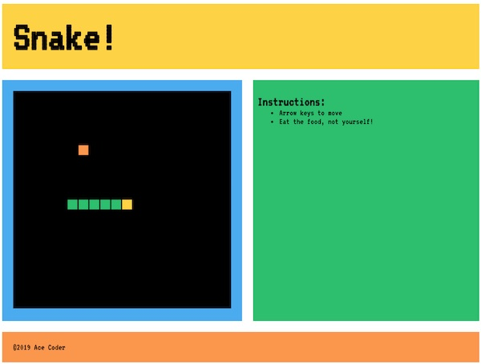
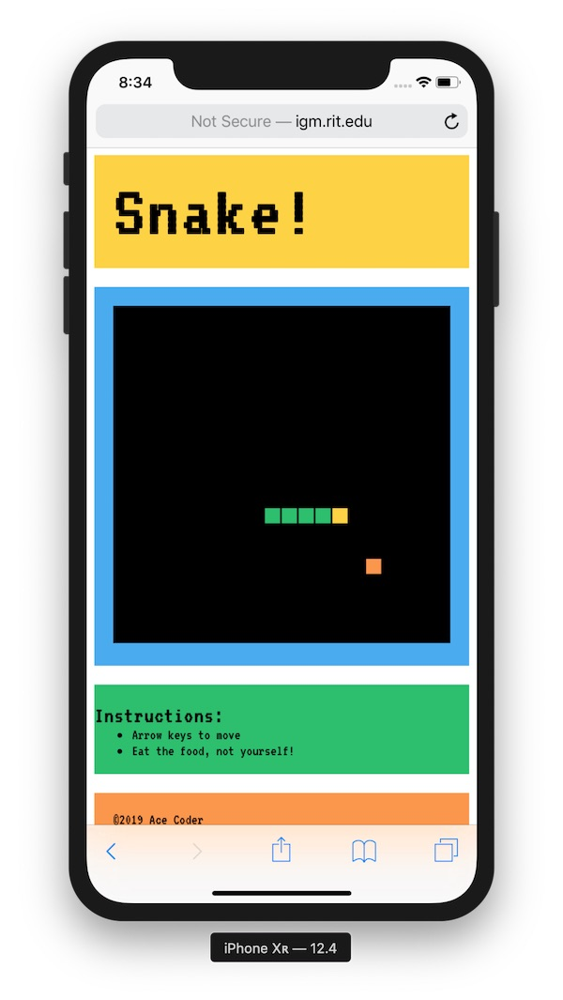
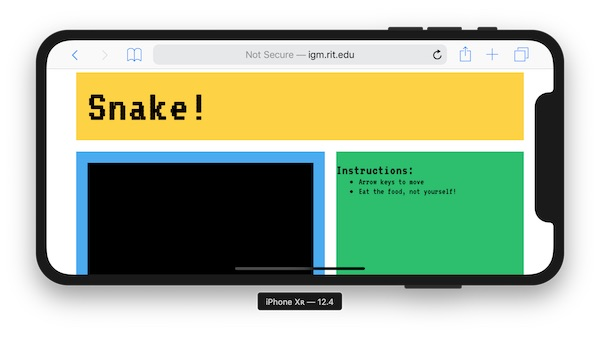
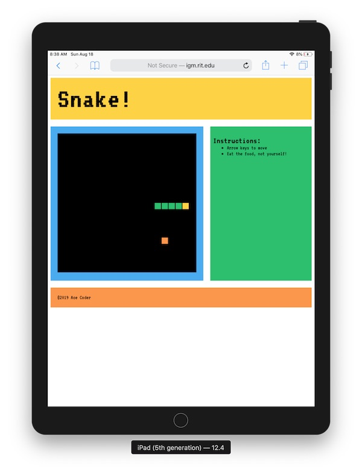
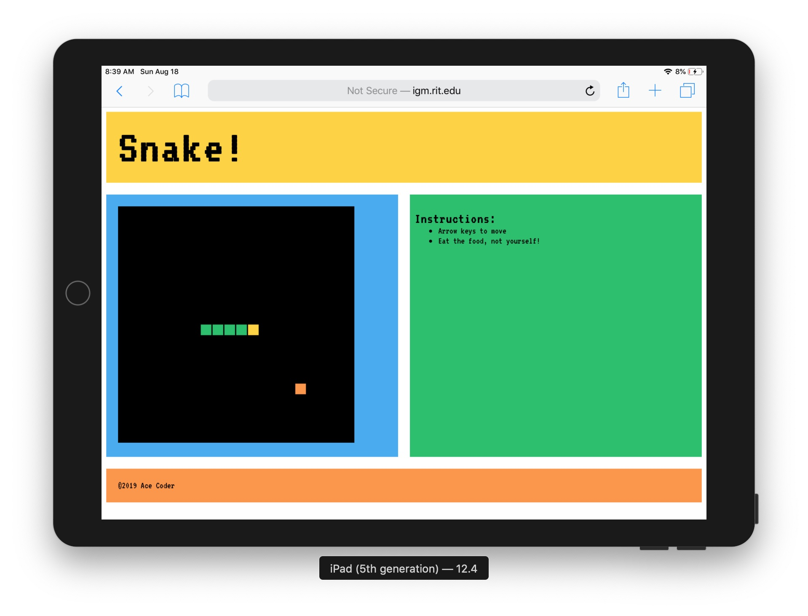
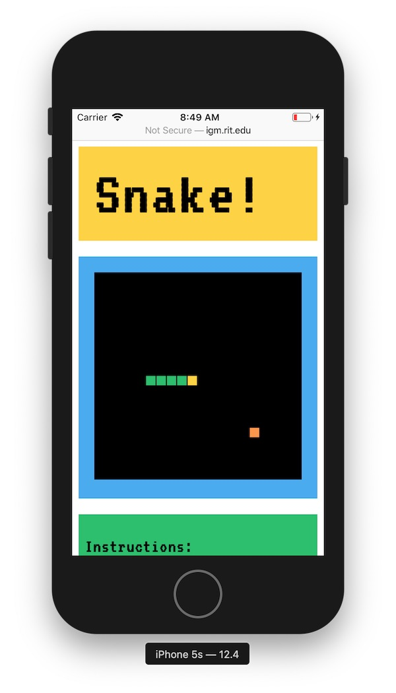

# Snake HW Part 0 - Overview

## I. Overview

- Overall goal - to architect an interactive,  media-rich responsive web application that runs on both mobile and desktop devices, without the use of any JavaScript libraries or dependencies. The *Snake* game was chosen because although the version we will build here is fairly simple, it does support mobile devices and is therefore not a throwaway or trivial example.
- The architecture we will use is in the "classic" style, and we will modify this architecture as we move through the course (by using ES6 classes and modules)

## II. Walkthrough Topics

### A. HTML & CSS:
- External CSS
- Loading a custom font
- CSS Grid for layout
- Responsiveness
- Setting the viewport
- Media queries for mobile & tablet support
- CSS Variables

### B. JavaScript
- ES5
    - `"use strict"`
    - `var`
    - `window.setTimeout()`
    - ternary operator
    - functions:
        - anonymous functions
        - functions as first class values
        - creating scope with IIFE
    - scope
        - function scope
        - globals and the window object
    - creating an external library of reusable JS code
    - Objects
        - Object literals
        - `this`
- ES6
    - `let`, `const`
    - template literals (strings)
    - enhanced object literals
    - arrow functions
    - default function parameters
    - Symbols & enums
- Events:
    - page load
    - keyboard
    - mouse
    - `window.focus` / `window.blur`

### C. Canvas API:
- `&lt;canvas>` element
- getting a drawing context object
- drawing state properties:
    - `.fillStyle`
    - `.globalAlpha`
    - `.font`
    - `.textAlign`
    - `.textBaseline`
- drawing state stack
- drawing state methods:
    - `.fillRect()`
    - `.fillText()`
    - `.save()`
    - `.restore()`

### D. Software Design Patterns:
- D.R.Y.
- OOP/Encapsulation
- Principle of least privilege
- Immutability

### E. Debugger:
- setting breakpoints
- viewing values of variables

<a id="part3"/>

## III. Screenshots

### III-A. Desktop

### III-B. Smartphone

### III-C. Tablet

### III-D. Small Smartphone

**[Next Chapter -> Snake Part I - Styling & Layout - A](HW-snake-1.md)**
