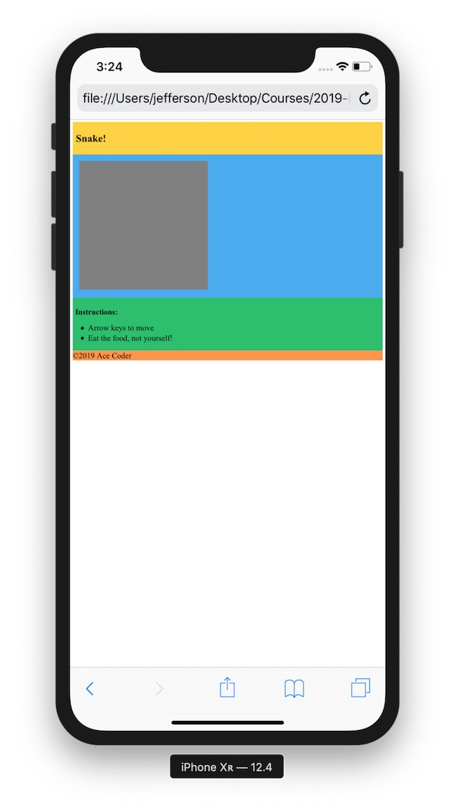

# Snake HW Part I - Styling & Layout - A

## I. Overview

- The *Snake* start code is below. Go ahead and create and name the file **snake-1.html**  
- Load the file into a web browser, and then check it out both on a desktop browser and on a mobile browser (or use the Chrome developer tools). You can also refer to the screenshots below.
- You should have noted that the the layout on the desktop version is missing the "2 column layout with header & footer" that we saw in the completed version in [Part 0](./HW-snake-0.md#part3).
- You should note that the page doesn't look too good on mobile compared to the "done version" we showed you in Part O. This is because the mobile browser assumes that the web page is 980-pixels wide, which means that all of the elements have to be scaled down (too much!) in order to fit. Thus the mobile versoin of the site is not very usable, unless the user pinches and zooms in.

## I-A. Reference

- Responsive design - https://developers.google.com/web/fundamentals/design-and-ux/responsive/
- viewport `<meta>` tag - https://developer.mozilla.org/en-US/docs/Mozilla/Mobile/Viewport_meta_tag

<hr>

## II. Start Code

**snake-start.html**

```html
<!DOCTYPE html>
<html lang="en">
<head>
	<meta charset="utf-8" />
	<title>Snake</title>
	<style>
		/* Layout & Colors from here: https://flaviocopes.com/css-grid/ */
		header {
			background-color: #fed330;
			padding: 10px;
		}
		article {
			background-color: #45aaf2;
			padding: 20px;
		}
		aside {
			background-color: #20bf6b;
			padding:.5em;
		}
		footer {
			background-color: #fd9644;
		}
		
		canvas{
			background-color: gray;
		}
		
	</style>
</head>
<body>
<div class="wrapper">
  <header><h1>Snake!</h1></header>
  <article>
    <canvas id="mycanvas" width="400" height="400"></canvas>
  </article>
  <aside>
  	<h2>Instructions:</h2>
		<ul>
			<li>Arrow keys to move</li>
			<li>Eat the food, not yourself!</li>
		</ul>
	</aside>
  <footer>&copy;2019 Ace Coder</footer>
</div>
</body>
</html>

```

<hr>

## III. Screenshots

**The layout isn't what we would like:**


**This layout makes all of the elements so small that the page is unreadable and unusable unless the user zooms in:**




<hr><hr>

**[Previous Chapter <- Snake Part 0 - Overview](HW-snake-0.md)**

**[Next Chapter -> Snake Part II - Desktop Layout](HW-snake-2.md)**
