# HW - Technobabble Generator II

## Overview

- Let's make some changes the Technobabble app and review some commonly used web technologies

## I. Stop Page Zooming

First, let's modify the viewport meta tag to more reliably turn off page zooming on mobile devices - we'll do this by adding a `maximum-scale` directive. Change the `<meta>` tag from this:

`<meta name="viewport" content="width=device-width, initial-scale=1, user-scalable=no">`

To this:

`<meta name="viewport" content="width=device-width, initial-scale=1, maximum-scale=1.0, user-scalable=no">`

<hr>

## II. Improve the experience for mobile and tablet devices

Let's go ahead and modify the CSS to improve the user experience on mobile devices. Basically, we want *Technobabble* to look less like  a webpage, and more like an *app*. What we're going to do is to center the text and the button both horizontally *and* vertically on the page for both mobile and tablet devices, while leaving the desktop experience with horizontal alignment only

- There are a lot of ways to do the vertical centering - see this Stack Overflow post --> https://stackoverflow.com/questions/19461521/how-to-center-an-element-horizontally-and-vertically
- Let's pick one of these approaches and use it - the second one - **Approach 2 - Flexbox method** works well
- In this exercise you will make create CSS breakpoints for 3 different screen sizes - mobile, tablet, and desktop/large tablet
- We will be using the same `max-width` breakpoints that bulma does - https://bulma.io/documentation/overview/responsiveness/
- First, here is your HTML for the new centered layout we are doing (replace the old HTML with this):


<hr>

```html
<h1>Technobabble Generator</h1>
<div class="container">
  <p id="output">Loading...</p>
  <button id="myButton">More Technobabble!</button>
</div>
```
<hr>

- Also, go ahead and delete the `max-width:600px` media query (and all of the CSS in it) that we made in the video, we're going to use a different approach below
- Keep the rest of the default CSS - among other things that can be the "fallback" for really old browsers that don't understand media queries
- Test this out in the Chrome developer tools - see how it looks on the desktop, and then preview at various screen sizes:
  - An old phone (ex. iPhone 4)
  - A previous generation phone (ex. iPhone 8)
  - A newer phone (ex. iPhone X)
  - A tablet (ex. iPad)
  - A large tablet (ex. iPad Pro)
 - It won't look too good on anything - let's fix this!

<hr>

**iPhone X (meh)**

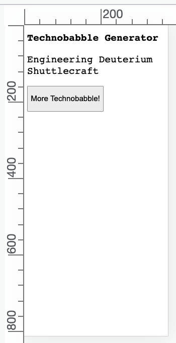

<hr>

### II-A. Mobile CSS breakpoint

- Here's the CSS media query and rules for a mobile browser (type this in!):

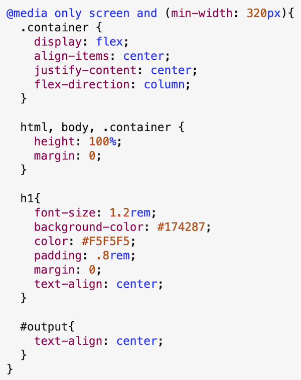

- This media query will apply to ***all*** devices where the `min-width` (usually meaning the width of the device when held in portrait orientation) is `320px` or larger
- And this means ALL phones, tablets and desktops (that understand media queries) will receive these rules
- Note: Even the original iPhone was 320 x 480, so it would use this query (although some early androids were 240 x 320, so they'd miss out!)
- What does this media query do?
  - Turns on flexbox, with a column layout, with the button and output centered horizontally and vertically
  - Styles the `<h1>`
  - Center-aligns the `#output` paragraph
- Go ahead and test it on the various devices in Chrome as we did above - it should look much better - especially on the phone-sized devices

<hr>

**iPhone 4 (`min-width`=320)**

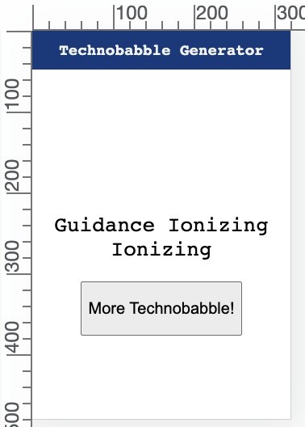

<hr>

**iPhone 8 (`min-width`=375)**

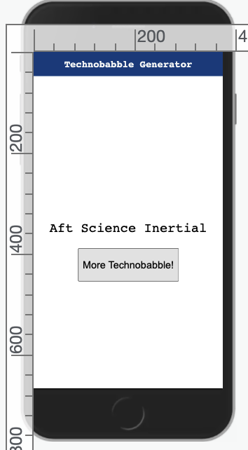

<hr>

**iPhone X (`min-width`=375)**

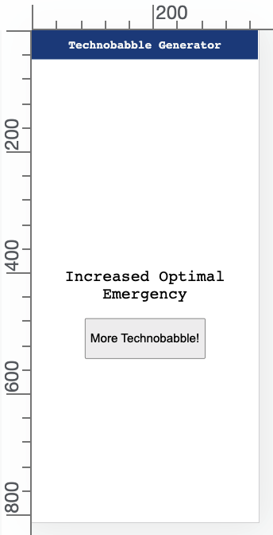

<hr>

- But note how the headline text, output text, and button all seem pretty small on larger screened devices like iPads - we'll fix that next!

**iPad (`min-width`=768)**

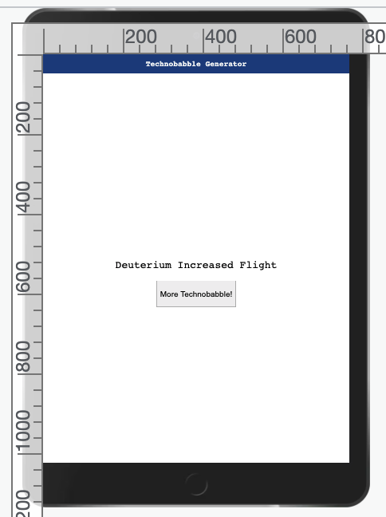

<hr>

### II-B. Tablet CSS breakpoint

- Here's the CSS media query and rules for a *tablet* browser (type this in!):

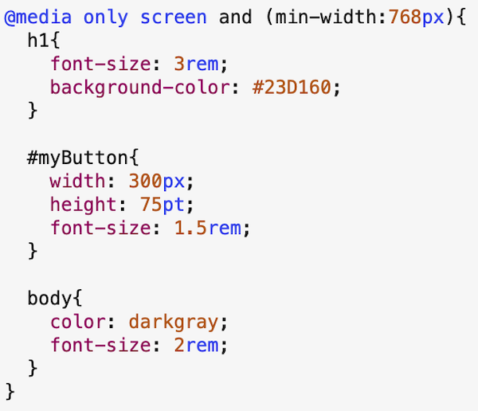

- This media query will apply to ***all*** devices where the `min-width` (usually meaning the width of the device when held in portrait orientation) is `768px` or larger
- And this means pretty much ALL tablets and desktops (that understand media queries) will receive these rules
- What does this media query do? It takes advantage of the tablet's extra screen real estate:
  - it changes the `background-color` of the `<h1>` to green, and increases the size of the font
  - it changes the `color` and increases the `font-size` of the output text and the button
- **IMPORTANT** - note that the `min-width=320px` media query is still "in effect" for the tablets. So for any of the previously written style rules that we didn't override in this rule, like `display: flex`,  **they remain in effect**

**iPad (`min-width`=768)**

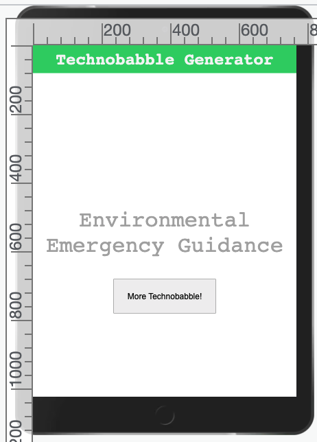

<hr>


### II-C. Desktop CSS breakpoint

- Here's the CSS media query and rules for a *large tablet* or desktop browser (type this in!):

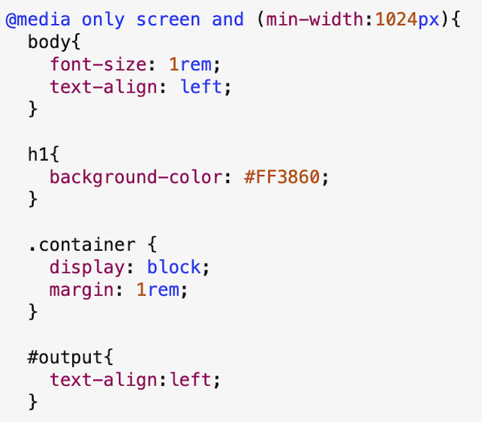

- Lastly, this media query will apply to ***all*** devices where the `min-width` (usually meaning the width of the device when held in portrait orientation) is `1024px` or larger - which means large tablets like the iPad Pro, as well as desktop computers
- And this means pretty much ALL tablets and desktops (that understand media queries) will receive these rules
- What does this media query do? It reverts to a more conventional web page design
  - it changes the `background-color` of the `<h1>` to red
  - it changes the `display` property from `flex` to `block`, which kills the flexbox "center fo the page" layout
  - it left aligns the `<h1>`, button, and output text 

<hr>

**iPad Pro (`min-width`=1024)**

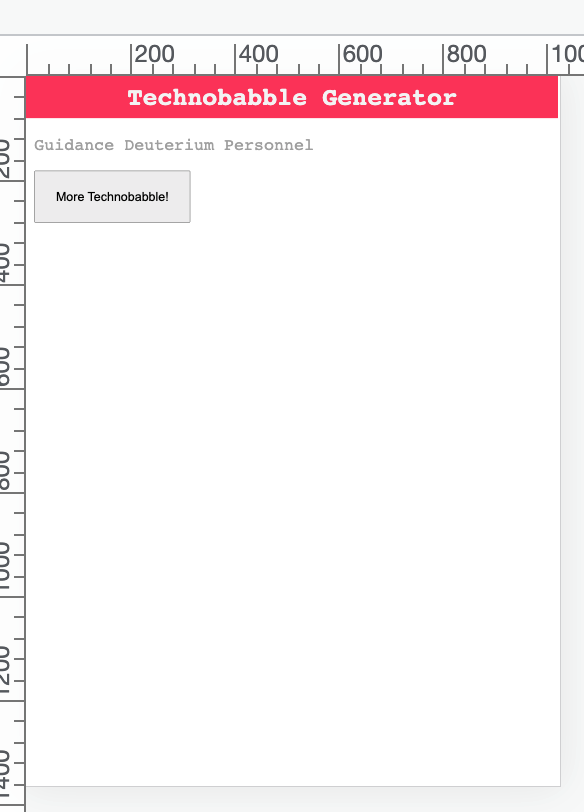

<hr>

<hr>

**Desktop (`min-width`=1200)**

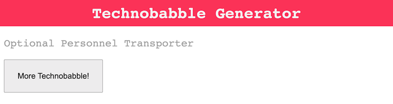

- Looks pretty good, but the button and `<h1>` sizes could be a little smaller, esp. on the desktop. Fix that if you wish in the next section

<hr>

### II-D. Your turn

- Go ahead and create one more CSS media query/breakpoint and give it some distinctive style rules. At a bare minimum, modify the `background-color` and `font-size` of the `<h1>`
- What should you choose as a breakpoint? 
  - maybe support those ancient android devices with a min-width of 240? (You can test that in the "responsive" mode of Chrome)
  - you could also support Phablets (large phones, bigger than an iPhone 8, and less than iPad sized)
  - or look at supporting Bulma's "fullhd" resolution, which is `1408px` and up
 - Make sure that you tell us what you did in the comments field of the dropbox

<hr>

## III. Embed a font

- You should already know how to do this:
  - head to https://fonts.google.com/
  - pick something distinctive (*Open Sans* and *Roboto* need not apply)
  - make sure that you tell us what you did in the comments field of the dropbox

<hr>

## IV. Re-organize the JS and CSS

- move your JavaScript code to an external folder and file named **src/main.js** - you have done this before - use the `<script>` tag
- move your CSS to external folder and file named **styles/default-styles.js**  - you have done this before - use the `<link>` tag
- PS and reminder - don't put the `<style>` tags in the external stylesheet - it will break things 

<hr>

## V. Submission
- make sure everthing still works!
- make sure that all the files are in a containing folder
- see myCourses for submission instructions

<hr><hr>

| <-- Previous Unit | Home | Next Unit -->
| --- | --- | --- 
|  [**HW - Technobabble Generator I**](HW-technobabble.md) |  [**IGME-330**](../README.md) | [**HW - Technobabble Generator III**](HW-technobabble-3.md)
