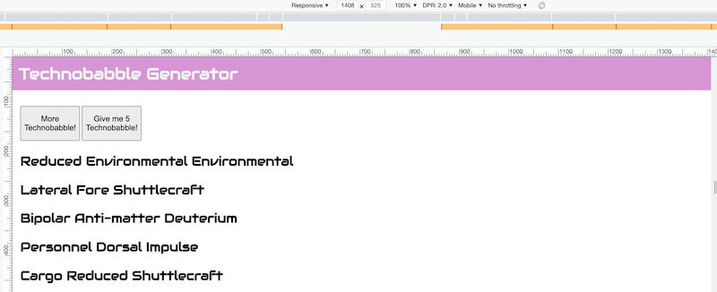
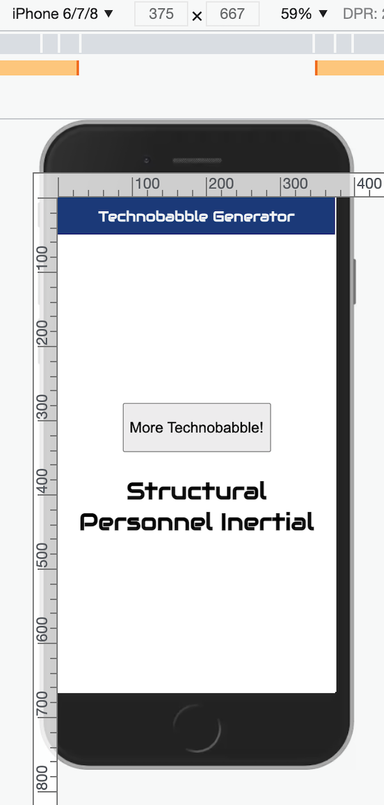

# HW - Technobabble Generator III

## I. Goal

- Add a functional "Give me 5 Technobabble" button to the TB Generator
- This button will display 5 lines of random babble every time it is clicked, rather than just 1
- ***This button will only appear at Bulma's "fullhd" resolution, which is 1408px*** - so you will need to write another media query to support this resolution

## II. Hints

- You will need to create a new button, and be sure to give it a unique `id`
- This button will call a function that generates 5 "technobabbles" and puts them on the screen
- The button should be invisible by default - use CSS `display: none` to hide it
- On screen sizes of `1408px` or higher, the button needs to be visible, so change the `display` property to something appropriate (`inline`, `inline-block`, or `block` should all work, depending on what you are trying to do)
- In my example below, I moved the `#output` paragraph to be below the button(s) on all of the screen sizes, so that the multiple lines of text displayed better, but you can leave that HTML alone if you prefer
- Once you have it working, both buttons MUST call the SAME function - named something like `generateTechno(num)`, passing in the number of technobabble that they want to be displayed

## III. Screenshots

**Desktop (`min-width`=1408 and higher) has TWO buttonss**

**iPhone 8 (min-width=375) has only ONE button and is unchanged from TB-II (other than the babble now being below the button)**

| <-- Previous Unit | Home | Next Unit -->
| --- | --- | --- 
|  [**HW - Technobabble Generator II**](HW-technobabble-2.md) |  [**IGME-330**](../README.md) | [**HW - Technobabble Generator IV**](HW-technobabble-4.md) 
