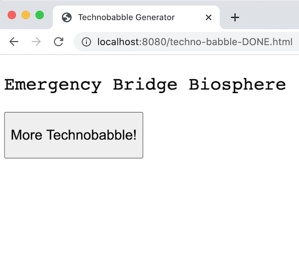
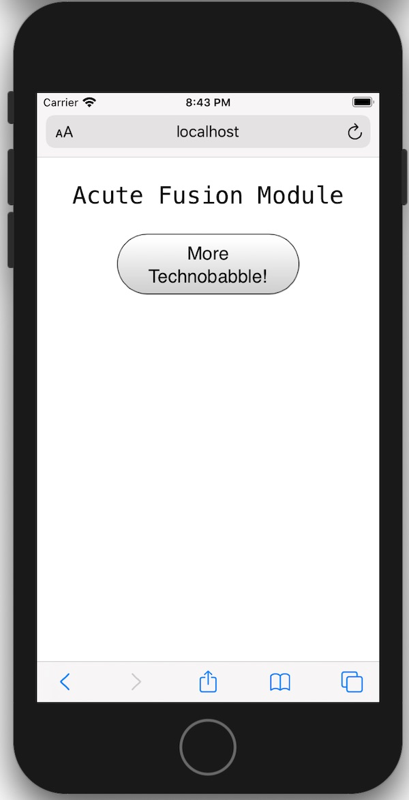
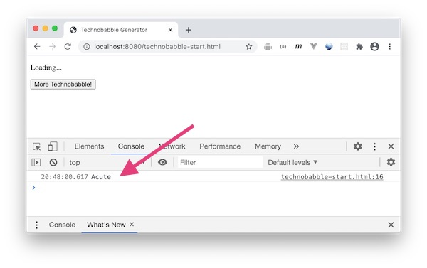

# HW - Technobabble Generator

***The walkthrough video for this assignment is here*** --> https://www.youtube.com/watch?v=DZ1q1zIdAb8

I. [Overview](#overview)

II. [Start Code](#start-code)

III. [Demo](#demo)

IV. [Review Questions](#review-questions)

V. [Reference](#reference)

<hr>

<a id="overview" />

## I. Overview

- Let's build a simple "Technobabble" JavaScript application:
  - What is *Technobabble*? --> https://www.youtube.com/watch?v=4RmKTAkNacw
- What the app does:
  - When the app starts up, it gives us a random string of *technobabble*, pulled from 3 arrays
  - When the user clicks the button, they get to see some new *technobabble*
- Here's a screenshot of the finished product:

<hr>



<hr>

- We'll even make it look acceptable on mobile phone

<hr>



<hr>

<a id="start-code" />

## II. Start Code

- When constructing a JavaScript web app that runs in a web browser, we are usually using at least 3 distinct computer *languages*:
  - [HTML](https://developer.mozilla.org/en-US/docs/Web/HTML) - to determine the *structure* of the page, which includes text elements such as headings and paragraphs, as well as interactive elements such as buttons and text input fields
  - [CSS](https://developer.mozilla.org/en-US/docs/Web/CSS) - *presentation*
  - [JavaScript](https://developer.mozilla.org/en-US/docs/Web/JavaScript) - *behavior*
- You can also think of these languages as tools to build three distinct *layers* of simple browser app
- With a larger app, we would place the HTML, CSS, and JavaScript into their own separate files, but today we'll keep things simple and keep all of the HTML/CSS/JS code in a single file 
- Go ahead and copy the following code and save it as a file to your desktop - name it **technobabble-start.html** 
  

**technobabble-start.html**
```html
<!DOCTYPE html>
<html lang="en">
<head>
	<meta charset="utf-8" />
	<title>Technobabble Generator</title>
	<style></style>
	<script>
	"use strict";
	
	const words1 = ["Acute", "Aft", "Anti-matter", "Bipolar", "Cargo", "Command", "Communication", "Computer", "Deuterium", "Dorsal", "Emergency", "Engineering", "Environmental", "Flight", "Fore", "Guidance", "Heat", "Impulse", "Increased", "Inertial", "Infinite", "Ionizing", "Isolinear", "Lateral", "Linear", "Matter", "Medical", "Navigational", "Optical", "Optimal", "Optional", "Personal", "Personnel", "Phased", "Reduced", "Science", "Ship's", "Shuttlecraft", "Structural", "Subspace", "Transporter", "Ventral"];
	
	const words2 = ["Propulsion", "Dissipation", "Sensor", "Improbability", "Buffer", "Graviton", "Replicator", "Matter", "Anti-matter", "Organic", "Power", "Silicon", "Holographic", "Transient", "Integrity", "Plasma", "Fusion", "Control", "Access", "Auto", "Destruct", "Isolinear", "Transwarp", "Energy", "Medical", "Environmental", "Coil", "Impulse", "Warp", "Phaser", "Operating", "Photon", "Deflector", "Integrity", "Control", "Bridge", "Dampening", "Display", "Beam", "Quantum", "Baseline", "Input"];
	
	const words3 = ["Chamber", "Interface", "Coil", "Polymer", "Biosphere", "Platform", "Thruster", "Deflector", "Replicator", "Tricorder", "Operation", "Array", "Matrix", "Grid", "Sensor", "Mode", "Panel", "Storage", "Conduit", "Pod", "Hatch", "Regulator", "Display", "Inverter", "Spectrum", "Generator", "Cloud", "Field", "Terminal", "Module", "Procedure", "System", "Diagnostic", "Device", "Beam", "Probe", "Bank", "Tie-In", "Facility", "Bay", "Indicator", "Cell"];

	console.log(words1[0]);
</script>
</head>
<body>
<p id="output">Loading...</p>
<button id="myButton">More Technobabble!</button>
	
</body>
</html>
```

- this doesn't do much yet, and the CSS is missing, but we'll rectify that soon
- load **technobabble-start.html** into a web browser (Chrome, Firefox, or Safari all work nicely), 
- now confirm that it is working by checking the console and verifying that the first element of the `words1` array has been logged out:
  - to open the developer console on Chrome, right-click in the window and choose **Inspect**, then find and click on the **Console** tab
  - you should see the following:

<hr>



<hr>

<a id="demo" />

## III. Demo

- Now we'll build the *Technobabble Generator* together (see the video link at the top of this page)
- What you **SHOULD** do first - is to go ahead and try to build *Technobabble Generator*  on your own - and then watch the video regardless of whether or not you were successful - to see how we wrote the code
- Issues we'll need to tackle to get this working:
  - **#1** - How to get random elements out of the 3 arrays:
    - **TIMTOWTDI** - pronounced *"Tim Toady"* - *there is more than one way to do it*: 
      - https://stackoverflow.com/questions/4550505/getting-a-random-value-from-a-javascript-array
      - https://en.wikipedia.org/wiki/There%27s_more_than_one_way_to_do_it
    - once you have this working, can you accomplish this in such a way to avoid a lot of duplicated code?
      - for example, ideally there should be ONE call to [`Math.random()`](https://developer.mozilla.org/en-US/docs/Web/JavaScript/Reference/Global_Objects/Math/random), not three!
      - This practice is often referred to as [D.R.Y. - "Don't repeat yourself"](https://en.wikipedia.org/wiki/Don%27t_repeat_yourself)
  - **#2** - How to string these three words together:
    - you could use string *concatenation* (e.g. the overloaded `+` operator)
    - **OR** JavaScript ES6 [Template Literals](https://developer.mozilla.org/en-US/docs/Web/JavaScript/Reference/Template_literals)
  - **#3** - How to update the `#output` paragraph element so that it displays the string of **technobabble**:
    - you can *select* this paragraph element with [`document.querySelector()`](https://developer.mozilla.org/en-US/docs/Web/API/Document/querySelector)
      - note that we won't be using [`document,getElementById()`](https://developer.mozilla.org/en-US/docs/Web/API/Document/getElementById), [`document.getElementsByTagName()`](https://developer.mozilla.org/en-US/docs/Web/API/Document/getElementsByTagName) *et al.* in this course
    - to modify the text of this paragraph, the [`.innerHTML`](https://developer.mozilla.org/en-US/docs/Web/API/Element/innerHTML) property of HTML elements will do the job
  - **#4** - How to get the `<button>` to call the above code when it is clicked
    - you will need to *select* the button using `document.querySelector()`
    - you could use the `onclick` [event handler](https://developer.mozilla.org/en-US/docs/Web/Guide/Events/Event_handlers)
    - you could use [`eventTarget.addEventListener()`](https://developer.mozilla.org/en-US/docs/Web/API/EventTarget/addEventListener) and the [`click` event](https://developer.mozilla.org/en-US/docs/Web/API/Element/click_event)
  - **#5** - **IMPORTANT** - your code must wait until the page loads before your JavaScript attempts to reference any elements on the page (e.g. the paragraph and button) 
    - you will run into this issue when attempting to complete #3 and #4 above
    - two solutions:
      - use [`window.onload`](https://developer.mozilla.org/en-US/docs/Web/API/GlobalEventHandlers/onload) or an event listener (listen for `load` or [`DOMContentLoaded`](https://developer.mozilla.org/en-US/docs/Web/API/Window/DOMContentLoaded_event)) to make sure that the "set up" code doesn't run until *after* the HTML on the page has fully loaded
      - **OR** move the `<script>` tag to the bottom of the `<body>` tag
  - **#6** - Improve the CSS so that we get a better look on both desktop and mobile devices
 <hr> 	
 
 <a id="review-questions" />
 
## IV. Review Questions (from notes & video - reference links below will help too)

- #1 - What are the 3 distinct *layers* of a (simple) web browser app?
- #2 - What are the 3 *languages* used to program these layers?
- #3 - List 3 things that `"use strict";` does? (see the link in *V. Reference* below below)
- #4 - Note that we declared the `words1`, `words2`, and `words3` arrays with `const` -  can elements be added and/or deleted from these arrays?
- #5 - Give an example of following the software development **D.R.Y.** principle
- #6 - Within JavaScript *template literals*, what goes inside the `${}`?
- #7 - Which symbol does a CSS *id selector* always start with?
- #8 - Using JS, what are two ways to detect that the page elements (i.e. DOM) have fully loaded?
- #9 - What does an *event handler* - ex. `myButton.onclick=` - "point" at?
- #10 - What do the first two arguments of `.addEventListener()` represent?
- Now, if you have time, you should go ahead and read this article about how the web browser downloads and renders HTML/CSS/JavaScript code into a web page:
  - https://blog.logrocket.com/how-browser-rendering-works-behind-the-scenes-6782b0e8fb10/ 
  - no more questions!
  

<hr>

<a id="reference" />

## V. Reference

- https://developer.mozilla.org/en-US/docs/Web/JavaScript/Reference/Strict_mode
- https://love2dev.com/blog/javascript-strict-mode/
- https://developer.mozilla.org/en/docs/Web/JavaScript/Reference/Statements/const
- https://en.wikipedia.org/wiki/Don%27t_repeat_yourself
- https://developer.mozilla.org/en-US/docs/Mozilla/Mobile/Viewport_meta_tag
- https://developer.mozilla.org/en-US/docs/Web/CSS/Media_Queries/Using_media_queries
