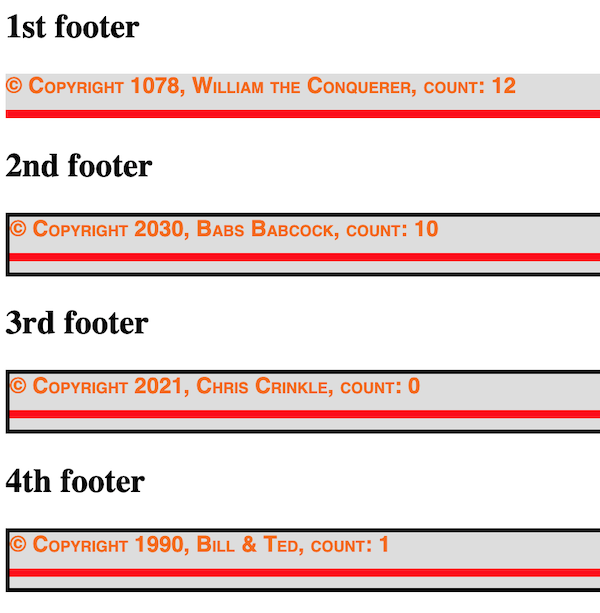

# HW - Web Components-2 - more lifecycle methods

## Overview
- This time we will add the `attributeChangedCallback()` & `disconnectedCallback()` lifecycle methods to our `<igm-footer>`
- We will also see how easy it is to add properties to our components by using vanilla JS in the component's constructor

<hr>

## I. Changing attribute values

- Starting with one of the example files where we built `<igm-footer>` last time (mayeb put it in a folder named **wc2/**) add the following to HTML document's `<script>` tag:

```js
window.onload = () =>{
  // get rid of the border of the first <igm-footer> - works!
  document.querySelector("igm-footer:first-of-type").style.border = "none";
  // change an attribute of the first <igm-footer> - fails!
  document.querySelector("igm-footer:first-of-type").setAttribute("data-year",1066);
};
```

- The first line of code succeeds in getting rid of the border that we previously added with the document-level `<style>`
- The second line of code that attempts to change the value of the `data-year` FAILS - why?
  - Because when attribute values are changed from their starting values, we need to write code that detects that change, and then re-renders the DOM
- Try using the web inspector to change the value of `data-year` directly - and the same thing happens - the text in the component's `<span>` fails to chnage
- So how do we get the text to update? Easy! The `attributeChangedCallback()` lifecycle method!

<hr>

## II. Implementing `attributeChangedCallback()`

- This is easy - first, tell the component to "watch" both the `data-year` and the `data-text` attributes

```js
static get observedAttributes(){
  return ["data-year", "data-text"];
}
```

- Then, implement `attributeChangedCallback()`
- Below, we are ignoring *which* attribute has changed, and to what value. We will instead simply re-render the component's DOM whenever one of the specified attributes values changes

```js
attributeChangedCallback(attributeName, oldVal, newVal){
  console.log(attributeName, oldVal, newVal);
  this.render();
}
```

- Test the code, now the JS should work and allow the component's attributes to be changed, and those changes will be reflected in the visible values of the component
- Let's pop some breakpoints into the code so that we can see what methods are getting called, and when
- One more thing - add this to the `window.onload` handler

```js
// BTW - the `dataset` property is easier to use than `.setAttribute()`
// Add this to the `window.onload` handler
document.querySelector("igm-footer:first-of-type").dataset.text= "William the Conquerer";
```

<hr>

## III. JS in our components

- We can easily add JS to our components
- How about, everytime we click on the `<span>` that contains the text & year, we increase the value of the year?
- First, let's give the component default values for `data-year` and `data-text`

```js
// put this at the end of the constructor
if(!this.dataset.year) this.dataset.year = 1989;
if(!this.dataset.text) this.dataset.text = "Bill & Ted";

// This line of code will create an property named `span` for us, so that we don't have to keep calling this.shadowRoot.querySelector("span");
this.span = this.shadowRoot.querySelector("span");
```

- Add the following to the top of  `connectedCallback()`

```js
this.span.onclick = () => {
  let year = +this.dataset.year + 1;
  this.dataset.year = year;
}
```

- Implement `disconnectedCallback()`
- This will be called when the component is removed from the DOM

```js
disconnectedCallback(){
  this.span.onclick = null;
}
```

- Test it! The year should increase by one every time the component's text is clicked
- PS - you can get rid of the annoying habit of the `<igm-footer>` text to keep being selected, with this CSS rule - put it in the `IGMFooter` component:

```css
user-select: none;
```

## III-A. Inspect the code
- In the debugger, let's put some breakpoints in, so we can see the lifecycle of the component:
  - put these breakpoints in `constructor()`, `connectedCallback()`, `disconnectedCallback()`, `attributeChangedCallback()` and `observedAttributes()`
  - it would be a goood idea to comment out the HTML so that there's only one component being added to the page
- From the console, you can now see the `disconnectedCallback()` method fired - type in this line of code - `document.querySelector("igm-footer:first-of-type").remove()`
- OR, you could have the component be removed from the DOM when the `<hr>` is clicked on:

```js
this.shadowRoot.querySelector("hr").onclick = () => {
 this.remove();
}

/* and here's the CSS to make the hr more "clickable"*/
hr{
  border: 3px solid red;
}
```

**... moving on ...**
- What does this line of code do?
  - `let year = +this.dataset.year + 1;`
  - How else could we write it?
- Change the function that `this.span.onclick` points at FROM an *ES6 arrow function*, TO a regular *ES5 function declaration* - ex. `funtion(){...}`
  - test the code - what happens?
  - why? - the value of `this` in a function depends on how the function was called - [MDN - `this`](https://developer.mozilla.org/en-US/docs/Web/JavaScript/Reference/Operators/this)

<hr>

## IV. Homework
- We've added a lot to this component, and it is demoing much of the web component API. It's actually been architected pretty nicely, especially it you are using the version where the HTML is contained in the `template`. *It also may be the ugliest and most useless thing we've made yet in this course!* So let's make one more change and then we're done with it
- Add a property to the constructor - `this.count=0;`
- Increment `this.count` every time the `<span>` text is clicked
- Display this value in the `<span>`

**Done Version:**



<hr><hr>

| <-- Previous Unit | Home | Next Unit -->
| --- | --- | --- 
|  [**HW - Web Components I**](HW-wc-1.md)  |  [**IGME-330**](../README.md) | :-\
