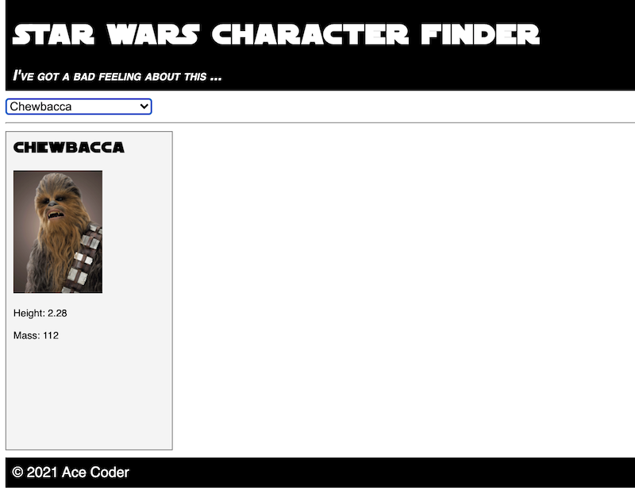
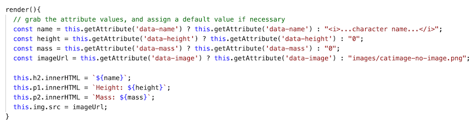

# HW - Web Components-3 - Build a component driven web app

## I. Overview

- Let's make a useful app that consists mostly of *web components* - notes and video links are below

<hr>

## II. Start Code

- Start files are here: [sw-start.zip](_files/sw-start.zip)
- Here's a screenshot of the starting version
- It has most of the functionality of the completed version, except that we are going to rewrite much of the app to use custom 3 web components, created by us
- BTW - the embedded fonts came from here - https://www.fontspace.com/sf-distant-galaxy-font-f6436



<hr>

## III. Screen Shot of completed version

- Most of the app functionality has been broken out into 3 components, and the final version allows us to add multiple `<sw-card>` instances to the page, and also remove them
- Note the HTML below that shows 2 components - `<sw-header>` & `<sw-footer>` - and `#cardlist` div which is where our `<sw-card>` instances will go


```html
<body>
  <sw-header data-title="Star Wars Character Finder"></sw-header>
  <main>
    <select id="character-select"></select>
    <hr>
    <div class="cardlist">
      <!-- This is where the <sw-cards> are displayed -->
    </div>
  </main>
  <sw-footer data-title="Ace Coder" data-year="2021"></sw-footer>
</body>
```

<hr>


<hr>

## IV. Walkthrough start code

- Video link is here - [HW - Web Components 3A - Walk Through Start Code (08:46)](https://rit.hosted.panopto.com/Panopto/Pages/Viewer.aspx?id=4b9441fc-595e-4589-9ab6-ada701395685&start=0)
- A few newish things in here:
  - All of the functions in this app (the **src/main.js** file) are [ES 6 Arrow functions](https://developer.mozilla.org/en-US/docs/Web/JavaScript/Reference/Functions/Arrow_functions). Because arrow function can only be called *after* they are declared, the best way to look at how the app is structured is to start at the bottom of the file

<hr>

- `loadFile()`:
  - `fetch()` and promises, `async`, `await`:
    -  with no error handling code, and we'll get away with that because it's a local file we are loading
    -  we covered `fetch()` in [HW-Ajax-5](HW-ajax-5.md), [HW-Ajax-6](HW-ajax-6.md) and [HW-Ajax-7](HW-ajax-7.md)
    - so our Ajax helper function is very simple, but does the job:

```js
const loadFile = (url,callback) => {
  const fetchPromise = async () => {
    const response = await fetch(url);
    callback(await response.json());
  }
  fetchPromise();
};
```

<hr>

- `jsonLoaded`:
  - converts the loaded JSON data structure from an array to an object, so that we can look up the characters by their *key* (`id`)
  - creates multiple `<option>` tags by looping through all of the keys of the JSON
  - creates a default character - "Stormtrooper Tim" - and passes it to `showCharacter()`

<hr>

- `selectChange()`:
  - triggered when the user chooses a new row of the `<select>`
  - does nothing if the first `<option>` is selected, or if for some reason there's no matching character in `swcJSON`

<hr>

`showCharacter()`:
  - updates the `innerHTML` of the `<section>` with the character info
  - note `??` - the [Nullish coalescing operator (??)](https://developer.mozilla.org/en-US/docs/Web/JavaScript/Reference/Operators/Nullish_coalescing_operator)
  - this *is a logical operator that returns its right-hand side operand when its left-hand side operand is null or undefined, and otherwise returns its left-hand side operand.*
  - think of it as a slightly safer way to assign default values than using logical OR like this - `let name = "Fred" || "No name given"`
  - try this in the console:
    - `let input = 0`
    - `let val = input || 42` - val=42 because zero is falsy
    - `let val = input ?? 42` - val=0 because zero is not `undefined` or `null`

<hr>

## V. Walk through (write) the "done" code

- Watch the videos!
- Note the comments, and some errata, for each video

**#1) [HW - Web Components 3A - Walk Through Start Code (08:46)](https://rit.hosted.panopto.com/Panopto/Pages/Viewer.aspx?id=4b9441fc-595e-4589-9ab6-ada701395685&start=0)**
    
- The walkthrough notes on this are in **section IV.** above

**#2) [HW - Web Components 3B - Implement `<sw-header>` (08:31)](https://rit.hosted.panopto.com/Panopto/Pages/Viewer.aspx?id=d72258d0-8419-4735-aeaa-ada7014993b4&start=0)**
    
- here is some code you can copy (we didn't show this very well in the video - you couldn't see the entire array):

```js
this.quotes = ["I've got a bad feeling about this ...","Will someone get this big walking carpet out of my way?!","Aren’t you a little short for a stormtrooper?","I hope you know what you’re doing.","Oh, it’s not like that at all. He’s my brother.","We have powerful friends. You’re going to regret this."];
```

**#3) [HW - Web Components 3C - Implement `<sw-card>` (15:32)](https://rit.hosted.panopto.com/Panopto/Pages/Viewer.aspx?id=066099ca-bd71-444f-a0a6-ada7016144b1&start=0)**
    
- in this video we introduce ES6 modules - you can read about them here:
  - https://developer.mozilla.org/en-US/docs/Web/JavaScript/Guide/Modules
  - https://developer.mozilla.org/en-US/docs/Web/JavaScript/Reference/Statements/import
  - https://developer.mozilla.org/en-US/docs/Web/JavaScript/Reference/Statements/export
- In the `<style>` section of **sw-card.js**, change `overflow: scroll;` to `overflow: auto;` - because some browsers will add scroll bars even when you don't need them
- Around the 12:00 mark on the video, we implemented the `render()` method, followed by the rest of the constructor code:
  - but it makes more sense to finish the constructor code *first*, then you'll have to deal with fewer error messages. That code is visible at 12:20
- Finally, the right-most portion of the `render()` method is cut off, so here's a screenshot of the completed version:




**#4) [HW - Web Components 3D - Multiple `<sw-card>` instances (06:49)](https://rit.hosted.panopto.com/Panopto/Pages/Viewer.aspx?id=15b3231b-b7df-40b2-9acc-ada80125d594&start=0)**
 
<hr>

## VI. One more thing

- The `loadFile()` function is something that we can keep reusing, let's move that into a separate file and make it an ES6 module

1) Create a file named **src/utils.js** and move `loadFile()` into it. Because all of the code in an ES6 module is scoped to the file it is declared in, we will need to ***`export`*** it so that it can be used in other JS files. Go ahead an move `loadFile()`  from **main.js** to **utils.js**, and add an `export` at the bottom:

```js
const loadFile = (url,callback) => {
  const fetchPromise = async () => {
    const response = await fetch(url);
    callback(await response.json());
  }
  fetchPromise();
};

export {loadFile};
```

2) At the top of **main.js**, ***`import`*** `loadFile()`:

```js
import {loadFile} from "./utils.js";
```

3) Test your program, it should work as before.


<hr>

## VII. Homework

- Get everything working that we covered in 3A-3D above
- Add 2 more properties of each character to the `<sw-card>`
  - one of these must be an array - for example `apprentices` (so yes you'll need to loop on it):
    - there are issues with passing in arrays to attributes - they will get converted to a string - solutions:
      - In `render()`, use `JSON.parse()` or `string.split()` as is appropriate
      - OR create a custom JS property - see [**HW-wc-4.md**](HW-wc-4.md) for that
  - make sure that the code still runs if that array is not present (for example, C-3P0 doesn't have any apprentices, meaning that the `apprentices` property is `undefined`)
- Create a `<sw-footer>` component, and add it to the page

<hr><hr>

| <-- Previous Unit | Home | Next Unit -->
| --- | --- | --- 
|  [**HW - Web Components II**](HW-wc-2.md)  |  [**IGME-330**](../README.md) | [**HW - Web Components IV**](HW-wc-4.md) 
