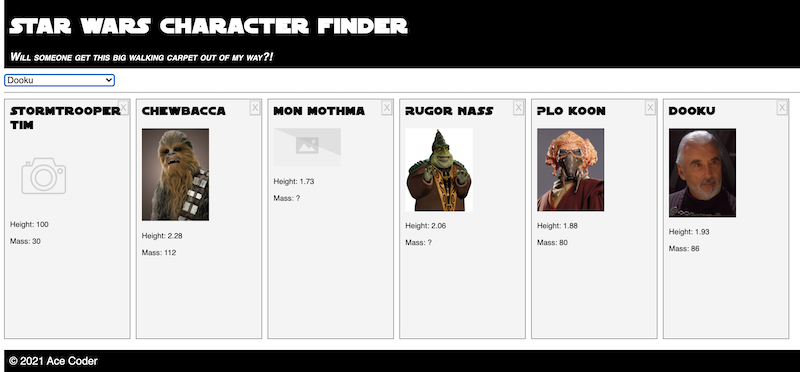

# HW - Web Components-3 - Build a component driven web app

## I. Overview

- Video links are below
- Coming soon! An announcement will be made in Slack once this document has been updated

<hr>

## II. Start Code

- Start files are here: [sw-start.zip](_files/sw-start.zip)
- Here's a screenshot of the starting version
- It has most of the functionality of the completed version, except that we are going to rewrite much of the app to use custom 3 web components, created by us


<hr>

## III. Screen Shot of completed version

- Most of the app functionality has been broken out into 3 components, and the final version allows us to add multiple `<sw-card>` instances to the page
- Note the HTML below that shows 3 components


```html
<body>
	<sw-header data-title="Star Wars Character Finder"></sw-header>
	<main>
		<select id="character-select"></select>
		<hr>
		<div class="cardlist">
			<!-- This is where the <sw-cards> are displayed -->
		</div>
	</main>
	<sw-footer data-title="Ace Coder" data-year="2021"></sw-footer>
</body>
```

<hr>



<hr>

## IV. Walk through start code

- A few newish things in here:
  - All of the functions in this app (the **src/main.js** file) are [ES 6 Arrow functions](https://developer.mozilla.org/en-US/docs/Web/JavaScript/Reference/Functions/Arrow_functions). Because arrow function can only be called *after* they are declared, the best way to look at how the app is structured is to start at the bottom of the file:

<hr>

- `jsonLoaded`:
  - converts the loaded JSON data structure from an array to an object, so that we can look up the characters by their *key* (`id`)
  - creates multiple `<option>` tags by looping through all of the keys of the JSON
  - creates a default character - "Stormtrooper Tim" - and passes it to `showCharacter()`

<hr>

- `loadFile()`:
  - `fetch()` and promises, `async`, `await`:
    -  with no error handling code, and we'll get away with that because it's a local file we are loading
    -  we covered `fetch()` in [HW-Ajax-5](HW-ajax-5.md), [HW-Ajax-6](HW-ajax-6.md) and [HW-Ajax-7](HW-ajax-7.md)
    - so our Ajax helper function is very simple, but does the job:

```js
const loadFile = (url,callback) => {
  const fetchPromise = async () => {
    const response = await fetch(url);
    callback(await response.json());
  }
  fetchPromise();
};
```

<hr>

- `selectChange()`:
  - triggered when the user choose a new row of the `<select>`
  - does nothing if the first `<option>` is selected, or if for some reason there's no matching character in `swcJSON`

<hr>

`showCharacter()`:
  - updates the `innerHTML` of the `<section>` with the character info
  - note `??` - the [Nullish coalescing operator (??)](https://developer.mozilla.org/en-US/docs/Web/JavaScript/Reference/Operators/Nullish_coalescing_operator)
  - this *is a logical operator that returns its right-hand side operand when its left-hand side operand is null or undefined, and otherwise returns its left-hand side operand.*
  - think of it as a slightly safer way to assign default values than using logical OR like this - `let val = 100 || 42`

<hr><hr>

| <-- Previous Unit | Home | Next Unit -->
| --- | --- | --- 
|  [**HW - Web Components II**](HW-wc-2.md)  |  [**IGME-330**](../README.md) | :-\
