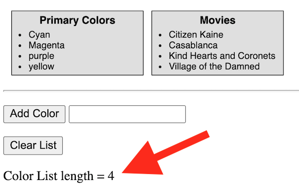
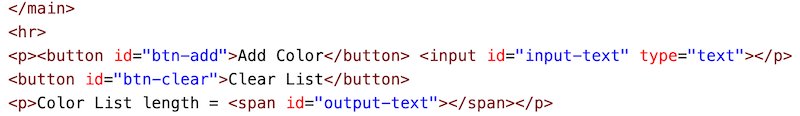
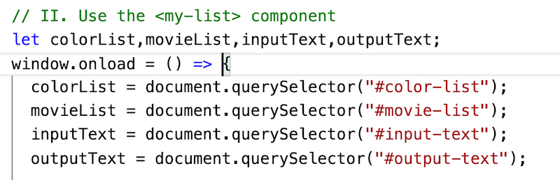

# HW - Web Components-5 - Dispatching Custom Events

## I. Overview

- So far we have seen that web components are an effective way to encapsulate a user interface (via HTML/CSS) & functionality (extending the `HTMLElement` class):
  - they can easily be reused on the same page - for example `<sw-card>` or between multiple pages/projects `<sw-header>`, `<my-header>`, `<my-footer>` etc
  - parameters can be passed in via HTML custom `data-` attributes, or via stanard JS object properties
- One issue that you will run into with web components (and also in other web frameworks) is how to pass information *out* of a web component:
  - how can a web component "communicate" with the rest of your app? how can it pass values to other components?
- One solution to this issue is to have a components emit a *custom event*, and then another part of your program can listen for and respond to these events:
  - the concept is the same as listening for `window.onload` or `btnSend.onclick` events, but in this case we are going to listen for `colorList.onlengthchanged` (but we'll have to use the more modern syntax instead - `colorList.addEventListener("lengthchanged", e => doStuff(e)`)
`)
  - you can get an overview of this here:
    - [MDN-Creating and triggering events](https://developer.mozilla.org/en-US/docs/Web/Events/Creating_and_triggering_events)
    - [CustomEvent](https://developer.mozilla.org/en-US/docs/Web/API/CustomEvent)
    - [EventTarget.dispatchEvent()](https://developer.mozilla.org/en-US/docs/Web/API/EventTarget/dispatchEvent)
- What we are trying to promote here is *loose coupling* of our software components, with minimal dependencies, which makes it easier to reuse and maintain our code
- BTW - Below we are going to demonstrate the *custom event* technique, but here are other ways to accomplish the same thing, possibly by hard coding global references in the component (BAD), or passing in function references that can be called back later when the array length changes (BETTER)

<hr><hr>

## II. Goal

- We are going to take the `<my-list>` component from [last time](HW-wc-4.md) and give it the ability to emit a `lengthchanged` event, this event will be broadcast by the component whenever the length of the `items` array changes. We can then write code (outside of the component) that will *listen* for this event, and then update the UI with the new length



<hr><hr>

## III. Get Started

<hr>

1) Make a copy of **list-component.html** and name it **list-component-with-event.html**

<hr>

2) Add a `clear()` method to the `MyList` class - it empties out the `_items` array - you can test it from the console:

```js
// type this in the browser console to test the code you wrote!
colorList.clear() // empties the `_items` array, which will be visible on the page
colorList.items // shows an empty array `[]`
```

<hr>

3) Add a `length()` getter method to the `MyList` class - it returns the length of `_items` - you can test it from the console:

```js
// type this in the browser console to test the code you wrote!
// remember that we call a getter method like it's a property, no parens are needed
colorList.length // returns number of items in list
```

<hr>

4) Add some HTML to the bottom of the page:



<hr>

5) Initialize the `inputText` and `outputText` variables (you won't be using the latter variable until the end of this)



<hr>

6) Here is the code that gets the `<input>` and the `#btn-add` button working, so that clikcing the button adds new items to the end of the list. Put this code at the end of the `window.onload` event handler:

```js
document.querySelector("#btn-add").onclick = e => {
  const item = inputText.value.trim();
  if(item){
    colorList.add(item);
    inputText.value = "";
  }
};
```

- test the form, you should be able to add items to the Color List now

<hr>

7) Finally, get `#btn-clear` working - we'll let you do that one on your own

<hr><hr>

## IV. The interesting part - "pushing" data from of the component by dispatching a custom event

- Now we are going to look at one way we can get our component to "push" or "broadcast" data to other parts of the program
- In this case, we want to have our component let any of its listeners know when the length of the list has changed
- Below we will use a `CustomEvent` (sent by the component) to do so.
- There are other ways to do this:
  - some more elaborate, like creating a separate "Notification Center" object
  - some easier, like having our code grab the `colorList.length` property every time we click the Add or Clear buttons
- but we are going to demo custom events below because often it's the best way to solve a particular problem


1) In `MyList`, write a `lengthChanged` helper method, it looks like this:

```js
lengthChanged(){
  this.dispatchEvent(new CustomEvent("lengthchanged", {
  detail: {
            length: this.length
          }
  })  // end new CustomEvent()
  ); // end dispatchEvent call
}
```
- here we will broadcast an event named `"lengthchanged"` to any object that is listening for it
- we are sending along the current length, wrapped in a `detail` object, which is a convention that the DOM uses
- the links to the docs for `dispatchEvent()` and `CustomEvent` are at the top of this document

<hr>

2) Now we need to call this helper at the appropriate times:

  - so go ahead and make a call to `this.lengthChanged();` in the `add()` and `clear()` methods (which is when the length of the list will change)

<hr>

3) Finally, back in the main program, in the `window.onload` event handler, add the following code:

```js
// listen for the "lengthchanged" event and then update the #output-text
colorList.addEventListener("lengthchanged", e => outputText.innerHTML = e.detail.length);
```

- be sure to put this code right **AFTER** the variable initialization, **BEFORE** we start to add items to the list
- test it, now the `#output-text` should update with the correct length every time we at items to the list, or clear it

<hr><hr>

## V.  Wrap Up

- Just like `window.onload` or `btnSend.onclick` events, that we can hook into with `btnSend.addEventListener("click", doStuff)` ...
- above we saw that we can also configure our component to send events that other parts of our program can listen for - `colorList.addEventListener("lengthchanged", doStuff);`

<hr>

## VI.  HW

- Get all of the above working - both the "Add" and "Clear" buttons - and the updating of the list component and `#output-text`
- See dropbox for submission instructions

<hr><hr>

| <-- Previous Unit | Home | Next Unit -->
| --- | --- | --- 
|  [**HW - Web Components IV**](HW-wc-4.md)  |  [**IGME-330**](../README.md) | :-\
