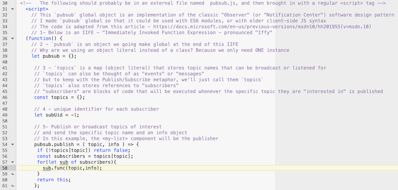
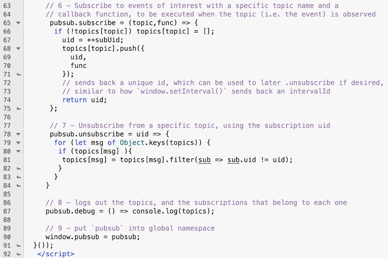

# HW - Web Components-6 - Building a "pubsub" object aka "Publish/Subscribe"

## I. Overview


## II. Our "pubsub" object

- below is the source code and comments for our `pubsub` object
- as you can see, there's not much code here, but it really will get the job done






<hr>

### III-A. Let's save you a little bit of typing

- Here is a stub, with mostly the comments preserved, you can type the rest in on your own:

**pubsub.js**

```js
<!--   The following should probably be in an external file named  pubsub.js, and then brought in with a regular <script> tag -->
	<script>
		// This `pubsub` global object is an implementation of the classic "Observer" (or "Notification Center") software design pattern
    // I made `pubsub` global so that it could be used with ES6 modules, or with older client-side JS syntax
		// The code is adapted from this article - https://docs.microsoft.com/en-us/previous-versions/msdn10/hh201955(v=msdn.10)
		// 1- Below is an IIFE - "Immediately Invoked Function Expression - pronounced "Iffy"
  (function() {
    // 2 - `pubsub` is an object we going make global at the end of this IIFE
	  // Why are we using an object literal instead of a class? Because we only need ONE instance 

 
		 // 3 - `topics` is a map (object literal) that stores topic names that can be broadcast or listened for
		 // `topics` can also be thought of as "events" or "messages"
		 // but to keep with the Publish/Subscribe metaphor, we'll just call them `topics`
		 // `topics` also stores references to "subscribers"
		 // "subscribers" are blocks of code that will be executed whenever the specific topic they are "interested in" is published

	
		 // 4 - unique identifier for each subscriber
		 let subUid = -1;
	
		 // 5- Publish or broadcast topics of interest
		 // and send the specific topic name and an info object
		 // In this example, the <my-list> component will be the publisher

	
		// 6 - Subscribe to events of interest with a specific topic name and a
		// callback function, to be executed when the topic (i.e. the event) is observed
		 
				// sends back a unique id, which can be used to later .unsubscribe if desired,
				// similar to how `window.setInterval()` sends back an intervalId
	
		 // 7 - Unsubscribe from a specific topic, using the subscription uid

		// 8 - logs out the topics, and the subscriptions that belong to each one

		// 9 - put `pubsub` into global namespace

 }());
``` 


<hr><hr>

| <-- Previous Unit | Home | Next Unit -->
| --- | --- | --- 
|  [**HW - Web Components V**](HW-wc-5.md)  |  [**IGME-330**](../README.md) | :-\
