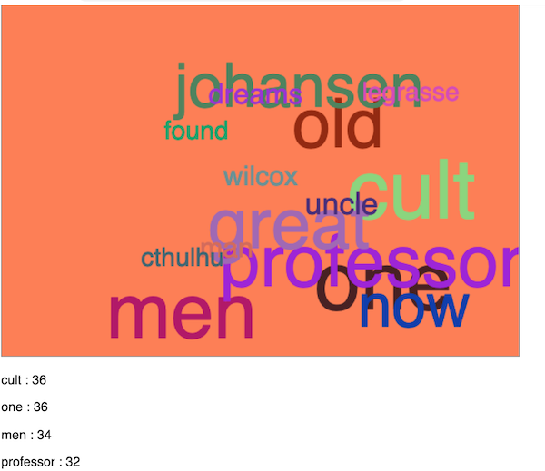

# HW - Word Cloud

## I. Overview
- Extend our word counting demo and create a canvas "word cloud" 
- If you extend and polish this HW assignment, it could make a nice portfolio piece

## II. Requirements

- Use the canvas API and state properties and methods such as [`.fillText()`](https://developer.mozilla.org/en-US/docs/Web/API/CanvasRenderingContext2D/fillText), [`strokeText()`](https://developer.mozilla.org/en-US/docs/Web/API/CanvasRenderingContext2D/strokeText), `.fillStyle`, `.font`, `textAlign` and `textBaseline`
- Limit the number of words that you draw in the cloud to something manageable - say between 10 and 25
- More frequent words appear larger than smaller words
- Be sure to specify a minimum font size of the words you draw
- This is worth TWO homework assignments
- Extras (not required, but if you have time):
  - don't let the words appear on top of each other 
  - animated words?
  
## III. Hints
- Replace the `#dropbox` paragraph with a &lt;canvas> element, and then add drag-and-drop to the canvas with: 

    `let dropbox = document.querySelector("canvas");`

- From our previous assignments, both `getRandom()`, and a modified version of `getRandomColor()` (with brighter colors), will be helpful
- To properly determine the size of each word, consider calculating the total number of appearances of all words, then calculate a weight (as a percentage) for each individual word. The words with the highest percentages would then of course be drawn at a larger font size than the words with lower percentage values 
  
## IV. Example
  - Nothing too fancy here - consider the screenshot below to be the MVP expected for the HW assignment
  - P.S. The corpus is *The Call of Cthulhu*
  
  
