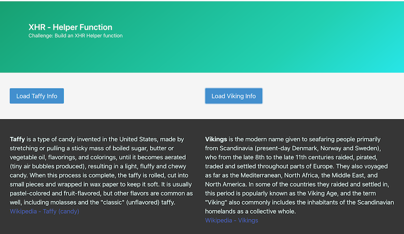

# XHR Helper Function Exercise

## I. Overview

- Your mission is to write code that follows the **DRY** software development principle:
  - Clicking the "Load Taffy Info" button in the screenshot below will load and display the contents of the **taffy-facts.txt** file
  - Clicking the "Load Viking Info" button will load and display the contents of the **viking-facts.txt** file
  - You will create a `loadTextXHR()` helper function named that accepts 2 parameters - `url` and `callback`
    - `url` is the path to the file you want to download with `XHR`
    - `callback` is the function you want to have called when the file has downloaded. This callback function will update the appropriate part of the page with the downloaded HTML fragment
  - the two buttons in the screenshot below are both calling the same `loadTextXHR()` function, but passing in different values for the 2 parameters

### II. Screenshot of completed version

- Here we are using the Bulma CSS framework - https://bulma.io/documentation/

### III. Start Files

- [XHR-helper-breakout-start.zip](_files/XHR-helper-breakout-start.zip)
