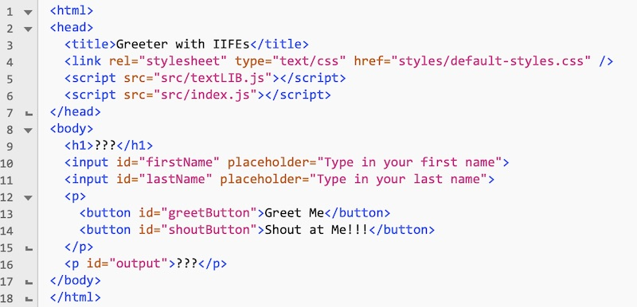
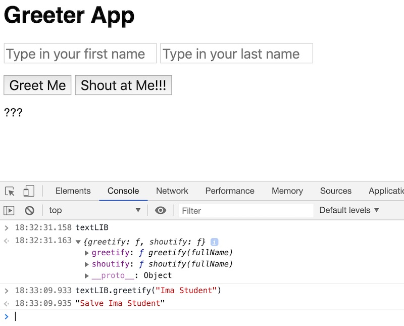

# IIFE Review

## I. Overview
- Recently you learned about IIFEs here --> [The IIFE - "Immediately Invoked Function Expression"](IIFE-notes.md)
- Let's practice how to architect a JS project, in a somewhat old school (but still relevant) "ES-5 / IIFE Style"!
- The instructions are in the HTML file below
- **HINTS:**
  - `<script>` tags don't belong in external JavaScript files
  - `<style>` tags don't belong in external CSS files

## II. Start Code


**greeter-app-globals.html**

```html
<html>
<head>
	<title>Greeter App with Globals</title>
	<style>
		body{
			font-family:sans-serif;
		}
		
		button,input{
			font-size:1.2em;
		}
		
		li{
			margin-bottom:1em;
		}
	</style>
</head>
<body>
	<h1>???</h1>
	<input id="firstName" placeholder="Type in your first name">
	<input id="lastName" placeholder="Type in your last name">
	<p>
		<button id="greetButton">Greet Me</button>
		<button id="shoutButton">Shout at Me!!!</button>
	</p>
	<p id="output">???</p>
	<hr>
	<h2>???</h2>
	<p id="instructions">???</p>
	
	<ol>
		<li>In a web browser, test this app, and then look over the HTML/CSS and JS code.</li>
		<li>In the console, test the <code>greetify()</code> and <code>shoutify()</code> functions with <code>greetify("Fred Jones")</code> and <code>shoutify("Norville Rogers")</code></li>
		<li>Open up the debugger, put in a breakpoint near the bottom of the &lt;script> tag:
			<ul>
				<li>What is the <i>scope</i> of <code>appData</code>?</li>
				<li>What is the <i>scope</i> of all 5 functions?</li>
			</ul>
		</li>
		<li>Wrap the contents of the &lt;script> tag in an <href="https://developer.mozilla.org/en-US/docs/Glossary/IIFE">IIFE</a>, and open the debugger:
			<ul>
				<li>Now what is the <i>scope</i> of <code>appData</code>?</li>
				<li>Now what is the <i>scope</i> of all 5 functions?</li>
				<li>In the console, test the <code>greetify()</code> and <code>shoutify()</code> functions again - what happens?</li>
			</ul>
		</li>
		<li>Now move the <code>greetify()</code> and <code>shoutify()</code> functions to an external file named <b>textLIB.js</b>:
			<ul>
				<li>save this file into a folder named <b>src</b></li>
				<li>wrap the two functions in an IIFE</li>
				<li>don't forget to <code>"use strict";</code></li>
				<li>to "export" these 2 functions and make them visible outside the IIFE, attach the 2 functions to a global object named <code>textLIB</code></li>
				<li>in the HTML file, create a &lt;script> tag that links to <b>textLIB.js</b></li>
				<li>in the HTML file, modify the JS calls to <code>greetify()</code> and <code>shoutify()</code> so that they utilize the <code>textLIB</code> object</li>
				<li>Test the app and be sure that it still works</li>
			</ul>
		</li>
		<li>Now move the rest of the JS code in the HTML file to an external file named <b>index.js</b>:
			<ul>
				<li>wrap all the code in an IIFE</li>
				<li>don't forget to <code>"use strict";</code></li>
				<li>You DO NOT NEED to create any sort of global object, just keep all of this JS "private" to the IIFE</li>
				<li>save this file into a folder named <b>src</b></li>
				<li>in the HTML file, create a &lt;script> tag that links to <b>index.js</b></li>
				<li>test the app and be sure that it still works</li>
			</ul>
		</li>
		<li>Now move the style rules from the HTML file to an external file named <b>default-styles.css</b>:
			<ul>
				<li>save this file into a folder named <b>styles</b></li>
				<li>in the HTML file, create a &lt;link> tag that links to <b>default-styles.css</b></li>
				<li>test the app and be sure that it still looks and works the same</li>
			</ul>
		</li>
		<li>In the HTML file, delete all the "instructions" HTML after (and including) the &lt;hr> tag. (Don't delete the &lt;script> tags and the closing &lt;/body> & &lt;/html> tags, obviously) Then delete any of the DOM code that "wrote" to that part of the page. Now there's not much left in the HTML file, that's a good thing!</li>
		<li>Test the app and be sure that it still works the same</li>
		<li>This is basically how Project 1 will need to be structured!</li>
	</ol>
	
	<script>
	"use strict";
	
	window.onload = init;
	
	const appData = {
		appHeadingText: "Greeter App",
		appInstructionsHeading: "Instructions for this exercise",
		appInstructionsText: "We are going to refactor the code in this example so that all the JS is wrapped in an IFFE, and has been moved to external files:"
	};
	
	function init(){
		document.querySelector("h1").innerHTML = appData.appHeadingText;
		document.querySelector("h2").innerHTML = appData.appInstructionsHeading;
		document.querySelector("#instructions").innerHTML = appData.appInstructionsText;
		
		document.querySelector("#greetButton").onclick = greetButtonClicked;
		document.querySelector("#shoutButton").onclick = shoutButtonClicked;
	}

	function greetButtonClicked(){
		let firstName = document.querySelector("#firstName").value;
		let lastName = document.querySelector("#lastName").value;
		output.innerHTML = greetify( `${firstName} ${lastName}` );
	}
	
	function shoutButtonClicked(){
		let firstName = document.querySelector("#firstName").value;
		let lastName = document.querySelector("#lastName").value;
		output.innerHTML = shoutify( `${firstName} ${lastName}` );
	}
	
	function greetify(fullName){
		let greetings = ["Hello", "Hi", "Bonjour", "Guten tag", "Hola", "Shalom", "Salve"];
		let randomGreeting = greetings[Math.floor(Math.random() * greetings.length)];
		return `${randomGreeting} ${fullName}`;
	}
	
	function shoutify(fullName){
		let exclamations = ["!", "!!", "!?!", "?!!", "@#$%!", "???", "!!!"];
		let randomExclamation = exclamations[Math.floor(Math.random() * exclamations.length)];
		return `Hey ${fullName} ${randomExclamation}`.toUpperCase();
	}
	
	</script>
</body>
</html>
```

### III. Screenshot

1. When you are all done, the app should function as before
2. All of your code (except for the `textLIB` global) should no longer be in the browser's global namespace 
3. The HTML file should look something like this:

**greeter-app-ES5-IIFE.html**



4. And the page and console should look like this:


