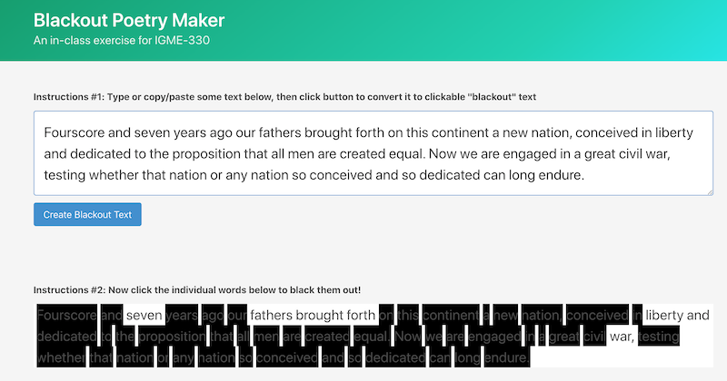
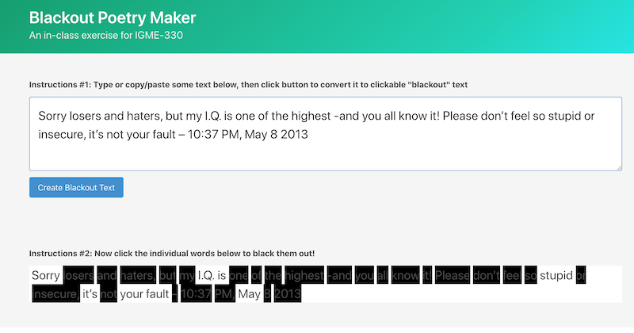
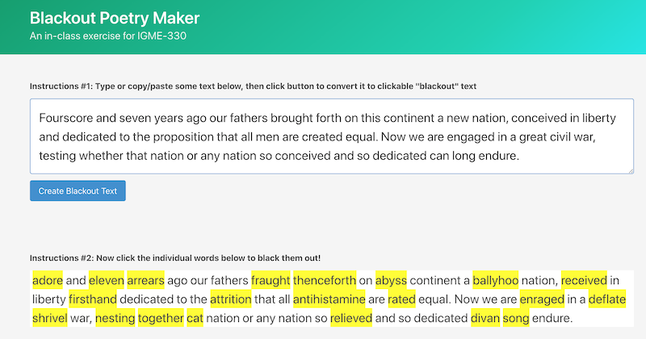

# Blackout Poetry Maker & RiTa.js

## I. Overview

- Blackout Poetry is a form of *appropriation art* (the use of pre-existing objects or images) where the artist takes a pieces of text (a book, a newspaper article, a tweet, a speech and so on) and "blacks out" (subtracts) the words they don't want.
- https://writers.com/what-is-blackout-poetry-examples-and-inspiration
- https://www.google.com/search?q=blackout+poetry&source=lnms&tbm=isch
- Related antecedants:
  - Erasure Poetry - https://poets.org/glossary/erasure
  - Garfield Minus Garfield - https://garfieldminusgarfield.net/

<hr>

## II. Example App Screenshot

- Let's build a simple web version of a Blackout Poetry tool - the user can type text into the top `<textarea>`, click the button, and then have clickable blackout text in the bottom paragraph
- here's 2 screenshots of our first version:



<hr>



- https://en.wikipedia.org/wiki/Gettysburg_Address#Text
- https://www.crowdbabble.com/blog/the-11-best-tweets-of-all-time-by-donald-trump/

<hr>

## III. Start Code
- [bp-start.zip](_files/bp-start.zip)
  - look in **main.js** for comments that will get you started 
  - BTW - as we write some of the code, we might get to talk about [JS event bubbling](https://javascript.info/bubbling-and-capturing)


<hr>

## IV. Blackout Poetry Resources
- [YouTube - Coding Tech - Making Blackout Poetry With Computers!](https://www.youtube.com/watch?v=hoxS_tLbqYs)
- [YouTube - Austin Kleon - How To Make A Newspaper Blackout Poem](https://youtu.be/wKpVgoGr6kE)
- https://authority.pub/blackout-poetry/
- https://www.miamioh.edu/hcwe/hwc/writing-resources/howe-blackout-poetry/index.html
- https://powerpoetry.org/actions/5-tips-creating-blackout-poetry
- https://dev.to/ivavay/create-a-black-out-poetry-maker-with-javascript-4kah
- https://codepen.io/Johnesco/pen/geewXm
- https://github.com/emmawinston/blackoutpoetry
- https://codepen.io/emmawinston/pen/VqoPEY
- https://mkremins.github.io/blackout/
- https://www.poetryfoundation.org/poems

<hr>

## V. Adding more capabilities with the RiTa.js library

### V-A. Overview of RiTa
- RiTa is a "software toolkit for computational literature"
- Documentation of the JavaScript version of RiTa is here: 
  - http://rednoise.org/rita/
  - https://rednoise.org/rita/#reference
  - https://github.com/dhowe/RiTaJS
- Some of RiTa's capabilities:
  - *text tagging* - get the part of speech of a word - such as *adjective*, *verb*, *noun*, *proper noun*, *pronoun* etc  - from the PENN part of speech tags: 
    - https://en.wikipedia.org/wiki/Part-of-speech_tagging
    - https://www.ling.upenn.edu/courses/Fall_2003/ling001/penn_treebank_pos.html
  - *verb conjugation* and *pluralization*
  - word *rhyming* and *alliteration* (we'll use these today)
  - *text generation* via context-free grammars

### V-B. Installing RiTa

- Make a copy of your **bp** folder, and name the copy **rhymer**
- To import the RiTa.js library, add the following to the `<head>` section of the HTML file

```html
<script defer src="https://unpkg.com/rita@2.7.1/dist/rita.js"></script>
```

### V-C. Testing RiTa

- We now have a top-level global object to work with: `RiTa`
- Let's type in each of the commands listed below into the console, in order to see that they do. The docs for all of the RiTa methods are here: https://rednoise.org/rita/#reference
- These commands use the RiTa *lexicon* - a lexicon is a set of words, and information about these words - their pronunication and part-of-speech for example. RiTa's lexicon is approximately 30,000 words - https://observablehq.com/@dhowe/rita-lexicon
        - `RiTa.VERSION`
	- `RiTa.randomWord({ pos: "nns"})` - a random plural noun from the lexicon
	  - full list of POS tags are here: https://www.ling.upenn.edu/courses/Fall_2003/ling001/penn_treebank_pos.html
	- `RiTa.rhymes("computer")`
	- `RiTa.pluralize("computer")`
	- `RiTa.singularize("people")`
	- `RiTa.alliterations("games")`
	- `RiTa.isRhyme("cat", "hat")`
	- `RiTa.soundsLike("institute")`

- RiTa can also tell us about the parts of speech of a sentence:
	 - `RiTa.isNoun("computer")`
	 - `RiTa.isVerb("take")`
	 - `RiTa.pastPart("take")`
	 - `RiTa.presentPart("take")`
	 - `RiTa.tokens("The quick brown fox")` - tokenizes the sentence and puts the tokens into an array
	 - `RiTa.analyze("The elephant took a bite!")` - lot's of info!
	 - `RiTa.pos("The quick brown fox")` - gets the parts-of-speech of the string in an array
	
### V-D. Adding RiTa capabilities to *rhymer*

- Now we will write a `replaceWithRhyme()` function for **rhymer** - let's do it together!

### V-E. Screenshot of completed *rhymer*


