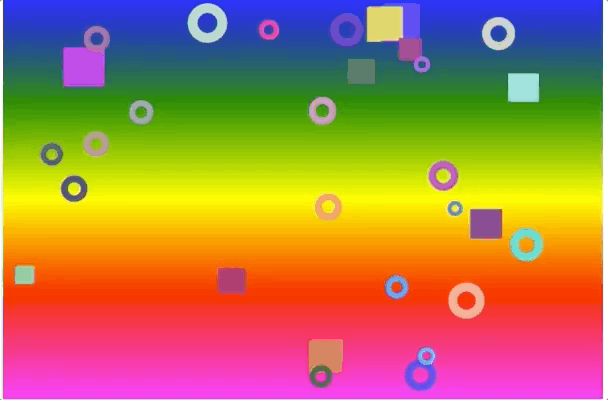
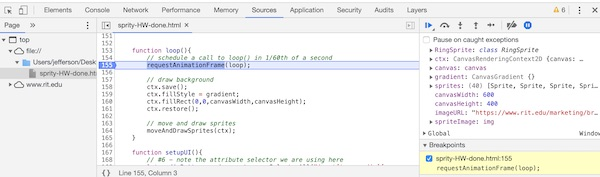
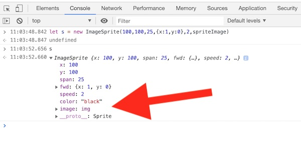
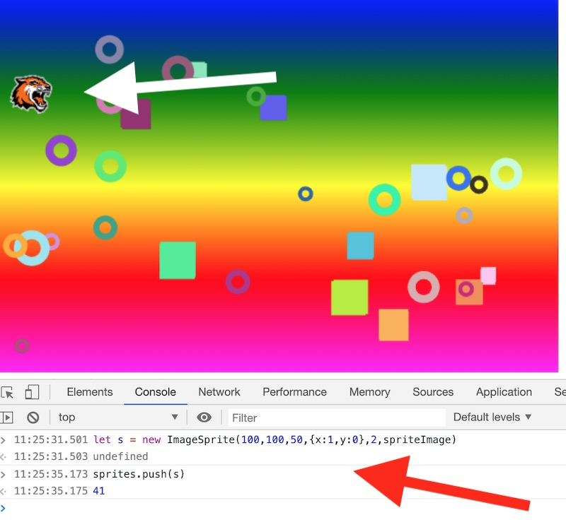
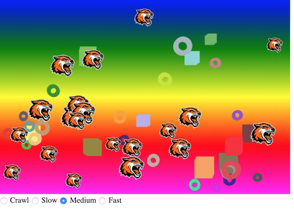
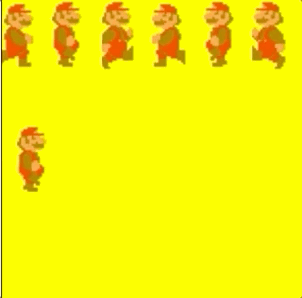

# Canvas VI - Canvas Sprites

[I. Overview](#overview)

[II. Screenshot](#screenshot)

[III. Code](#code)

[IV. Homework - *Sprity!*](#homework)

[V. Spritesheets & Animation](#spritesheet)

[VI. Resources](#resources)

[VII. HW Submission / Extra Credit](#submission)

<a id="overview"></a>

## I. Overview
- So there's no new Canvas API concepts below, but there's a lot of potentially helpful example code below - see comments in source file:
  - #1 - [ES6 Classes](https://developer.mozilla.org/en-US/docs/Web/JavaScript/Reference/Classes) with `draw()` and `move()` methods:
    - note that we are drawing these sprites the "better way", by FIRST translating, rotating, and scaling the context, and then SECOND by drawing the shapes at the origin (or "around" the origin in the case of the rectangle) 
  - #2 - A quick and convenient way to assign multiple object properties with [`Object.assign()`](https://developer.mozilla.org/en-US/docs/Web/JavaScript/Reference/Global_Objects/Object/assign)
  - #3 - [ES6 Class inheritance](https://developer.mozilla.org/en-US/docs/Web/JavaScript/Reference/Classes#Sub_classing_with_extends)
  - #4 - A handy `createLinearGradient()` helper function
  - #5 - [`array.concat()`](https://developer.mozilla.org/en-US/docs/Web/JavaScript/Reference/Global_Objects/Array/concat) and the [ES6 spread syntax](https://developer.mozilla.org/en-US/docs/Web/JavaScript/Reference/Operators/Spread_syntax)
  - #6 - The [CSS attribute selector](https://developer.mozilla.org/en-US/docs/Web/CSS/Attribute_selectors)
  - #7 - Form values are returned as strings! Don't forget to convert them to a number if that's what you need!
  - #8 - ES6 class [reference](https://codeburst.io/explaining-value-vs-reference-in-javascript-647a975e12a0) used as an argument to a function
  - #9 - Standard "move and check world boundaries" code
  - #10 - How to set up the HTML for radio buttons


<a id="screenshot"></a>

## II. Screenshot




<a id="code"></a>

## III. Code

**sprites-and-radio-buttons.html**

```html
<!DOCTYPE html>
<html lang="en">
<head>
	<meta charset="utf-8" />
	<title>Sprites and Radio Buttons</title>
	<script>
	// #1 CLASS CODE
	// we've put these Sprite classes in a separate <script> tag from the rest of the code, but this code should really be in another file
	class Sprite{
		constructor(x=0,y=0,span=10,fwd={x:1,y:0},speed=0,color="black"){
			this.x = x;
			this.y = y;
			this.span = span;
			this.fwd = fwd;
			this.speed = speed;
			this.color = color;
			
			// #2 - Here's a cooler idiom to accomplish the same property assignment as above, 
			// with one line of code!
			// https://developer.mozilla.org/en-US/docs/Web/JavaScript/Reference/Global_Objects/Object/assign
			//Object.assign(this,{x,y,span,fwd,speed,color});
		}

		draw(ctx){
			ctx.save();
			ctx.translate(this.x,this.y);
			ctx.beginPath();
			ctx.rect(-this.span/2,-this.span/2,this.span, this.span);
			ctx.closePath();
			ctx.fillStyle = this.color;
			ctx.fill();
			ctx.restore();
		}

		move(){
			this.x += this.fwd.x * this.speed;
			this.y += this.fwd.y * this.speed;
		}

		reflectX(){
			this.fwd.x *= -1;
		}

		reflectY(){
			this.fwd.y *= -1;
		}
	}
	
	// #3 - Inheritance example. Note that `RingSprite` is using all the methods of Sprite 
	// except for `draw()`, which it is replacing (overriding) with its own implementation
	class RingSprite extends Sprite{
		draw(ctx){
			ctx.save();
			ctx.translate(this.x,this.y);
			ctx.beginPath();
			ctx.arc(0,0,this.span/2,0,Math.PI * 2,false);
			ctx.arc(0,0,this.span/4,0,Math.PI * 2,true);
			ctx.closePath();
			ctx.fillStyle = this.color;
			ctx.fill();
			ctx.restore();
		}
		
	}
	</script>
	
	<script>
		// #4 - UTILITY CODE
		// Here's more code that should probably be in a separate file
		// Maybe in abcLIB.js (if you are working on Project 1) or utils.js (if you are working on Project 2)
		// Also check out `createLinearGradient()`, it's new and handy

		function getRandomUnitVector(){
			let x = getRandom(-1,1);
			let y = getRandom(-1,1);
			let length = Math.sqrt(x*x + y*y);
			if(length == 0){ // very unlikely
				x=1; // point right
				y=0;
				length = 1;
			} else{
				x /= length;
				y /= length;
			}
			return {x:x, y:y};
		}

		function getRandom(min, max) {
			return Math.random() * (max - min) + min;
		}

		function getRandomColor(){
			const getByte = _ => 35 + Math.round(Math.random() * 220);
			return `rgba(${getByte()},${getByte()},${getByte()},1)`;
		}

		function createLinearGradient(ctx,startX,startY,endX,endY,colorStops){
			let lg = ctx.createLinearGradient(startX,startY,endX,endY);
			for(let stop of colorStops){
				lg.addColorStop(stop.percent,stop.color);
			}
			return lg;
		}
	</script>
	
	<script>
	// MAIN CODE
	let ctx,canvas
	let gradient;
	let sprites = [];
	const canvasWidth = 600, canvasHeight = 400;
	
	window.onload = init;
	
	function init(){
		canvas = document.querySelector('canvas');
		canvas.width = canvasWidth;
		canvas.height = canvasHeight;
		ctx = canvas.getContext("2d");
		gradient = createLinearGradient(ctx,0,0,0,canvasHeight,[{percent:0,color:"blue"},{percent:.25,color:"green"},{percent:.5,color:"yellow"},{percent:.75,color:"red"},{percent:1,color:"magenta"}])
		
		// #5 - make 2 different kinds of sprites and use `array.concat()` to append them to 
		// the `sprites` array
		sprites = sprites.concat(sprites,createSprites(10,Sprite));
		sprites = sprites.concat(sprites,createSprites(20,RingSprite));

		// But cool kids use the spread operator instead of `array.concat()`
		// https://developer.mozilla.org/en-US/docs/Web/JavaScript/Reference/Operators/Spread_syntax
		// sprites =  [...createSprites(10,Sprite), ...createSprites(20,RingSprite)];
		
		// hook up event handlers
		setupUI();
		
		// kick off animation loop
		loop();
	}
	
	function loop(){
		// schedule a call to loop() in 1/60th of a second
		requestAnimationFrame(loop);

		// draw background
		ctx.save();
		ctx.fillStyle = gradient;
		ctx.fillRect(0,0,canvasWidth,canvasHeight);
		ctx.restore();
		
		// move and draw sprites
		moveAndDrawSprites(ctx);
	}
	
	function setupUI(){
		// #6 - note the attribute selector we are using here
		let radioButtons = document.querySelectorAll("input[type=radio][name=speed]");
		for (let r of radioButtons){
			r.onchange = function(e){
				// #7 - form values are returned as Strings, so we have to convert them to a Number
				let speed = Number(e.target.value);
				for (let s of sprites){
					s.speed = Math.random() + speed;
				}
			}
		}
	}
	
	// #8 - Note that here we take a Class as a function to an argument
	// That means that in JS, classes (as well as functions) are "first class" types like
	// String, Number etc in that they can be passed as arguments to functions, and also
	// returned from functions.
	function createSprites(num=5,classRef=Sprite){
		// create array to hold all of our sprites
		let array = [];
		
		// make some sprites
		for(let i=0;i<num;i++){
			// determine random properties and instantiate new sprite
			let x = Math.random() * (canvasWidth - 100) + 50;
			let y = Math.random() * (canvasHeight - 100) + 50;
			let span = 15 + Math.random() * 25;
			let fwd = getRandomUnitVector();
			let speed = Math.random() + 2;
			let color = getRandomColor();
			let s = new classRef(x,y,span,fwd,speed,color);
	
			// add to end of array
			array.push(s);
		} // end for
		
		return array;
	}
	
	// #9 - standard "move and check world boundaries" code
	function moveAndDrawSprites(ctx){
		ctx.save();
		for (let s of sprites){
			// move sprite
			s.move();

			// check sides and bounce
			if (s.x <= s.span/2 || s.x >= canvasWidth-s.span/2){
				s.reflectX();
				s.move();
			}
			if (s.y <= s.span/2 || s.y >= canvasHeight-s.span/2){
				s.reflectY();
				s.move();
			}
				
			// draw sprite
			s.draw(ctx);

		} // end for
		ctx.restore();
	}
	
	</script>
	
</head>
<body>
<canvas></canvas>
<!-- 
#10 - note that for radio buttons to be in a group, where only one is selected at a time,
they need to all have the same value for the `name` attribute. 
Also note that we have given each of them individually their own `id`, but we're not using
that value in this example
 -->
<div>
  <input type="radio" id="crawlRadio" name="speed" value="0.1"> <label for="crawlRadio">Crawl</label>
  <input type="radio" id="slowRadio" name="speed" value="1"> <label for="slowRadio">Slow</label>
  <input type="radio" id="mediumRadio" name="speed" value="2" checked> <label for="mediumRadio">Medium</label>
  <input type="radio" id="fastRadio" name="speed" value="3"> <label for="fastRadio">Fast</label>
</div>
</body>
</html>
```

<a id="homework"></a>

## IV. Homework - *Sprity!*

***Take the above code, rename the file to **sprity-HW.html**,  and do the following:***

<hr>

1) Get image "pre-loading" working: 

- Copy the `preloadImage(url,callback)` function in  **canvas-image-demo.html** (from [Canvas Part V](./canvas-5.md)) to the &lt;script> tag where we have the utilities declared (UTILITY CODE)

- We need a variable to reference a downloaded bitmapped image that we will soon be drawing to the screen. In the main script (MAIN CODE), declare a variable named `spriteImage`. Do so up "at the top" on the main script, in the same scope as the `ctx` and other variables.

- We don't want to start the animation loop until the image has loaded, so delete the call to `loop()` that is at the end of the `init()` function

- Save and reload the page. Check the console, there shouldn't be any code errors, but all you are seeing is a blank screen because our `loop()` never gets called.

- We instead want to call `loop()` AFTER the image has loaded
- Go ahead and add this call to `preloadImage()` to the *bottom* of `init()` :
  - `preloadImage(imageURL,function(image){spriteImage = image; loop();});` :
    - the *first* parameter of `preloadImage()` is `imageURL`, which an image that you want to load and use as a sprite
      - you will need to both declare `imageURL` and provide a URL that points at an image file.  This image can be either a local file you will provide, or out on the web, but DO NOT use the "tiger" image that we did in the example.
      - if you don't understand what `imageURL` is supposed to be, go back and look at the **canvas-image-demo.html** code again 
    - the *second* parameter of `preloadImage()` is the anonymous function that is going to be called when the image is loaded
    - the *first* parameter of the anonymous callback function is `image`, which points at the now downloaded image.
    - the *first line of code* in the anonymous callback function assigns this downloaded image to `spriteImage`, which you declared earlier
    - the *second line of code* in the anonymous callback function calls `loop()`, which kicks off the animation
  - Save and reload the page. Check the console, there shouldn't be any code errors, and the animation should now work as before.
- To verify that the image you are using is loaded, either put in a `console.log()`, or use the debugger to put in a breakpoint and then inspect the value of `spriteImage`



<hr>

2) Create a new class named `ImageSprite` that extends `Sprite` above. This class will override the `draw()` method of `Sprite`, and instead of a rectangle it will draw your loaded bitmapped image to the canvas.
  - create a new `constructor` for `ImageSprite`:
    - delete the 'color' parameter and replace it with an `image` parameter
    - initialize a new property named `image` with this value
  - be sure to still initialize the other properties (`x`, `y`, etc) either by calling [`super()`](https://developer.mozilla.org/en-US/docs/Web/JavaScript/Reference/Classes#Sub_classing_with_extends) with the first 5 arguments, or in some other manner
  - let's test the code. Fortunately?, we still have all of our code floating around in global namespaces that are visible in the console, so we can use the console to create an `ImageSprite` instance. Test your code by creating a new `ImageSprite` in the console as seen below, and pass in the value of `spriteImage`. You should see that the there is an `image` property, and that it points at the correct image:
  


<hr>

3) In `ImageSprite`, go ahead and *overload* the `Sprite` `draw()` method to instead use `ctx.drawImage()`:
  - you will most likely use the "5 arguments" version --> `ctx.drawImage(image, dx, dy, dWidth, dHeight)`. (See `RingSprite` to see how we did this overloading)
  - P.S. don't forget about the "half width" and "half height" trick for drawing rectangles so that they will "bounce" correctly, and will pivot from the center. Remember that `this.span` is both the width and the height of the sprite. (Which means our image sprites have to be squares - this is something you might want to change at some point)
  - to test this code and the `draw()` method, head to the console again, see screenshot below:
  
  **Success!**
  


<hr>

4) Now create a new helper method - something like - `function createImageSprites(num,image){...}` - to create at least 10 `ImageSprite` instances, and then add them to the `sprites` array:
  - be sure to call this new function AFTER the image has loaded - *look at your code carefully!* - otherwise you will get weird errors
  - when you are done, run the code, it should look something like this (but animated, obviously, and not with the tiger image!):




<a id="spritesheet"></a>

## V. Spritesheets & Animation

- This demo shows how we can use a spritesheet, `ctx.drawImage()` and a timer to create a "frame by frame" animation. Look this over if you are interested. The complete files can be found here --> [sprite-sheet-demo-mario.zip](_files/sprite-sheet-demo-mario.zip)



<a id="resources"></a>

## VI. Resources

- See [Canvas Part V](./canvas-5.md) for help on pre-loading an image and using `ctx.drawImage()` 
- See [ES6 Class inheritance](https://developer.mozilla.org/en-US/docs/Web/JavaScript/Reference/Classes#Sub_classing_with_extends) if you need help on JS class inheritance

<a id="submission"></a>

## VII. HW Submission / Extra Credit

- Complete the above and get it working perfectly
- Extra credit opportunities (you MUST document that you did these in the comments field of the myCourses dropbox):
  - Add animated rotations to the `ImageSprite` - give it a `rotationSpeed` property - each sprite gets a random value - and then rotate it by that amount every frame. Recall that this value will represent rotation values in *radians per 1/60th of a second* ***(Up to +25% bonus)***
  - Subclass `Sprite` again - this time have it do some custom drawing using something besides circles and rectangles - maybe a `TriangleSprite` or better yet `PolygonSprite` with an arbitrary number of sides. You could also do something with curves, etc.. or maybe a `SmileySprite` - surprise us! ***(Up to +50% bonus)***
  - Subclass `Sprite` again and overload `update()` to do something interesting. Remember `WrappingCircle` and `SeekingCircle` and the ["subclass sandbox"](https://gameprogrammingpatterns.com/subclass-sandbox.html) design pattern from 235's [HW-Circle Blast IV](https://github.com/tonethar/IGME-230-Master/blob/master/notes/HW-circle-blast-4.md#section5) assignment? ***(Up to +50% bonus)***
  - Subclass `Sprite` again - this time override `draw()` to do a spritesheet animation - see [V. Spritesheets & Animation](#spritesheet) above for starter code ***(Up to +50% bonus)***
  - ZIP and POST to dropbox


**[Previous Chapter <- Canvas Part V](canvas-5.md)**
