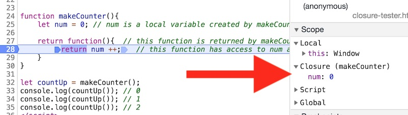

# JavaScript Closures

## I. Closures
- *Closures* are created whenever a function is declared inside of another function
- Whenever a function is declared, a *closure* which stores both a reference to the function as well as all variables currently in scope for that function is maintained.
- We have used closures in this course many times - remember the IIFE we used in the AudioVisualizer and in the ES5 module pattern? IIFEs are closures.
- *A closure can also be though of as when a function "remembers" the variables around it even when that function is executed elsewhere (in a different scope).*
- Closures can be used as a way to create multiple "bubbles" or "bottles" that hold separate copies of variables and functions, similar to what objects do for us.
- *Closures are functions that refer to independent (free) variables (variables that are used locally, but defined in an enclosing scope). In other words, these functions ‘remember’ the environment in which they were created.* —Mozilla Developer Network
- *A closure is the combination of a function and the lexical environment (i.e. scope) within which that function was declared.* —Mozilla Developer Network

## I-A. Variables that closures can access
- Nested functions have access to variables declared in their outer scope.
- There are three scope chains the closure has access to:
  - its own scope (variables defined between its curly brackets)
  - the outer function's variables
  - global variables.
  
<hr>

## II. An "ordinary" closure 
Below is an example of a closure that is created, utilized, and quickly destroyed. It's not very cool, but it's a closure.

**closure-0.html**

```js
<!DOCTYPE html>
<html lang="en">
<head>
	<meta charset="utf-8" />
	<title>Closure 0</title>
</head>
<body>
<script>
function addThreeAndDouble(num){
  num += 3; 	// local variable
  newNum = doubleIt();
  return newNum;
  
  function doubleIt(){	// local function
    return num *2;
  }
}

console.log(addThreeAndDouble(10));
console.log(addThreeAndDouble(20));
//console.log(doubleIt(30)); // error! `doubleIt()` is scoped to `addThreeAndDouble()`
</script>
</body>
</html>
```

- below we can see that Chrome's debugger has detected a closure, which gives the `doubleIt()` function its own copy of `num`


- every time `addThreeAndDouble()` is called, a new `num` parameter and a `doubleIt()` function are created
- when the the `doubleIt()` function is declared, a closure is created, and the `doubleIt()` function gets its own copy of the `num` parameter
- once the `addThreeAndDouble()` function returns, both `num` and `doubleIt()` are destroyed and memory is reclaimed
- so, we got to see a closure (sort of), but it went away pretty quickly and without any apparent practical use, and the code we wrote here is sloppy

<hr>

## III. `makeCounter()` - a simple closure example

- **If we can get the inner function to *persist* in some way after the outer function returns, we can see a closure in action!**
- And because we can't just *tell* you about closures, we have to *show* you:

**closure-1.html**
```js
function makeCounter(){
	let num = 0; // num is a local variable created by makeCounter()
	
	return function(){  // this function is returned by makeCounter()
		return num ++;  // this function has access to num and "remembers" its value
	}
}

let countUp = makeCounter();
console.log(countUp()); // 0
console.log(countUp()); // 1
console.log(countUp()); // 2
```

- `makeCounter()` is basically a factory function - it returns an anonymous "incrementing" function - in this case stored in the `countUp` variable. Everytime we invoke `countUp()`, we can see that the number increases by 1, which means that the value of `num` is being preserved with each call to `countUp()`
- the inner function of `makeCounter()` still has access to `num` and anything else within `makeCounter()`, that reference is called a *closure*.


And if we create a new variable named `countMore`, we get a new function that has it's own copy of `num`:

```js
let countMore = makeCounter();
console.log(countMore()); // 0
console.log(countMore()); // 1
console.log(countMore()); // 2
```

**Below we can see that the anonymous function has its own copy of `num`:**



<hr>

## IV. Closures and timers

- can you figure out what's going on here?
- note that we are not returning anything from `makeTimer()`, but we are getting 2 independent copies of the function because `setInterval()` is keeping a reference to them

**closures-with-timer.html**

```html
<!DOCTYPE html>
<html lang="en">
<head>
	<meta charset="utf-8" />
	<title></title>
</head>
<body>
<p id="counter1">???</p>
<p id="counter2">???</p>
	
<script>
makeTimer(counter1,10);
makeTimer(counter2,-10);

function makeTimer(element,step){
	let counter = 0;
	setInterval(function(){tick(element,step);},1000);
	
	function tick(element,step){
		counter += step;
		element.innerText = counter;
	}
}
</script>
</body>
</html>
```

<hr>

## V. `makeAdder()` - another example

This example is from here: https://developer.mozilla.org/en-US/docs/Web/JavaScript/Closures#Closure

**closure-2.html**

```js
function makeAdder(x) {
  return function(y) {
    return x + y;
  };
}

var add5 = makeAdder(5);
var add10 = makeAdder(10);

console.log(add5(2));  	// 7
console.log(add5(22));  // 27
console.log(add10(2)); 	// 12
console.log(add10(90)); // 100
```

-  `add5` and `add10` are distinct function *instances*
- in both of these instances the value of `x` (a parameter) is preserved

**Here are the results of both calls to `add5()`, note how `x` is the same for both invocations:**


<hr>

## VI. Can we do something similar with ES6 classes?

**closure-3.html**

```js
class Adder{
	constructor(x){
		this.x = x;
	}
	
	add(y){
		return this.x + y;
	}
}

let add5 = new Adder(5);
let add10 = new Adder(10);

console.log(add5.add(2));  	// 7
console.log(add5.add(22));  	// 27
console.log(add10.add(2)); 	// 12
console.log(add10.add(90)); 	// 100
```

Sure!

- So why not just use classes instead of returning functions from functions and creating *closures*?
- The output of the code will be the same, but if we dig into the debugger we will see that the created `add5` variables are distinctly different kinds of objects, for example:
  - In the closure `add5`, `x` is completely private, and cannot be accessed or changed
  - But in `Adder` instance `add5`, the `x` property is both public and mutable.
  - This means that in some very important ways, the closure is more powerful than the `Adder` instance.

<hr>

## VII. Practical Closures
- check out the jsfiddle here: https://jsfiddle.net/vnkuZ/7726/
- earlier in the semester, we saw how IIFEs allowed us to have private properties and functions, and to only return those properties or functions we wanted to expose (make public)

**closure-4.html**
```js
let lib = (function(){
		let a = "hello";
		let b = "private";
		
		function doStuff(){
			console.log(`Do Stuff! The value of b is "${b}"`);
		}
		
		function setB(val){
			b = val;
		}
		
		// our public interface
		return{
			a: a,
			doStuff: doStuff,
			setB: setB
		}
	})();
	
lib.doStuff(); 		// Do Stuff! The value of b is "private"
console.log(lib.a); 	// hello
console.log(lib.b); 	// undefined
lib.setB("hello again");
lib.doStuff(); 		// hello again
```

- Go ahead and put a breakpoint in `doStuff()` - you will see that `b` is a *closure* variable
- Can you see how this closure is analagius to an object, with both public and private state and behavior?

<hr>

## VIII. References
- https://developer.mozilla.org/en-US/docs/Web/JavaScript/Closures
- [You Don't Know JS: Scope & Closures](https://github.com/getify/You-Dont-Know-JS/blob/master/scope%20%26%20closures/ch5.md)
