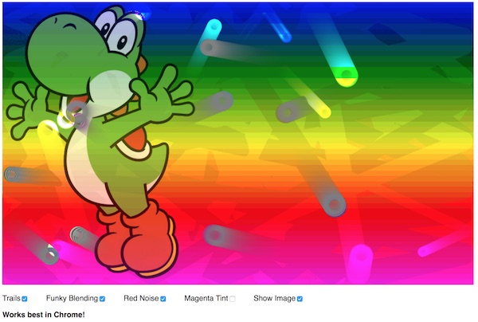

# Demo Canvas Image Data (and Sprites!)

## I. Overview
- Note that the code in this example has been split out into multiple files
- Here we will:
  - review hooking up DOM controls to canvas
  - play with blending mode a little more
  - grab the image data from the canvas, perform manipulations on that data, and copy it back to the canvas
  - see the effects of drawing an insecure image on the canvas 
  - think about you could potentially use all of this in your Audio Visualizer project - including having the audio frequency data effect the motion of sprites
  - think about how you incorporate mouse movement into this demo or your audio visualizer project. See the *Speed Circles* demo in mycourses for JS code that accesses the mouse position
- Other stuff to note:
  - be sure to look the code over and ask questions about anything you don't understand - there's a lot here!
  - everything will still work even if we change the `height` and `width` attributes of the &lt;canvas>

## II. Screenshot of completed version

## III. Start Files

- Start files are here:  [sprites-plus-bitmap-manip-start.zip](_files/sprites-plus-bitmap-manip-start.zip)

See comments #1 - #6 in the **main.js** source file. We will walk through these steps together in class, but feel free to modify these effects to make them more interesting.
- #1  - **Show Trails**
  - how can we make the trails *longer*?
- #2  - **Show Image**
  - why don't we need an image *pre-loader* here?
- #3 - **Stop using an insecure image**
  - ... and load off of a web server rather than the desktop to get rid of errors
- #4  - **Show Blending**
- #5  - **Show Noise**
  - how do we make black noise? White noise?
  - how do we make the noise appear less frequently?
- #6  - **Show Tint**
  - how do tint the canvas *blue*?
  - how do we *brighten* the canvas?
  - how do we *darken* the canvas?
  - how do we convert the canvas to a *gray scale* image?

## IV. Reference
- You can ready more about canvas image manipulation here:
  - https://www.html5rocks.com/en/tutorials/canvas/imagefilters/
  - http://html5doctor.com/video-canvas-magic/

