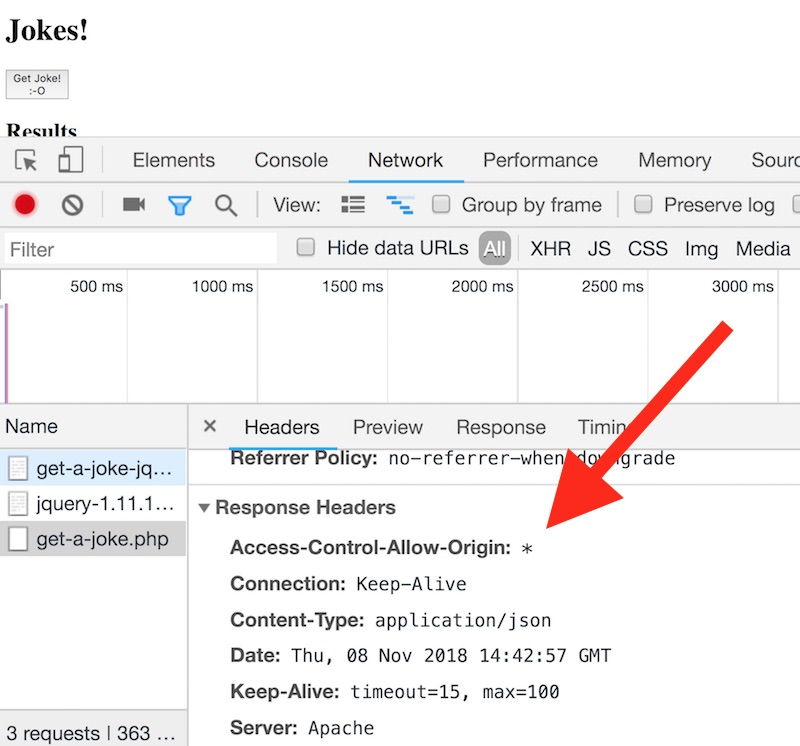

# Demo: PHP-driven JSON Web Service

## Overview

- We can use the PHP scripting language to return data in the JSON format - thus creating our own web service:
  - https://en.wikipedia.org/wiki/JSON

## I. Simple Web Service (JSON format)

- This web service returns a random joke in the JSON format
- Here is a working version: http://igm.rit.edu/~acjvks/courses/2018-fall/330/php/get-a-joke.php
- We will explain this code in class - but as you can see - at a bare minimum a web service just needs to emit a `content-type` header and some text

### I-A. The *server* code (in PHP)

**get-a-joke.php**

```php
<?php
/*
	Name: get-a-joke.php
	Description: Returns a single random joke in JSON format
	Author: Keyser Soze
	Last Modified: 11/5/2018
*/

// $jokes contains our data
// this is an indexed array of associative arrays
// the associative arrays are jokes -  they have an 'q' key and an 'a' key
$jokes = array(
	array("q"=>"What do you call a very small valentine?","a"=>"A valen-tiny!"),
	array("q"=>"What did the dog say when he rubbed his tail on the sandpaper?","a"=>"Ruff, Ruff!"),
	array("q"=>"Why don't sharks like to eat clowns?","a"=>"Because they taste funny!"),
	array("q"=>"What did the boy cat say to the girl cat?","a"=>"You're Purr-fect!"),
	array("q"=>"What is a frog's favorite outdoor sport?","a"=>"Fly Fishing!")
);

// get a random element of the $jokes array
// there are a bunch more PHP array functions at: http://php.net/manual/en/ref.array.php
$numJokes = count($jokes);
$randomJoke = $jokes[mt_rand(0, $numJokes - 1)];

// json_encode() turns an associative array into a string of well-formed JSON
$string = json_encode($randomJoke);

// Sends the correct HTTP header
// header("Access-Control-Allow-Origin: *");
header('content-type:application/json');
echo $string;

?>
```

<hr>

## II. The *client* code (Node.js JavaScript)

- You can create a node project like we did here - [node-and-web-services-2.md](./node-and-web-services-2.md) - and run this code. 

```
npm init -y
npm install request
node index.js
```

- Here's the Node.js code:

**random-joke/index.js**

```js
// #1 - import the request module, which is used to download data over http
const request = require('request');

// #2 - set our URL
let url = "http://igm.rit.edu/~acjvks/courses/2018-fall/330/php/get-a-joke.php";

// #3 - make the request
// the second parameter below is a callback function (an ES6 arrow function in this case)
// which is called when the data is downloaded
request(url, (err, response, body) => {
    // if there's no error, and if the server's status code is 200 (i.e. "Ok")
    if(!err && response.statusCode == 200){
    	// A - convert the downloaded text to a JavaScript Object
        let obj = JSON.parse(body); 
        let text = `${obj.q}\n\n${obj.a}`;
        // B - log it out
        console.log(`***The joke is:***\n ${text}`);
    }else{
    	console.log(`err=${err}`);
    }
});
```

- **SUCCESS!** - It will call the web service and print out a random joke:

```
***The joke is:***
What do you call a very small valentine?

A valen-tiny!
```

<hr>

## III. The *client* code (Web Browser JavaScript - `XMLHttpRequest`)

- Here we are going to try to download this JSON data utilizing the standardized [`XMLHttpRequest`](https://developer.mozilla.org/en-US/docs/Web/API/XMLHttpRequest) method

**get-joke-xhr-json.html**

```html
<!DOCTYPE html>
<html lang="en">
<head>
	<meta charset="utf-8" />
 	<title>Get a joke XHR/JSON</title>

  
  <script>
  //https://developer.mozilla.org/en-US/docs/Web/API/XMLHttpRequest/Using_XMLHttpRequest
  
  "use strict";
	const URL = "http://igm.rit.edu/~acjvks/courses/2018-fall/330/php/get-a-joke.php";
	window.onload = init;
	
	function init(){
		document.querySelector("#search").onclick = getData;
	}
	
	// MY FUNCTIONS
	function getData(){
		let url = URL;
		console.log("loading " + url);
		
		// https://developer.mozilla.org/en-US/docs/Web/API/XMLHttpRequest
		let xhr = new XMLHttpRequest();
		xhr.onload = jsonLoaded;
		xhr.onprogress = (e) => console.log(`PROGRESS: ${e}`); 
		xhr.onerror = (e) => console.log(`ERROR: ${e}`); 
		
		// xhr.open(method, url, async, user, password)
		xhr.open("GET", url, true);
		xhr.send();	
	}
	

	function jsonLoaded(e){
			console.log(`LOADED: ${e}`);
			let responseText = e.target.responseText;
			console.log(`responseText: ${responseText}`);
			let obj = JSON.parse(responseText);
			console.log(obj);
			

		/*
			Write code to display the .q and .a properties of the joke
		*/

		let bigString = `<p><i>${obj.q}</i></p>`;
		bigString += `<p><b>${obj.a}</b></p>`;
		document.querySelector("#content").innerHTML = bigString;
	}

 </script>
  
  
</head>
<body>
 <h1>Jokes!</h1>


<button type="button" id="search">Get Joke!<br />:-O</button>

<h2>Results</h2>
 <div id="content">
 <p>No data yet!</p>
 </div>
 

</body>
</html>
```

- A. **FAIL!** - Here's the error message: 

```
Access to XMLHttpRequest at 'http://igm.rit.edu/~acjvks/courses/2018-fall/330/php/get-a-joke.php' from origin 'null'
has been blocked by CORS policy: No 'Access-Control-Allow-Origin' header is present on the requested resource.
```

- B. CORS stands for "Cross-Origin Resource Sharing" 

- "Cross-Origin Resource Sharing (CORS) is a mechanism that uses additional HTTP headers to tell a browser to let a web application running at one origin (domain) have permission to access selected resources from a server at a different origin." - https://developer.mozilla.org/en-US/docs/Web/HTTP/CORS

- C. In this case, we can enable CORS for this web service because we are the ones that wrote it. Add this header to your PHP script (*before* the `echo()` statement):

```php
header("Access-Control-Allow-Origin: *");
```

- D. Now check the Network tab in the Web Inspector to see this new header:



- E. Try your browser client again - you should be able to download the JSON now!

- F. ***Summary: Web browsers can NOT directly download JSON data from another domain unless CORS is enabled (or the browser's security restrictions are turned off).***


<hr>

## IV. Utilizing a Proxy Server to download web services
- So what if the web service you want to use does NOT enable CORS, and you don't have any control over the service? What do you do?
- Answer: Use a [Proxy Server](https://en.wikipedia.org/wiki/Proxy_server) to fetch the web service data for us!
- Here is an example of a free proxy server that we can use: https://cors-anywhere.herokuapp.com
- This service has CORS enabled, so the JS running in the browser will be able to contact the service using XHR
- If our JS passes along the URL of the "Random Joke" web service, the proxy service will donwload the JSON data for us, and then send the results back to our browser
- Try it out. In **get-joke-xhr-json.html**, change the URL to this:
  - `const URL = "https://cors-anywhere.herokuapp.com/http://igm.rit.edu/~acjvks/courses/2018-fall/330/php/get-a-joke.php";`
  - Test it. The JSON data should download with no issues, regardless of whether CORS is enabled for the web service
  - **Fun Fact:** Note that the "cors-anywhere" service uses a "RESTful" API style where the parameters are passed in as a regular URL, rather than as a query string like most of the services we have seen ex. `http://joker.com/getJoke.php?limit=10`
  

