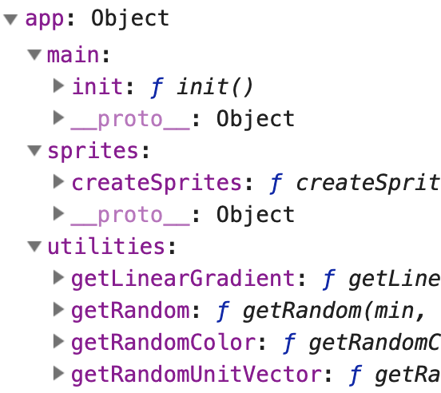

# Demo - ES5 Revealing Module Pattern

## I. Overview
- Here we will learn how to create multiple **modules** in our code by utilizing IIFEs, where the various units of JavaScript can run without interference from the other units
- In the **FIRST part** of today's demo, we will take a previous demo where all of the JS code is contained in the HTML file and split the code between 4 JS files, which will improve the readability and organization of the code. There is a lot of re-factoring to do, so this part of the demo will take a while.
  - ***Issue***: as far as the JavaScript runtime engine is concerned, all of this code is still intermingled in the global and "script" scopes - so variables in different files can still overwrite each other - we need to fix this!
- In the **SECOND part** of today's demo, we will fix this issue by implementing the ***revealing module pattern***. 
  - This pattern uses multiple IIFEs to first hide away all the code in a file that we wish to be *private* and not visible to the outside, and then to only export those variables and functions that we wish to be *public*.
  - ***Issue***: the code is dramatically better than what we had before, but there is still a problem -  two of the  modules contain hard-coded *dependencies* on the 'app` global - so let's move on and fix that!
- In the **THIRD part** of today's demo - we will eliminate these *dependencies* by passing them in as parameters, rather than hard-coding them, which will have the effect of completely *decoupling* our modules, which makes them more re-usable and easier to test and debug. This is a very simple technique, but it comes with fancy names like *inversion of control (IOC)* and [*dependency injection (DI)*](https://medium.com/@fleeboy/dependency-injection-in-javascript-9db9ea6e4288), which can be summarized as *"instantiate and pass in a module's dependencies, rather than have that module declare them itself."*
  
 ## II. Start Files
- The start file for this presentation is the completed version of the the "Demo - Sprite Literals and Canvas Image Data", we did recently, and it is here --> [filter-plus-bitmap-manip-example.zip](./_files/filter-plus-bitmap-manip-example.zip)

## III. Demo Walkthrough

### Part One - move the code to separate files:

Follow along if you can - or try it out later!

1. Create a folder named `src`
2. In the `src` folder, create a file named `utilities.js`, and cut/paste your `UTILITY FUNCTIONS` into it
3. Reload the HTML page - ERROR!
4. Create your &lt;script> tag in the &lt;head> section of the HTML page --> `<script src="src/utilities.js"></script>`
5. Reload the HTML page - ERROR! - **`ReferenceError: ctx is not defined`**
6. `getLinearGradient()` is looking for a globally scoped `ctx` variable - let's fix that! How? We add a `ctx` parameter to the beginning of the `getLinearGradient()` declaration in **utilities.js**, and then pass `ctx` in when we *call* `getLinearGradient()` in the HTML file 
7. Reload the HTML page, it should now work.
8. Now move all of the `FACTORY FUNCTIONS` to a new file named `sprites.js` and save it into the `src` folder
9. Go ahead and create a new &lt;script> tag to link to `sprites.js`
10. Reload the page - ERROR! - **`ReferenceError: canvasWidth is not defined`** 
11. Go ahead and fix the `createSprites()` function by adding `canvasWidth` and `canvasHeight` parameters, and then adding all of the necessary arguments to the `createSprites()` call in the HTML file
12. Reload the HTML page, it should now work.
13. Move the rest of the code (minus the Iffy) into a file named `main.js` and create a &lt;script> element for it in the &lt;head> section of the HTML file like we did for the other two modules
14. Delete the empty &lt;script> tag that remains in the HTML file (the one with the Iffy in it)
15. Reload the page - ERROR! - **`Cannot read property 'getContext' of null at main.js`** - we have a problem with some of the code at the top of **main.js** - do you know what it is?
16. To fix this issue, first create a new JS file named `loader.js` and put this in it:

```js
window.onload = _ =>{
	init();
}
```
17. Create a &lt;script> tag for `loader.js`
18. Delete the `init()` call from `main.js`
19. Reload the page - multiple ERRORs! Why?
20. Fix the issues in `main.js` by initializing certain variables in the `init()` function
21. Reload Page - everything should work. So we have great code, right?
22. Not really! Check the debugger and you'll see that even though all of the code is in separate files, all the functions and variables are still stuck in either global or script scope!
23. Save a copy of Part One and move on

### Part Two - create *modules* with their own scope:

1. At the top of `utilities.js` - add the following `var app = app || {};` - we will explain this in class - it's also the only time in this course that we MUST use `var`
2. Now create the utilities *module* - which is an IIFE - like this at the beginning of the code - `app.utilities = (function(){ ...` - and this at the end - `})();`
3. Now all of our utilities code is hidden away in an Iffy - obviously this will break everything - **`ReferenceError: getLinearGradient is not defined`**
4. Take a look at `app.utilities` in the debugger it's `undefined`
5. So how do we make this utilities code visible to the outside? Just return a "public interface" like this:

```js
// our "public interface"
return {
	getRandomUnitVector: getRandomUnitVector,
	getRandom:getRandom,
	getRandomColor: getRandomColor,
	getLinearGradient: getLinearGradient
};
// remind us to show you the ES6 shorthand way to initialize an object!
```
6. Now all the utilities functions can get called through `app.utilities`! Fix the errors in **sprites.js** and **main.js** and make it so!
7. Add this line to the top of all of the JS files - `var app = app || {};`
8. Now we will make `sprites.js` a module (name it `.sprites`) in a similar way to how we did `app.utilities` - don't forget to "export" `createSprites` - now make it so!
9. Reload the page. Fix the error in **main.js**!
10. Now make `main.js` a module (named `.main`) - and you only need to "export" the `init` function - everything else is "private"
11. Call `app.main.init()` from `loader.js` and you are good to go!
12. Put a breakpoint on the `app.main.init()` line in loader - and check out the global `app` variable, its modules, and the "public" properties of those modules (i.e. the ones we returned). Note that for **main.js** we can only see the `init` function, and not the other variables and functions that we didn't "export". Thus we have successfully *encapsulated* code in JavaScript, here using functions, as opposened to languages like Java and C# that use classes to achieve encapsulation



### Part Three - get rid of the remaining dependencies:

- The code we wrote in Part Two above works well, but as mentioned in the intro, two of the modules contain hard-coded *dependencies* on the `app` global
- Some people might stop refactoring at this point and say "good enough" - but that's not how we roll! 
- To fix this properly, we are actually going to re-structure the app one more time so that we can pass arguments (ex. references to the other modules) into the modules
- The way we are going to do this also necessitates getting rid of the Iffys
- So we are going to tear this code apart one last time, but it will be worth it to make the code right!
- Save a copy of Part Two, and move on

1. First, we need to look at our modules one at a time to look for the actual dependencies they have on global variables:
  - **utilities.js** does not depend on any global variables or functions. As a matter of fact, all of the functions in this file are highly re-usable ["pure functions"](https://en.wikipedia.org/wiki/Pure_function), which do not produce any side effects. 
  - **sprites.js** has two dependencies on the `app` global object:
    - when it calls `app.utilities.getRandomColor()` AND 
    - when it calls `app.utilities.getRandomUnitVector()`
  - **main.js** has two dependencies on the `app` global object:
    - when it calls `app.utilities.getLinearGradient()` AND
    - when it calls `app.sprites.createSprites()`
2. First, we will head to **utilities.js** - we are going to get rid of both the `app` global declaration and the Iffy. The top of it looks like this:

```js
"use strict";
const myUtilities = function(){
   function getRandomUnitVector(){
   ...
```

And the bottom looks like this (no Iffy!):

```js
 // this module's "public" interface
// note the ES6 "shorthand object literal" syntax
return {
	getRandomUnitVector,
	getRandom,
	getRandomColor,
	getLinearGradient
      };
};
```

3. If you reload the page everything breaks, so just continue the refactoring. Head to **sprites.js** and make the top look like this:

```js
"use strict";
const mySprites = function(utilitiesModule){
   const utilities = utilitiesModule;
   
   function createSprites(...
```

- and be sure to delete the `app` global declaration from the top, and the "Iffy" code off of the "end" of **sprites.js** as well
- note that here we are now passing in and creating a `utilities` local variable for the sprites module
- to use this variable instead of the `app` global (which we deleted) be sure to:
  - change the line of code `app.utilities.getRandomColor();` to `utilities.getRandomColor();`
  - change the line of code `app.utilities.getRandomUnitVector()` to `utilities.getRandomUnitVector()`

5. Head to **main.js** and do some refactoring:

- first, rename the current `sprites` variable (the one that refers to the array of sprites) to `spriteArray` - you will need to update the code in three places. The reason that we are doing this is that we are going to be using the variable name `sprites` to instead refer to the sprites module
- next, make the top of **main.js** look like this:

```js
"use strict";
const myMain = function(utilitiesModule,spritesModule){
   const utilities = utilitiesModule;
   const sprites = spritesModule;
   
   let ctx;
   ...
```

- and be sure to delete the `app` global declaration from the top, and the "Iffy" code off of the "end" of **main.js** as well
- note that here we are now passing in and creating both `utilities` AND `sprites` local variables for the main module
- go ahead and delete the two references to `app` in the main module, and call the local variables instead


6. Finally, head to **loader.js** and make it look like this:

```js
"use strict";
const app = {};

window.onload = _ =>{
	// create modules with DI
	let utilities = myUtilities();
	let sprites = mySprites(utilities);
	let main = myMain(utilities,sprites);
	
	// assign properties and begin program
	app.utilities = utilities;
	app.sprites = sprites;
	app.main = main;
	app.main.init();
}
```

7. Reload the page - everything should work as before! If you check out `app` in the debugger, it will look the same as before because we have not changed the "public interface" of any of the modules

## IV. Summary

- We have seen now seen how to build a a powerful JS code pattern - this is how you'll start off your big JS projects, right? In order to avoid a lot of refactoring of code?
- Go back and look at are original start code (when everything is jammed in the HTML file) and ask yourself:
  - which version (the start or the end code) will have more reusable units of code?
  - which version (the start or the end code) will be easier to work on with a partner?
  - which version (the start or the end code) will be easier to debug?
  - which version (the start or the end code) will be easier to understand if you came back and looked at this code in 6 months?
- Our final implementation is simple, but it works well, runs on pretty much any browser ever shipped, and follows the spirit of DI. Our implementation also avoids the use of a separate module loader library --> https://www.jvandemo.com/a-10-minute-primer-to-javascript-modules-module-formats-module-loaders-and-module-bundlers/


