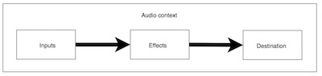

# Web Audio I - *Build a Simple Audio Visualizer*

## I. Background
1) Some important notes about the Web Audio API are here, so we will referring to some of the notes and graphics here:
    - [HW - Audio Visualizer - Part I - Overview](./HW-AV-2195-1.md#overview)
    - [HW - Audio Visualizer - Part I - Audio Graphs & Sampling](./HW-AV-2195-1.md#audio-graphs-and-sampling)
    - [HW - Audio Visualizer - Part I - What does the audio data represent](./HW-AV-2195-1.md#audio-frequency-data)
  
2) The concepts we are covering today:
  
    A) the [`AudioContext`](https://developer.mozilla.org/en-US/docs/Web/API/AudioContext) - an audio-processing *graph* built from audio modules linked together, each represented by an `AudioNode`
  
    B) Audio Routing Graph:
      - Audio Nodes - [`AudioNode`](https://developer.mozilla.org/en-US/docs/Web/API/AudioNode) - an audio processing module (ex. a media source, an audio filter, speakers, etc)
      - [`.connect()`](https://developer.mozilla.org/en-US/docs/Web/API/AudioNode/connect) - lets you connect a node's outputs to a target, which is usually another `AudioNode`
      - ex.of *Audio Routing Graph* -  **Audio Source** (ex. mp3) --> **Audio Effect Node** --> **Analyser Node** --> **Destination Node** (ex. speakers)
    
   C) [`AnalyserNode`](https://developer.mozilla.org/en-US/docs/Web/API/AnalyserNode) - provides real-time frequency and time-domain analysis (waveform) information - it allows you to take the generated data, process it, and create audio visualizations, without modifying the underlying data. Today we will be getting this data back in a `Uint8Array`

   D) [`Uint8Array`](https://developer.mozilla.org/en-US/docs/Web/JavaScript/Reference/Global_Objects/Uint8Array) - this is an 8-bit typed array:
     - can only hold hold unsigned 8-bit integers
     - can not be resized after it is created
     - the `Uint8Array` is much more performant than a standard JavaScript [Array](https://developer.mozilla.org/en-US/docs/Web/JavaScript/Reference/Global_Objects/Array) (the one we usually create with the `[]` syntax) 
     - is a [`TypedArray`](https://developer.mozilla.org/en-US/docs/Web/JavaScript/Reference/Global_Objects/TypedArray) that references an underlying binary [`ArrayBuffer`](https://developer.mozilla.org/en-US/docs/Web/JavaScript/Reference/Global_Objects/ArrayBuffer)
       - `ArrayBuffers` are called "byte arrays" in other languages 
   
**Example of audio routing graph:**



<hr>

## II. Start Files
- [sounds.zip](./_files/sounds.zip)


## III. First Audio Visualizer

- This demo is going to set up an audio context that is connected to a frequency analyzer, and will display the audio frequency data in an HTML table. The code is 100% complete and functioning.
- First, make sure you can get this working. See the HW exercise linked above with how to deal with the CORS issue.
- Things to try:
  - increase the sampling rate - it needs to be a power-of-2 number like 16, 32, 64 etc

**web-audio-1.html**

```html
<!DOCTYPE html>
<html lang="en">
<head>
	<meta charset="utf-8" />
	<title>Web Audio 1</title>
	<style>
		table{border:1px solid black;}
		td,th{border:1px solid black;width:30px;}
	</style>
</head>
<body>
<!-- use obama-oilspill.mp3 or human-voice.mp3 -->
<audio controls src="sounds/human-voice.mp3"></audio>
<table></table>

<script>
	const NUM_SAMPLES = 32;
	
	// 1 - get reference to <audio> element on page
	let audioElement = document.querySelector('audio');
			
	// 2 - create a new `AudioContext` object
	// https://developer.mozilla.org/en-US/docs/Web/API/AudioContext
	let audioCtx = new (window.AudioContext || window.webkitAudioContext); // to support Safari and mobile
	
	// 3 - create a node that points at the <audio> element
	// https://developer.mozilla.org/en-US/docs/Web/API/AudioContext/createMediaElementSource
	let sourceNode = audioCtx.createMediaElementSource(audioElement); 
	
	// 4 - create a *analyser node*
	// https://developer.mozilla.org/en-US/docs/Web/API/AnalyserNode
	// this gets us real-time frequency and time-domain (i.e. waveform) information
	let analyserNode = audioCtx.createAnalyser();
	
	// 5 - How many samples do we want? fft stands for Fast Fourier Transform
	analyserNode.fftSize = NUM_SAMPLES;
	
	// 6 - hook up the <audio> element to the analyserNode
	sourceNode.connect(analyserNode);
	
	// 7 - connect to the destination i.e. the speakers
	analyserNode.connect(audioCtx.destination);
	
	// 8 - create a new array of 8-bit integers (0-255)
	// https://developer.mozilla.org/en-US/docs/Web/JavaScript/Reference/Global_Objects/Uint8Array
	let data = new Uint8Array(NUM_SAMPLES/2); // OR analyserNode.fftSize/2
	
	// Chrome autoplay fix
	// https://developers.google.com/web/updates/2017/09/autoplay-policy-changes
	document.querySelector("audio").onplay = (e) => {
  	  if (audioCtx.state == "suspended") {
    	    audioCtx.resume();
  	  }
	};
	
	loop();
	
	function loop() { 
		// 9 - this schedules a call to the loop() method in 1/60 second
		requestAnimationFrame(loop);
		
		/*
				Nyquist Theorem
				http://whatis.techtarget.com/definition/Nyquist-Theorem
				The array of data we get back is 1/2 the size of the sample rate 
		*/
			
		
		
		// 10 - populate the array with the frequency data
		// notice these arrays are passed *by reference*
		analyserNode.getByteFrequencyData(data);
		
		// 11 - Let's visualize the audio data in an HTML table (lame!)
		let htmlR1="<tr>";
		let htmlR2="<tr>";
		let index = 0;
		let sum = 0;
		for(let b of data){
			htmlR1 += `<th>${index}</th>`;
			htmlR2 += `<td>${b}</td>`;
			sum += b;
			index++;
		}
		htmlR1 += "<th><i>Average of Samples</i></th>";
		htmlR1 += "</tr>";
		htmlR2 += `<td><i>${Math.floor(sum/data.length)}</i></td>`;
		htmlR2 += "</tr>";
		document.querySelector("table").innerHTML = htmlR1 + htmlR2;
	}
	
</script>
</body>
</html>
```

## IV. Audio Visualizer & Canvas

- In this demo, we are going to get rid of the HTML table and instead use canvas to draw a bar graph that displays the frequency values. 
- We are going to need to write some code in class to get this to work.
- Things to try:
  - increase the sampling rate
  - change the width and height and spacing of the bars

**web-audio-2.html**

```html
<!DOCTYPE html>
<html lang="en">
<head>
	<meta charset="utf-8" />
	<title>Web Audio 2</title>
	<style>
		canvas{border:1px solid black;display:block;}
	</style>
</head>
<body>
<canvas width="640" height="480"></canvas>

<!-- use obama-oilspill.mp3 or human-voice.mp3 -->
<audio controls src="sounds/obama-oilspill.mp3"></audio>

<script>
	const NUM_SAMPLES = 32;
	// 1 - get reference to <audio> element on page
	let audioElement = document.querySelector('audio');
			
	// 2 - create a new `AudioContext` object
	// https://developer.mozilla.org/en-US/docs/Web/API/AudioContext
	let audioCtx = new (window.AudioContext || window.webkitAudioContext); // to support Safari and mobile
	
	// 3 - create a node that points at the <audio> element
	// https://developer.mozilla.org/en-US/docs/Web/API/AudioContext/createMediaElementSource
	let sourceNode = audioCtx.createMediaElementSource(audioElement); 
	
	// 4 - create a *analyser node*
	// https://developer.mozilla.org/en-US/docs/Web/API/AnalyserNode
	// this gets us real-time frequency and time-domain (i.e. waveform) information
	let analyserNode = audioCtx.createAnalyser();
	
	// 5 - How many samples do we want? fft stands for Fast Fourier Transform
	analyserNode.fftSize = NUM_SAMPLES;
	
	// 6 - hook up the <audio> element to the analyserNode
	sourceNode.connect(analyserNode);
	
	// 7 - connect to the destination i.e. the speakers
	analyserNode.connect(audioCtx.destination);
	
	// 8 - create a new array of 8-bit integers (0-255)
	  // https://developer.mozilla.org/en-US/docs/Web/JavaScript/Reference/Global_Objects/Uint8Array
	  let data = new Uint8Array(analyserNode.frequencyBinCount); // OR analyserNode.fftSize/2
	
	// Chrome autoplay fix
	// https://developers.google.com/web/updates/2017/09/autoplay-policy-changes
	document.querySelector("audio").onplay = (e) => {
  	  if (audioCtx.state == "suspended") {
    	    audioCtx.resume();
  	  }
	};
	
	// canvas stuff
	let ctx = document.querySelector("canvas").getContext("2d");
	const BAR_WIDTH = 30;
	const MAX_BAR_HEIGHT = 100;
	const PADDING = 4;
	const MIDDLE_Y = ctx.canvas.height/2;
	
	
	
	loop();
	
	function loop() { 
	  // 9 - this schedules a call to the loop() method in 1/60 second
	  requestAnimationFrame(loop);
		
	 
		
	  // 10 - populate the array with the frequency data
	  // notice these arrays are passed *by reference*
	  analyserNode.getByteFrequencyData(data);
		
	  // 11 - this time, let's visualize the audio data on the canvas
		
     	  /* YOU WRITE THIS! */
    
	}
	
</script>
</body>
</html>
```

## V. Adding an Audio Effect Node

- In this demo, we are going to add a "high shelf" filter effect node to the audio graph, which should improve the sound quality of the 2 provided samples. It will do this by boosting the higher frequencies, which will improve the clarity of the sounds (it basically acts as a *treble* control).
- Here is the API link: https://developer.mozilla.org/en-US/docs/Web/API/BiquadFilterNode
- More on filters: https://en.wikipedia.org/wiki/Filter_design
- Below is a code snippet that gets you 90% of the way there - can you do the rest yourself by properly connecting this node to the others? Hints:
  - think about how your *audio routing graph* should look
  - achieve this by using the `connect()` method
- Things to try:
  - increase the sampling rate
  - modify the value of `.gain`
  - modify the value of `.frequency`

**web-audio-3.html code snippet**

```js
// https://developer.mozilla.org/en-US/docs/Web/API/BiquadFilterNode
let biquadFilter = audioCtx.createBiquadFilter();
biquadFilter.type = "highshelf";
biquadFilter.frequency.setValueAtTime(1000, audioCtx.currentTime);
biquadFilter.gain.setValueAtTime(25, audioCtx.currentTime);
```

## VI. Wrap up
- Be sure to get this working - we'll be building on it next time

<hr><hr>

**[Next Chapter -> Web Audio II](demo-web-audio-2.md)**
