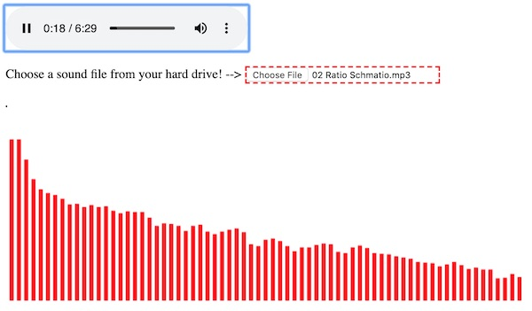

# Web Audio III - *File Chooser*

## I. Load a sound file from your hard drive

- For obvious security reasons, the only way JS can load file from a user's local hard drive is if they *initiate* this action themselves
- This can be done with either a &lt;file> input or drag-and-drop
- Here we'll get it done with the former option and a callback function that is triggered `onchange`:
  - https://developer.mozilla.org/en-US/docs/Web/HTML/Element/input/file

## II. Screenshot



## III. Code

**web-audio-file-chooser.html**

```html
<!DOCTYPE html>
<html lang="en">
<head>
	<meta charset="utf-8" />
	<title>Web Audio - File Chooser</title>
	<style>
		table{border:1px solid black;}
		td,th{border:1px solid black;width:30px;}
		input[type=file]{border:2px dashed red;margin-bottom:1em;}
	</style>
</head>
<body>
<audio controls src="" allow="autoplay"></audio>
<!-- NEW -->
<p>Choose a sound file from your hard drive! --> <input type="file" id="upload" title="Upload File" /></p>

<table></table>

<script>
	const NUM_SAMPLES = 32;
	
	// 1 - get reference to <audio> element on page
	let audioElement = document.querySelector('audio');
			
	// 2 - create a new `AudioContext` object
	// https://developer.mozilla.org/en-US/docs/Web/API/AudioContext
	let audioCtx = new (window.AudioContext || window.webkitAudioContext); // to support Safari and mobile
	
	// 3 - create a node that points at the <audio> element
	// https://developer.mozilla.org/en-US/docs/Web/API/AudioContext/createMediaElementSource
	let sourceNode = audioCtx.createMediaElementSource(audioElement); 
	
	// 4 - create a *analyser node*
	// https://developer.mozilla.org/en-US/docs/Web/API/AnalyserNode
	// this gets us real-time frequency and time-domain (i.e. waveform) information
	let analyserNode = audioCtx.createAnalyser();
	
	// 5 - How many samples do we want? fft stands for Fast Fourier Transform
	analyserNode.fftSize = NUM_SAMPLES;
	
	// 6 - hook up the <audio> element to the analyserNode
	sourceNode.connect(analyserNode);
	
	// 7 - connect to the destination i.e. the speakers
	analyserNode.connect(audioCtx.destination);
	
	// 8 - create a new array of 8-bit integers (0-255)
	// https://developer.mozilla.org/en-US/docs/Web/JavaScript/Reference/Global_Objects/Uint8Array
	let data = new Uint8Array(NUM_SAMPLES/2); // OR analyserNode.fftSize/2

	// Chrome autoplay fix
	// https://developers.google.com/web/updates/2017/09/autoplay-policy-changes
	document.querySelector("audio").onplay = (e) => {
		if (audioCtx.state == "suspended") {
			audioCtx.resume();
		}
	};
	
	// NEW
	document.querySelector("#upload").onchange = (e) => {
		const files = event.target.files;
		document.querySelector("audio").src = URL.createObjectURL(files[0]);
	};
	
	loop();
	
	
	function loop() { 
		// 9 - this schedules a call to the loop() method in 1/60 second
		requestAnimationFrame(loop);
		
		/*
				Nyquist Theorem
				http://whatis.techtarget.com/definition/Nyquist-Theorem
				The array of data we get back is 1/2 the size of the sample rate 
		*/
		
		// 10 - populate the array with the frequency data
		// notice these arrays are passed *by reference*
		analyserNode.getByteFrequencyData(data);
		
		// 11 - Let's visualize the audio data in an HTML table (lame!)
		let htmlR1="<tr>";
		let htmlR2="<tr>";
		let index = 0;
		let sum = 0;
		for(let b of data){
			htmlR1 += `<th>${index}</th>`;
			htmlR2 += `<td>${b}</td>`;
			sum += b;
			index++;
		}
		htmlR1 += "<th><i>Average of Samples</i></th>";
		htmlR1 += "</tr>";
		htmlR2 += `<td><i>${Math.floor(sum/data.length)}</i></td>`;
		htmlR2 += "</tr>";
		document.querySelector("table").innerHTML = htmlR1 + htmlR2;
	}
	
</script>
</body>
</html>
```


<hr><hr>

**[Previous Chapter <- Web Audio II](demo-web-audio-2.md)**

**[Next Chapter -> Web Audio IV](demo-web-audio-4.md)**
