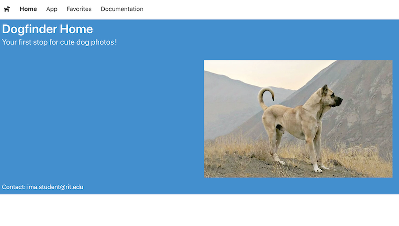
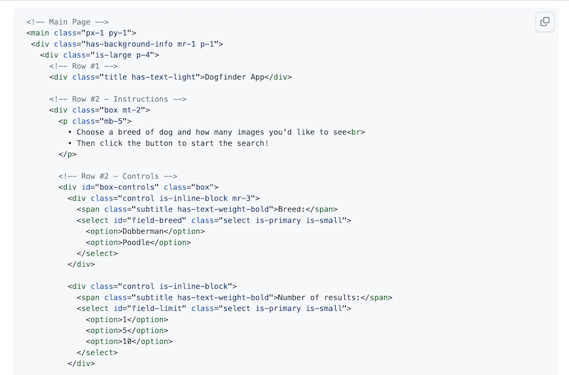
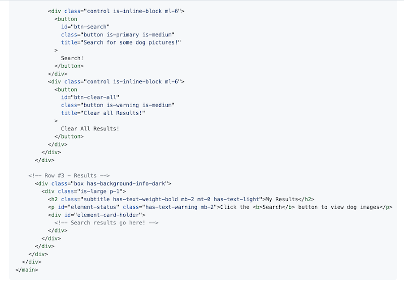
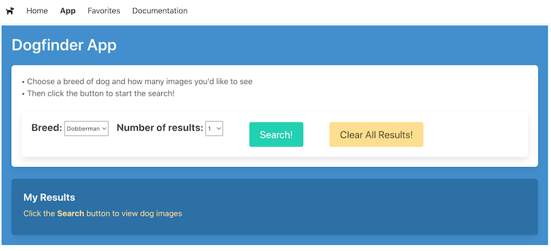
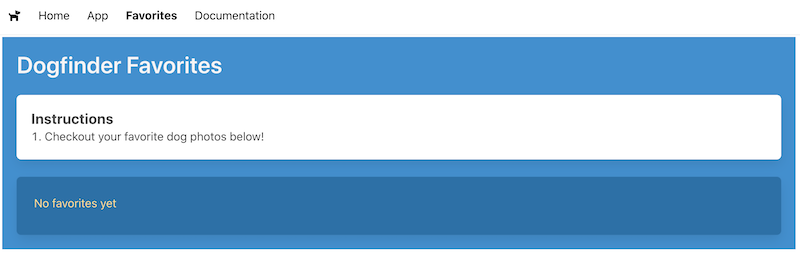
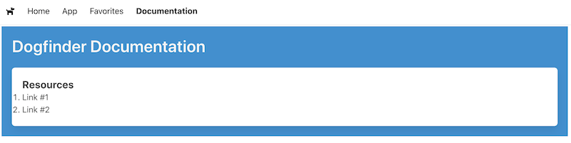

# Dogfinder App - Part I

## I. Overview

- In this series we are going to be building a "dog finder" app, which will allow the user to view and favorite various dog pictures
- This will be a good starting point for your project 1

## II. API
 
- This API is about as "developer friendly" as they get:
  - there's no API key required
  - it only has a few endpoints
  - the returned JSON is easy to parse, with only 2 top level keys:  `"message"` and ``"status"``
- API Docs at: https://dog.ceo/dog-api/
- Random image - all breeds: https://dog.ceo/api/breeds/image/random
- Random Image - specific breed: https://dog.ceo/api/breed/affenpinscher/images/random
- List of all breeds - https://dog.ceo/api/breeds/list/all
- BTW - the Bulma docs might come in handy too - https://bulma.io/documentation/

## III. Start code

- Your start files are **home.html** and **index.js** from [HW - Bulma I - Intro to Bulma](https://github.com/tonethar/IGME-330-Master/blob/master/notes/HW-bulma-1.md)
  - if you didn't complete that assignment - head there now to work on it!
- verify that the hamburger menu functions:
  - re-size the window to less than 1024px wide to see the hamburger menu
  - clicking on the hamburger icon should toggle the visibility of the navigation menu 
    - if it doesn't work, then check the console
    - you can also debug your code - add a breakpoint to the **index.js** code 
    
    
## IV. Get started - set up the site and navigation

1) Put **home.html** and **index.js** in a folder named ***lastname*-p1-starter** (where *lastname* is your actual last name)

2) Change the contents of the `<title>` tag (up in the `<head>` section) to "DogFinder" (without the quotes) 

3) In the "navbar brand", change the font awesome icon from `fa-hotdog` to `fa-dog`

4) We want to change the background color of the hero from green (`is-primary` to blue (`is-info`) - modify `<div class="hero is-large is-primary p-2">` to read `<div class="hero is-large is-info p-2">`

5) Add `<!DOCTYPE html>` to the top of **home.html** (so that the page will validate properly)

    - now head to https://validator.w3.org/ and be sure that **home.html** validates
    - you should see zero errors or warnings. Ff you do get any, fix them

6) Duplicate **home.html** 3 times and name the copies:

    - **app.html**
    - **favorites.html**
    - **documentation.html**

7) Now change the contents of each page's `<title>` tag to read "Dogfinder Home", "Dogfinder App" and so on

8) Now change the "hero" on the **home.html** page to read "Dogfinder Home" and "Your first stop for cute dog photos!"

9) Now change the "footer" on the **home.html** page to display your actual RIT email address

10) Now change the `` on the **home.html** page to point at this dog photo - https://upload.wikimedia.org/wikipedia/commons/7/77/Sarabi-dog.jpg

11) Now add "you are here" cues to the navigation systems for all 4 pages:

  - In the **home.html** file, in the navbar, in the `<a>` tag for the "Home" link:
    -  add the `has-text-weight-bold` Bulma class right after the `navbar-item` class
    -  convert the `<a>` to a `<span>` - and don't forget the closing tag
    -  the HTML for "Home" looks like this now: `<span class="navbar-item has-text-weight-bold">Home</span>`
      - Test it - the "Home" text should now be **bold**
  - Now head to the **app.html** file, and in the navbar:
    - add `href="home.html"` to the "Home" link so that it functions, and `is-hoverable` to its class attribute
    - delete `href="app.html"` from the "App" link, and convert it into a `<span>`
    - in the "App" link `class` attribute, replace `is-hoverable` with `has-text-weight-bold`
    - Test it:
      - you should be able to click on the "Home" and "App" links in the menubar and switch back and forth between these 2 pages
      - the text of the current page will be bold and "not clickable"
  - get the **favorites.html** and **documentation.html** pages functioning the same way
    - now all the pages should function as described above
    - example - **home.html** should look like this:





12) Now let's create the main UI for our **App** page. In **app.html**, replace the entire "columns" div (which is all the HTML below the `<nav>` area) with:






- Once you are done typing it in, validate the HTML at https://validator.w3.org/ to help test that you typed it in right - there should not be any errors or warnings
- Make sure that **app.html** looks like this: 



13) Put a `<style>` tag at the top of **app.html** - here it is for your copy/paste pleasure:

```html
<style>
  select#field-limit{
    width:2.5rem;
  }
  h2.subtitle{
    font-family:'Underdog',sans-serif;
  }
</style>
```

14) Now create a **styles/** folder and put a file named **default-styles.css** in it - it will look like this:

```css
@import url('https://fonts.googleapis.com/css2?family=Underdog&display=swap');

ol{
  list-style-position: inside;
}
```

15) Add a `<link>` tag to the `<head>` section of **app.html** that links to this stylesheet

    - `<link rel="stylesheet" href="styles/default-styles.css">`
    - Test it. The font for "My Results" should change to the Underdog font

16) Now let's stub in a starting UI for our **Favorites** page

    - In **favorites.html**, `<link>` to the default stylesheet as above
    - Now replace the entire "columns" div with (you can copy/paste this):

```html
<!-- Main Page -->
<main class="px-1 py-1">
  <div class="has-background-info mr-1 p-1"> 
    <div class="is-large p-4">
      <!-- Row #1 -->
      <div class="title has-text-light">Dogfinder Favorites</div>
      
      <!-- Row #2  -->
      <div class="box mt-2">
        <h2 class="subtitle has-text-weight-bold mb-0">Instructions</h2>
        <ol>
          <li>Checkout your favorite dog photos below!</li>
        </ol>
      </div>

      <!-- Row #3 -->
      <div class="box has-background-info-dark"> 
        <div class="is-large p-1">
          <p id="element-status" class="has-text-warning mb-2">No favorites yet</p>
          <div id="element-card-holder">
            <!-- Favorites go here! -->
          </div>
        </div>
      </div>
    </div>
  </div>
</main>
```

- **favorites.html** should now look like this 



17) Finally, let's add our default UI to **documentation.html**, go ahead and `<link>` to the default stylesheet, and replace the entire "columns" div with:


```html
<!-- Main Page -->
<main class="px-1 py-1">
  <div class="has-background-info mr-1 p-1"> 
    <div class="is-large p-4">
      <!-- Row #1 -->
      <div class="title has-text-light">Dogfinder Documentation</div>
      
      <!-- Row #2  -->
      <div class="box mt-2">
        <h2 class="subtitle has-text-weight-bold mb-0">Resources</h2>
        <ol>
          <li>Link #1</li>
          <li>Link #2</li>
        </ol>
      </div>
    </div>
  </div>
</main>
```


- When you are done, it will look like this:



    
  


 


